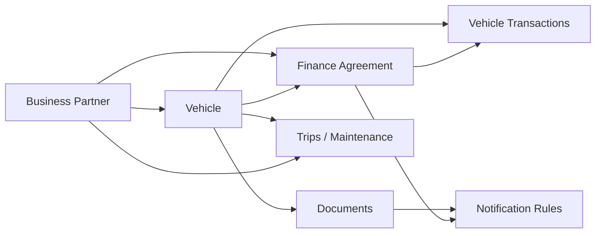
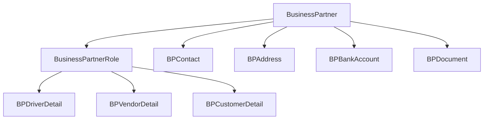
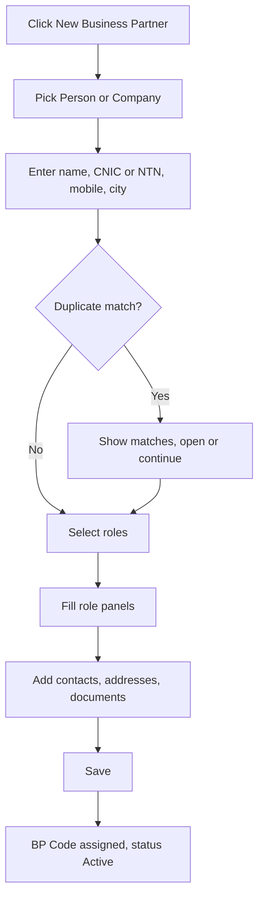
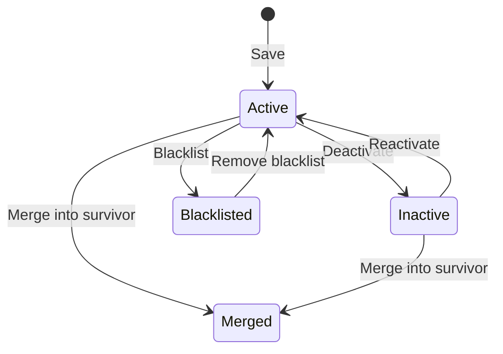
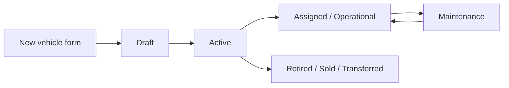
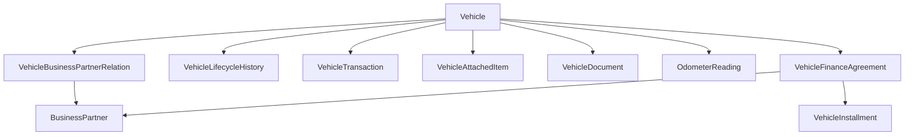
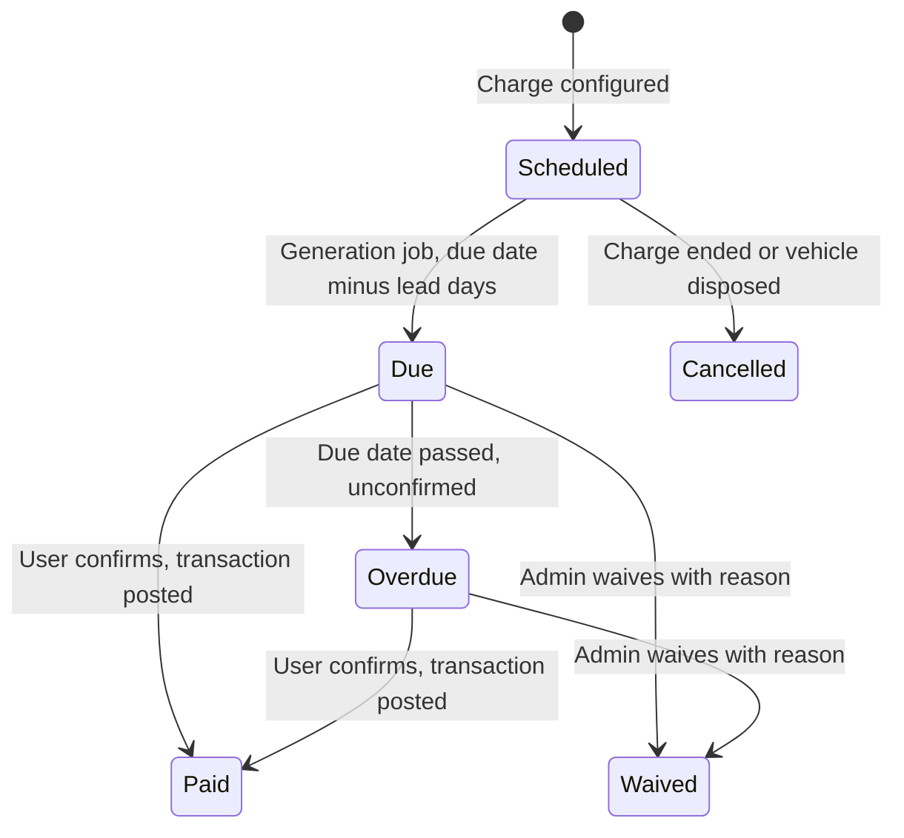
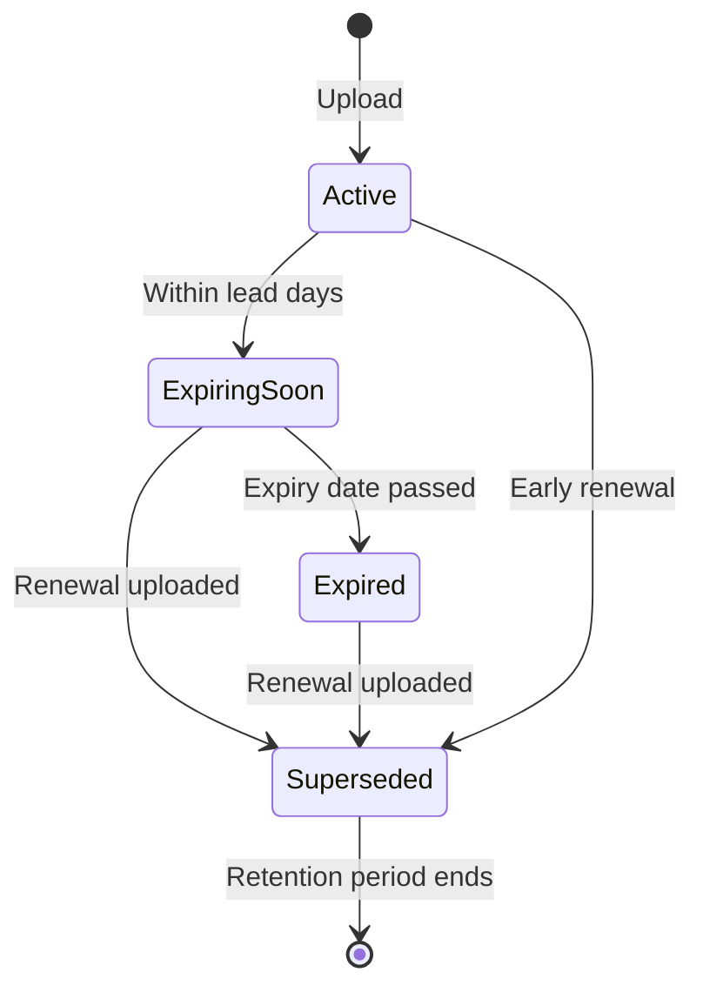
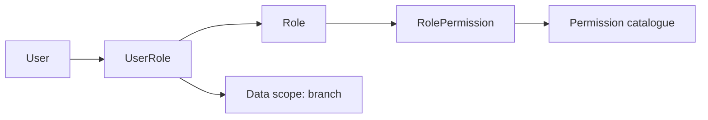

# VMS Phase 1 FSD — Business Partner & Vehicle Creation

2026-09-20 · @Someone

## 1. Document control

This FSD specifies two modules of VMS Phase 1 in build-ready detail: **Business Partner creation** and **Vehicle creation**. Everything else in the Phase 1 requirement document depends on these two masters, so they are specified first.

| Item | Detail |
| --- | --- |
| Document | VMS Phase 1 FSD — Business Partner & Vehicle Creation |
| Version | 1.0 — draft for client review |
| Date | 20 Sep 2026 |
| Source requirement | Vehicle Management System — Phase 1 / V1, Updated Functional & Implementation Requirements |
| Source sections covered | 2 (Business Partner), 3 (Categories), 5 Basic + Ownership rows, 8 (Bank lease), 13 (Audit), 14 (Entities) |
| Audience | Client sponsor, product owner, development team, QA, UAT testers |
| Currency | PKR, 2 decimal places |
| Locale | Taken from the machine the system is opened on — its time zone, calendar and date format |

**In scope**

- Business Partner master: create, edit, multi-role assignment, contacts, addresses, bank details, documents, status lifecycle, duplicate control.
- Vehicle master: create with full technical identity, ownership category and its counterparty, acquisition cost, bank lease agreement and schedule, attached items, documents, opening financial postings.
- Field-level definitions, validations, business rules, permissions, audit and acceptance criteria for both.

**Out of scope for this document**

- Trips, monthly P&L screens, driver mobile app, maintenance jobs, notification delivery engine, reports and dashboards. These are separate FSDs; this document defines only the data and hooks they consume.
- Live GPS, tracker APIs, geofencing, route replay — Phase 2 per the source document.

## 2. Scope and objectives

The objective is that a user can create a Business Partner once and a Vehicle once, and every downstream module — expenses, income, installments, trips, maintenance, notifications — finds the master data it needs without re-entry.

Four design objectives govern every rule in this document:

1. **One party, many roles.** A workshop that also supplies parts is one record with two roles, not two records.
2. **Capture the financial opening position at creation.** Purchase price, down payment and lease agreement are entered on the vehicle creation screen and posted as system transactions, so the vehicle's paid-to-date figure is correct from day one without any manual total.
3. **Nothing is overwritten.** Category changes, role changes and counterparty changes are closed and superseded, never edited in place.
4. **Minimum typing.** User, timestamp, branch, sequence numbers and derived amounts are supplied by the system.

### Dependency map

Business Partner must be built and populated before Vehicle: a vehicle cannot be created in the Bank Leased, Rented, Shared or Customer Arrangement category without an existing partner to point at.

## 3. Glossary and conventions

| Term | Meaning in this system |
| --- | --- |
| Business Partner (BP) | Any external or internal party the company deals with. One master record, one or more roles. |
| Role | A capacity in which a BP is used: Driver, Workshop, Bank, Vendor, Customer, Tracker Company, Body Maker, Fuel Card Company, Running Customer. |
| Ownership Category | The commercial relationship of a vehicle: Self Owned, Shared, Rented, Customer Arrangement, Bank Leased. |
| Counterparty | The BP tied to the vehicle by its current ownership category (the bank, lessor, partner or customer). |
| Vehicle Relation | A dated record joining a vehicle to a BP in a category. Closed and superseded on change, never edited. |
| Attached Item | A major removable asset fitted to the vehicle: container, AC unit, tyre set, crane, tank. |
| Opening Posting | A vehicle transaction the system creates automatically at vehicle creation. |
| Finance Agreement | The lease or financing contract with a bank, holding schedule and installment terms. |

### Requirement ID scheme

| Prefix | Meaning | Example |
| --- | --- | --- |
| FR-BP / FR-VH | Functional requirement | FR-VH-014 |
| BR-BP / BR-VH | Business rule, testable | BR-BP-007 |
| VAL-BP / VAL-VH | Field or form validation with a message | VAL-VH-003 |
| AC-BP / AC-VH | Acceptance criterion | AC-BP-002 |
| OQ | Open question for the client | OQ-05 |

### Field table legend

Every field specification table uses these columns. **M** = mandatory, **O** = optional, **C** = conditional (mandatory only when the stated condition is true). **Sys** = system-supplied, never typed by the user.

Data types are written in SQL Server terms: `nvarchar(n)`, `decimal(18,2)` for money, `date`, `datetime2`, `bit`, `int`, `uniqueidentifier`.

# Module A — Business Partner

## 4. Concept and rationale

A Business Partner is one master record for a person or company, carrying one or more roles. Roles are additive flags with their own attribute sets, not separate records and not a single "type" field.

The alternative — a separate Drivers table, Vendors table, Banks table — breaks down the moment the same party appears twice. These cases are real in this business:

| Situation | Single-master result | Separate-tables result |
| --- | --- | --- |
| A workshop also sells tyres and spare parts | One BP, roles Workshop + Vendor. One ledger, one payables position. | Two records, split history, reconciliation by hand. |
| An adda pays monthly hire and also owns a vehicle the company runs | One BP, roles Customer + Running Customer + Shared counterparty. | Three records for one party. |
| A driver leaves and returns as a contractor with his own vehicle | Same BP, Driver role reactivated, new Rented counterparty relation. | New record, old trip and expense history orphaned. |
| A bank finances vehicles and is also a corporate customer | One BP, roles Bank + Customer. | Two records, confusing selection lists. |

### Rules that follow from the concept

- **FR-BP-001** — A BP may hold any combination of the nine roles at once. There is no restriction on combinations.
- **FR-BP-002** — Role-specific fields are captured only when that role is active. Adding the Driver role reveals licence fields; removing it hides them but retains the stored values.
- **FR-BP-003** — Every selection list elsewhere in the system filters by role, not by name. The bank picker on a vehicle shows only BPs with an active Bank role.
- **FR-BP-004** — A BP is either a **Person** or a **Company**. This choice drives which identity fields apply (CNIC vs NTN/STRN) and cannot be changed after the first transaction is posted against the BP.

## 5. Business Partner data model

Nine tables. `BusinessPartner` is the master; everything else hangs off it.

| Entity | Holds | Cardinality to BP | Key columns |
| --- | --- | --- | --- |
| BusinessPartner | Identity, tax, status, defaults | 1 | BusinessPartnerId (PK), BPCode (unique), PartyType, LegalName |
| BusinessPartnerRole | One row per role held | 1 : many | BPRoleId, BusinessPartnerId, RoleCode, IsActive, EffectiveFrom, EffectiveTo |
| BPContact | Named people at the partner | 1 : many | BPContactId, BusinessPartnerId, ContactName, Mobile, IsPrimary |
| BPAddress | Registered, billing, workshop and yard addresses | 1 : many | BPAddressId, BusinessPartnerId, AddressType, City, IsPrimary |
| BPBankAccount | Payment instructions | 1 : many | BPBankAccountId, BusinessPartnerId, AccountTitle, IBAN, IsPrimary |
| BPDocument | Scans: CNIC, licence, NTN, agreements | 1 : many | BPDocumentId, BusinessPartnerId, DocTypeId, ExpiryDate, FilePath |
| BPDriverDetail | Licence, blood group, employment terms | 0..1, exists only with active Driver role | BusinessPartnerId (PK/FK), LicenceNo, LicenceExpiry |
| BPVendorDetail | Payment terms, supply category | 0..1 | BusinessPartnerId (PK/FK), PaymentTermDays |
| BPCustomerDetail | Billing cycle, credit limit, rate basis | 0..1 | BusinessPartnerId (PK/FK), BillingCycle, CreditLimit |

### Model rules

- **BR-BP-001** — Role-specific detail rows are created when the role is first activated and are never physically deleted. Deactivating a role sets `BusinessPartnerRole.IsActive = 0` and stamps `EffectiveTo`; the detail row stays for history.
- **BR-BP-002** — Exactly one row per child collection may carry `IsPrimary = 1`. Setting a new primary clears the previous one in the same transaction.
- **BR-BP-003** — `BPCode` is system-generated, unique, and immutable once saved.
- **BR-BP-004** — Bank, Workshop, Body Maker, Tracker Company and Fuel Card Company need no dedicated detail table in V1; their extra attributes fit in the common fields plus contacts and documents. A detail table is added later only if the client confirms role-specific fields for them (see OQ-03).

## 6. Business Partner — core field specification

These fields apply to every partner regardless of role. They sit on the **General** tab.

| # | Field | Type | M/O/C | Validation and behaviour |
| --- | --- | --- | --- | --- |
| 1 | BP Code | nvarchar(20) | Sys | Auto from series `BP-{YY}-{00000}`. Read-only, shown after save. |
| 2 | Party Type | enum | M | Person or Company. Radio buttons. Locked once any transaction references the BP. |
| 3 | Legal Name | nvarchar(150) | M | Full registered name or CNIC name. Trimmed, min 3 chars. Duplicate-checked (§12). |
| 4 | Display / Short Name | nvarchar(60) | O | Used in dropdowns and reports. Defaults to Legal Name truncated to 60. |
| 5 | Roles | multi-select | M | At least one role required. Drives conditional tabs (§7). |
| 6 | CNIC | nvarchar(15) | C — M when Party Type = Person | Format `00000-0000000-0`. Unique across active BPs. |
| 7 | NTN | nvarchar(15) | C — M when Party Type = Company | Format per FBR NTN. Unique across active BPs. |
| 8 | STRN / Sales Tax No | nvarchar(20) | O | Free text, unique when entered. |
| 9 | Filer Status | enum | O | Filer / Non-Filer / Unknown. Default Unknown. Affects withholding reporting later. |
| 10 | Primary Mobile | nvarchar(20) | M | Pakistani mobile format `03XX-XXXXXXX` or E.164. Used for SMS notifications. |
| 11 | Alternate Phone | nvarchar(20) | O | Landline or second mobile. |
| 12 | Email | nvarchar(100) | C — M when Customer or Bank role active | RFC-valid. Used for document and invoice mail. |
| 13 | City | lookup | M | From City master. Type-ahead. |
| 14 | Address Line | nvarchar(250) | M | Primary address; also written to BPAddress as the primary Registered row. |
| 15 | Branch / Location | lookup | M | Owning branch. Defaults to logged-in user's branch. Controls row-level visibility. |
| 16 | Status | enum | Sys on create | Active on save. Changed only through the status action (§13). |
| 17 | Opening Balance | decimal(18,2) | O | Default 0.00. Positive = we owe the partner, negative = partner owes us. Posted as an opening entry, not editable after save. |
| 18 | Opening Balance Date | date | C — M when Opening Balance ≠ 0 | Cannot be a future date. |
| 19 | Default Currency | lookup | Sys | PKR in V1, field present for future use, not shown on screen. |
| 20 | Notes | nvarchar(1000) | O | Free text, shown on the partner header. |
| 21 | Created By / Created On | — | Sys | Logged-in user and server timestamp. |
| 22 | Modified By / Modified On | — | Sys | Stamped on every save. |

### Notes on specific fields

- **FR-BP-005** — CNIC and NTN are mutually exclusive by Party Type, but both columns exist. A sole proprietor entered as a Company may carry both; the system does not block that, it only enforces the mandatory one.
- **FR-BP-006** — Opening Balance exists so the client can go live with partners who already have running accounts. If the client prefers to start every partner at zero, this field is hidden by configuration (OQ-02).
- **FR-BP-007** — Branch drives visibility: a user restricted to one branch sees only that branch's partners in lists, but any partner can still be selected on a vehicle if the user has cross-branch permission.

## 7. Role-specific attribute sets

Each active role adds one collapsible panel to the partner form. An inactive role shows no panel.

### 7.1 Driver

| Field | Type | M/O/C | Rule |
| --- | --- | --- | --- |
| Licence Number | nvarchar(30) | M | Unique among active drivers. |
| Licence Type | lookup | M | LTV / HTV / Motorcycle / Other. HTV required to be assigned to a truck. |
| Licence Issue Date | date | O | Not future. |
| Licence Expiry Date | date | M | Must be future at creation. Feeds the expiry notification rule. |
| Employment Type | enum | M | Employee / Contractor / Ad-hoc. |
| Date of Joining | date | C — M when Employee | Not future. |
| Salary / Monthly Rate | decimal(18,2) | O | Visible only with the Finance permission. |
| Trip Commission Basis | enum | O | None / Percent of trip income / Fixed per trip. |
| Commission Value | decimal(18,2) | C — M when basis ≠ None | Percent 0–100 or fixed PKR. |
| Blood Group | lookup | O | For emergency records. |
| Emergency Contact Name / Phone | nvarchar(100) / (20) | O | Recommended for HTV drivers. |
| Guarantor / Reference | nvarchar(150) | O | Free text. |
| Driver App Access | bit | O | Default off. Switching on requires a linked login (§13). |

### 7.2 Workshop

| Field | Type | M/O/C | Rule |
| --- | --- | --- | --- |
| Workshop Type | multi-select | M | Engine / Body / Electrical / Tyre / AC / Denting-Painting / General. |
| Service Rate Basis | enum | O | Per job / Hourly / Contract. |
| Default Turnaround Days | int | O | Used later for maintenance scheduling. |

### 7.3 Bank

| Field | Type | M/O/C | Rule |
| --- | --- | --- | --- |
| Branch Name | nvarchar(120) | M | The financing branch. |
| Relationship Manager | nvarchar(100) | O | Name; phone goes in Contacts. |
| Default Finance Type | enum | O | Lease / Ijarah / Loan / Other. Pre-fills the vehicle finance form. |
| Default Installment Frequency | enum | O | Monthly / Quarterly. Pre-fills the schedule. |

### 7.4 Vendor

| Field | Type | M/O/C | Rule |
| --- | --- | --- | --- |
| Supply Categories | multi-select | M | Parts / Tyres / Lubricants / Fuel / Toll / Services / Other. |
| Payment Terms (days) | int | O | 0 = cash. Default 0. |
| Credit Limit | decimal(18,2) | O | Warning only in V1, not a hard block. |

### 7.5 Customer

| Field | Type | M/O/C | Rule |
| --- | --- | --- | --- |
| Customer Type | enum | M | Adda / Cargo company / Factory / Trader / Other. |
| Billing Cycle | enum | M | Per trip / Weekly / Fortnightly / Monthly. |
| Rate Basis | enum | O | Per trip / Per tonne / Per km / Monthly fixed. |
| Default Rate | decimal(18,2) | O | Pre-fills trip and income entry. |
| Credit Limit | decimal(18,2) | O | Warning only in V1. |
| Credit Days | int | O | Drives overdue receivable reporting later. |

### 7.6 Running Customer

The party currently using the vehicle or generating its income. Distinguished from Customer because a vehicle points at exactly one running customer at a time, while Customer is a billing relationship that may cover many vehicles.

| Field | Type | M/O/C | Rule |
| --- | --- | --- | --- |
| Running Arrangement Type | enum | M | Monthly hire / Per trip / Revenue share. |
| Agreed Monthly Amount | decimal(18,2) | C — M when Monthly hire | Pre-fills monthly income entry. |
| Revenue Share % | decimal(5,2) | C — M when Revenue share | 0–100. |

### 7.7 Tracker Company, Body Maker, Fuel Card Company

| Role | Fields |
| --- | --- |
| Tracker Company | Portal URL, Support Contact, Default Monthly Charge per vehicle. All optional in V1; the role exists so Phase 2 tracker integration has a partner to attach to. |
| Body Maker | Fabrication Types (Container / Tanker / Flatbed / Refrigerated / Other) — mandatory; Default Warranty Months — optional. |
| Fuel Card Company | Card Program Name — mandatory; Billing Cycle (Weekly / Fortnightly / Monthly) — mandatory; Portal URL — optional. Individual card numbers are captured on the vehicle, not here. |

## 8. Child collections — contacts, addresses, bank accounts, documents

All four are grids on their own tabs with inline add and edit. None is mandatory at creation except the primary address written from the General tab.

### 8.1 Contacts

| Field | Type | M/O/C | Rule |
| --- | --- | --- | --- |
| Contact Name | nvarchar(100) | M | — |
| Designation | nvarchar(60) | O | Owner, Manager, Accounts, Dispatcher. |
| Mobile | nvarchar(20) | M | Same format as primary mobile. |
| Email | nvarchar(100) | O | RFC-valid. |
| Is Primary | bit | O | Only one per partner; setting it clears the previous. |
| Notes | nvarchar(250) | O | — |

### 8.2 Addresses

| Field | Type | M/O/C | Rule |
| --- | --- | --- | --- |
| Address Type | enum | M | Registered / Billing / Workshop / Yard / Correspondence. |
| Address Line 1 | nvarchar(250) | M | — |
| Address Line 2 | nvarchar(250) | O | — |
| City | lookup | M | From City master. |
| Province | lookup | O | Auto-filled from City where mapped. |
| Landmark | nvarchar(150) | O | Practical for workshops and addas. |
| Is Primary | bit | O | One per partner. The General tab address is created as Registered + Primary. |

### 8.3 Bank accounts

Needed for vendor and driver payments and for lease debits.

| Field | Type | M/O/C | Rule |
| --- | --- | --- | --- |
| Account Title | nvarchar(150) | M | — |
| Bank Name | nvarchar(100) | M | Free text or Bank BP lookup. |
| Branch / Code | nvarchar(80) | O | — |
| Account Number | nvarchar(34) | M | Digits and dashes. Unique per bank within the partner. |
| IBAN | nvarchar(34) | O | `PK` + 22 alphanumeric when entered; checksum validated. |
| Is Primary | bit | O | One per partner. |

### 8.4 Documents

| Field | Type | M/O/C | Rule |
| --- | --- | --- | --- |
| Document Type | lookup | M | CNIC, Licence, NTN Certificate, Agreement, Cheque copy, Other. From a configurable master. |
| Document Number | nvarchar(60) | O | — |
| Issue Date | date | O | Not future. |
| Expiry Date | date | C — M when the document type is flagged *expirable* | Feeds expiry notifications. |
| File | upload | M | PDF, JPG, PNG. Max 10 MB per file. Stored outside the DB with a path reference. |
| Remarks | nvarchar(250) | O | — |

### Rules

- **BR-BP-005** — When the Driver role is active, a licence document row is expected. The system warns on save if none is attached but does not block; the warning is configurable to a hard block (OQ-04).
- **BR-BP-006** — Uploaded files are virus-scanned and stored with a generated name; the original filename is kept as metadata.
- **BR-BP-007** — A document row is never deleted once its expiry has driven a notification. It is marked superseded when a renewal is uploaded, and the renewal carries a link to the superseded row.

## 9. Business Partner screens

### 9.1 List screen

Default sort: Modified On descending. Page size 25, server-side paging.

| Element | Specification |
| --- | --- |
| Columns | BP Code, Legal Name, Roles (chips), City, Primary Mobile, Status, Branch, Modified On |
| Quick search | Single box matching BP Code, Legal Name, Display Name, CNIC, NTN, Mobile — partial match from 3 characters |
| Filters | Role (multi), Status, City, Branch, Party Type, Has expiring document (next 30 days) |
| Row actions | View, Edit, Change Status, Duplicate check, View vehicles linked |
| Header actions | New Business Partner, Export to Excel, Import (Phase 1.1) |
| Empty state | "No business partners match these filters" with a Clear filters link |

### 9.2 Create / edit screen

A tabbed form, not a wizard. The partner is a reference master that users revisit, and a wizard would slow repeat entry.

| Tab | Contents | Visible when |
| --- | --- | --- |
| General | §6 core fields, role multi-select | Always |
| Role Details | One collapsible panel per active role (§7) | At least one role selected |
| Contacts | Contacts grid | Always |
| Addresses | Addresses grid | Always |
| Bank Accounts | Bank accounts grid | Always |
| Documents | Documents grid | Always |
| Linked Vehicles | Read-only list of vehicles where this partner is counterparty, bank, body maker or running customer | Edit mode only, and only when at least one link exists |
| History | Audit entries, role change log, status change log | Edit mode only |

### 9.3 Field behaviour

- **FR-BP-008** — Selecting a role immediately reveals its panel on the Role Details tab without a page reload. Clearing a role hides the panel and warns: values entered there will be retained but inactive.
- **FR-BP-009** — Mandatory-field indicators update live as roles change. A field mandatory only for Driver shows its asterisk only while Driver is selected.
- **FR-BP-010** — Tabs other than General are enabled in create mode and their rows are held client-side until the first save, then persisted together in one transaction. The user never has to save twice to add a contact.
- **FR-BP-011** — Unsaved-change guard: navigating away with dirty state prompts Save, Discard, Cancel.
- **FR-BP-012** — The header of the edit screen always shows BP Code, Legal Name, role chips and Status, whichever tab is open.

## 10. Business Partner create flow

### Step detail

1. **New** — from the list header, or inline from any partner picker elsewhere in the system ("+ Add new" inside the bank dropdown on the vehicle form opens a compact version of this screen with the Bank role pre-selected and locked).
2. **Identity** — Party Type first, because it switches the CNIC/NTN field. Duplicate check fires on blur of Legal Name and of CNIC/NTN (§12).
3. **Roles** — multi-select. At least one required. Roles pre-selected by the calling context cannot be removed in the compact dialog.
4. **Role panels** — only for selected roles; each panel validates independently and shows its own error count in the tab badge.
5. **Child grids** — optional, held client-side until save.
6. **Save** — one server transaction writes BusinessPartner, BusinessPartnerRole rows, detail rows, child rows, the opening balance entry if any, and the audit record. Any failure rolls back everything.

### Post-save behaviour

- **FR-BP-013** — On success the screen stays open in edit mode with a toast showing the assigned BP Code, and the Linked Vehicles and History tabs become available.
- **FR-BP-014** — When the partner was created from a picker, the dialog closes and the new partner is selected in the calling field automatically.
- **FR-BP-015** — A **Save and New** action is available for bulk data entry; it retains Party Type, Roles, City and Branch and clears everything else.
- **FR-BP-016** — Documents flagged expirable generate their notification subscriptions at save, not at the next batch run, so a licence expiring in 10 days is picked up immediately.

## 11. Business Partner business rules

| ID | Rule | Enforcement |
| --- | --- | --- |
| BR-BP-010 | At least one role must be active at all times. Removing the last active role is rejected. | Save-time block |
| BR-BP-011 | A role cannot be deactivated while it is in use: Driver assigned to a vehicle or an open trip; Bank on an open finance agreement; counterparty on an active vehicle relation; Running Customer on an active vehicle. | Save-time block, with a list of the blocking records |
| BR-BP-012 | Party Type cannot change after the first transaction, vehicle link or document is attached. | Field disabled |
| BR-BP-013 | CNIC must be unique across all BPs with status ≠ Merged. NTN must be unique across all Company BPs with status ≠ Merged. | Unique index + friendly message |
| BR-BP-014 | A BP cannot be set Inactive while any of these is open: driver assignment, vehicle relation, finance agreement, unbilled income or unpaid expense. | Status-change block |
| BR-BP-015 | A BP is never physically deleted. Delete is available only to Admin, only when zero child rows and zero transactions exist, and is recorded as a soft delete with reason. | Permission + guard |
| BR-BP-016 | Adding a role is always allowed and is effective-dated from the date of addition; it does not backdate history. | Automatic |
| BR-BP-017 | The Driver role requires Licence Number and Licence Expiry. A driver whose licence has expired cannot be assigned to a new trip; the partner record itself stays Active. | Assignment-time block |
| BR-BP-018 | Opening Balance may be entered only once, at creation. Later corrections go through a journal adjustment with reason and audit, not by editing the field. | Field disabled after save |
| BR-BP-019 | Changing Legal Name is allowed but is written to the audit log with old and new values, and the previous name remains searchable. | Audit + search index |
| BR-BP-020 | Blacklisted partners cannot be selected in any picker. Existing links stay intact and existing obligations remain payable. | Picker filter |

### Role change log

Every add or remove writes a row: BusinessPartnerId, RoleCode, Action (Added / Removed), EffectiveDate, Reason, UserId, Timestamp. This log is shown on the History tab and is the evidence behind BR-BP-011 and BR-BP-016.

## 12. Validations, duplicate detection and messages

### 12.1 Duplicate detection

Runs on blur of Legal Name, CNIC, NTN and Primary Mobile, and again on save.

| Check | Match type | Response |
| --- | --- | --- |
| CNIC exact | Hard | Block save. Offer to open the existing partner. |
| NTN exact | Hard | Block save. Offer to open the existing partner. |
| Mobile exact | Soft | Warn, list the matches, allow continue with a tick box. |
| Legal Name ≥ 85% similar | Soft | Warn with a side-by-side panel of candidates: code, name, roles, city, status. |
| Name exact + City exact | Soft, higher priority | Warn prominently; this is the common real duplicate. |

**BR-BP-021** — A soft-duplicate override is recorded in the audit log with the user, the ignored candidate and the timestamp, so duplicates created deliberately can be traced later.

**FR-BP-017** — Admin has a *Merge Partners* action: pick survivor and duplicate, the system re-points all children and transactions to the survivor, sets the duplicate to status Merged with a pointer to the survivor, and writes a merge audit record. Merge is irreversible and is deferred to Phase 1.1 if the client prefers (OQ-06).

### 12.2 Message catalogue

| ID | Condition | Message |
| --- | --- | --- |
| VAL-BP-001 | No role selected | Select at least one role for this business partner. |
| VAL-BP-002 | CNIC format wrong | Enter CNIC as 00000-0000000-0. |
| VAL-BP-003 | CNIC already used | This CNIC belongs to {BPCode} — {LegalName}. Open that record instead. |
| VAL-BP-004 | NTN already used | This NTN belongs to {BPCode} — {LegalName}. |
| VAL-BP-005 | Mobile format wrong | Enter mobile as 03XX-XXXXXXX. |
| VAL-BP-006 | Similar name found | {n} partners have a similar name in {City}. Review before saving. |
| VAL-BP-007 | Licence expiry in the past | Licence expiry must be a future date. |
| VAL-BP-008 | Driver role without licence number | Licence number is required for the Driver role. |
| VAL-BP-009 | Last role being removed | A business partner must keep at least one role. |
| VAL-BP-010 | Role in use on removal | {Role} cannot be removed — it is in use on {n} records. View list. |
| VAL-BP-011 | Opening balance without date | Enter the opening balance date. |
| VAL-BP-012 | Opening balance date in future | Opening balance date cannot be in the future. |
| VAL-BP-013 | Email missing for Customer role | Email is required for customers. |
| VAL-BP-014 | Document expirable without expiry | Enter the expiry date for {DocumentType}. |
| VAL-BP-015 | File too large | File exceeds 10 MB. Compress it or upload a smaller scan. |
| VAL-BP-016 | Deactivation blocked | This partner has {n} open records and cannot be deactivated. View list. |

All messages are held in a resource file so they can be translated or reworded without a code change.

## 13. Status, audit and permissions

### 13.1 Status lifecycle

| Status | Selectable in pickers | Editable | Notes |
| --- | --- | --- | --- |
| Active | Yes | Yes | Default on save |
| Inactive | No | Yes | Existing links stay; blocked by BR-BP-014 while anything is open |
| Blacklisted | No | Yes | Requires a reason, minimum 10 characters |
| Merged | No | No | Read-only tombstone pointing at the survivor |

Every status change captures status from, status to, reason, effective date, user and timestamp.

### 13.2 Audit

Written for: create, every field change on the General and role panels, role add/remove, status change, child row add/edit/delete, document upload and supersede, duplicate override, merge.

Each entry holds: entity, record id, action, field, old value, new value, reason where captured, user id, user name, server timestamp, IP or device.

**BR-BP-022** — Audit rows are append-only. No role, including Admin, can edit or delete them through the application.

### 13.3 Permissions

| Capability | Admin | Fleet Manager | Finance | Operations | Read Only |
| --- | --- | --- | --- | --- | --- |
| View partners | Yes | Yes | Yes | Yes | Yes |
| Create / edit partner | Yes | Yes | Yes | Limited to Customer and Running Customer roles | No |
| View salary, commission, credit limit, opening balance | Yes | No | Yes | No | No |
| Add or remove roles | Yes | Yes | No | No | No |
| Change status / blacklist | Yes | No | No | No | No |
| Merge partners | Yes | No | No | No | No |
| Upload documents | Yes | Yes | Yes | Yes | No |
| Grant Driver App access | Yes | Yes | No | No | No |
| Export list | Yes | Yes | Yes | No | Yes |

Roles and their capabilities are configurable per the source document; this matrix is the shipped default.

# Module B — Vehicle

## 14. Vehicle creation objectives

Vehicle creation is not just a master record. It is the opening entry of the vehicle's financial and commercial life, so the screen captures four things at once:

1. **Identity and technical data** — registration number, make, model, engine, chassis, capacity.
2. **Commercial relationship** — which of the five categories applies, and which Business Partner is on the other side of it.
3. **Opening financial position** — purchase price, amount paid at creation, and the bank lease agreement with its installment schedule where applicable.
4. **Attached items and documents** — container, AC, tyres, registration book, insurance, fitness, permits.

The requirement in §8 of the source document — that a vehicle created with PKR 2,000,000 paid and later PKR 150,000 of installments shows PKR 2,150,000 paid — is only achievable if the initial payment is posted as a transaction at creation rather than stored as a number on the vehicle. That is the central design decision of this module.

### Lifecycle entry

**FR-VH-001** — A vehicle may be saved as **Draft** with only its identity fields, so a purchase in progress can be recorded. It becomes **Active** only when category, counterparty and acquisition data are complete. Draft vehicles cannot be assigned, cannot take expenses and do not appear in operational pickers.

## 15. Vehicle data model

One save of the vehicle creation screen can write to eight tables.

| Entity | Written at creation | Rows | Purpose |
| --- | --- | --- | --- |
| Vehicle | Always | 1 | Identity, technical data, current status, current category (denormalised for speed) |
| VehicleBusinessPartnerRelation | When category ≠ Self Owned | 1 | Dated link to the counterparty. Closed and superseded on category change, never edited |
| VehicleLifecycleHistory | Always | 1–2 | Created, and Activated if not saved as Draft |
| VehicleTransaction | When purchase price or initial payment entered | 1–2 | Acquisition and initial payment postings (§19) |
| VehicleFinanceAgreement | When Finance Type = Bank Lease | 1 | Bank, agreement reference, amounts, schedule terms |
| VehicleInstallment | When Finance Type = Bank Lease | n = tenure | The full expected schedule, status Pending |
| VehicleAttachedItem | When items entered | 0..n | Container, AC, tyre set, crane |
| VehicleDocument | When documents uploaded | 0..n | Registration, insurance, fitness, permit, lease |
| OdometerReading | When opening odometer entered | 0..1 | Source = Vehicle Creation |
| VehicleRecurringCharge | When periodic charges are configured | 0..n | Insurance, tracker fee, rent and other recurring obligations (§19A) |
| VehicleRecurringChargeEntry | No | — | Due and paid entries produced later by the nightly generation job |

### Model rules

- **BR-VH-001** — `Vehicle.CurrentCategory` and `Vehicle.CurrentCounterpartyId` are convenience copies of the open `VehicleBusinessPartnerRelation`. The relation table is the record of truth; the copies are maintained by the same transaction and are never edited directly.
- **BR-VH-002** — A vehicle has at most one open relation at a time, identified by `EffectiveTo IS NULL`. Enforced by a filtered unique index.
- **BR-VH-003** — All financial figures shown on the vehicle screen are aggregates over `VehicleTransaction`. No running-total column is stored on Vehicle.
- **BR-VH-004** — A vehicle has at most one active finance agreement. Historic agreements remain with status Closed or Settled.

## 16. Vehicle — core field specification

### 16.1 Identity

| # | Field | Type | M/O/C | Validation and behaviour |
| --- | --- | --- | --- | --- |
| 1 | Vehicle Code | nvarchar(20) | Sys | Series `VH-{YY}-{0000}`. Internal key shown on all screens. |
| 2 | Registration Number | nvarchar(20) | M | Unique among non-retired vehicles. Stored uppercase, spaces and dashes stripped for comparison so `LES-1234` and `LES 1234` clash. |
| 3 | Registration City | lookup | O | Province/city of registration. |
| 4 | Chassis Number | nvarchar(30) | O | Unique when entered. |
| 5 | Engine Number | nvarchar(30) | O | Unique when entered. |
| 6 | Vehicle Type | lookup | M | Truck / Trailer / Prime Mover / Pickup / Tanker / Bus / Car / Bike / Other. Configurable master. |
| 7 | Make | lookup | M | Hino, Isuzu, Nissan, Mercedes, Master, Toyota, Suzuki, Other. Configurable. |
| 8 | Model | nvarchar(60) | M | Free text or filtered lookup by Make. |
| 9 | Manufacturing Year | int | O | 1950 to current year + 1. |
| 10 | Colour | nvarchar(30) | O | — |

### 16.2 Technical and capacity

| # | Field | Type | M/O/C | Validation and behaviour |
| --- | --- | --- | --- | --- |
| 11 | Fuel Type | enum | M | Diesel / Petrol / CNG / LPG / Hybrid / Electric. Drives fuel entry units. |
| 12 | Tank Capacity (litres) | decimal(10,2) | O | Used to sanity-check fuel entries. |
| 13 | Load Capacity | decimal(10,2) | C — M for Truck, Trailer, Tanker, Prime Mover | Value plus unit. |
| 14 | Capacity Unit | enum | C — M when Load Capacity entered | Tonne / Kg / Litre / CFT / Passengers. |
| 15 | Axle Configuration | lookup | O | 4×2, 6×4, 10-wheeler, 22-wheeler. |
| 16 | Body Type | lookup | O | Open / Container / Tanker / Flatbed / Refrigerated / Dumper. |
| 17 | Tyre Count | int | O | 2–22. Used by the tyre-set attached item. |
| 18 | GVW | decimal(10,2) | O | Gross vehicle weight from the registration book. |

### 16.3 Operational

| # | Field | Type | M/O/C | Validation and behaviour |
| --- | --- | --- | --- | --- |
| 19 | Branch / Location | lookup | M | Defaults to the user's branch. Drives visibility. |
| 20 | Opening Odometer (km) | int | O | Reading on the date the vehicle enters the system. Written to OdometerReading. Later readings cannot be lower. |
| 21 | Opening Odometer Date | date | C — M when opening odometer entered | Not future. |
| 22 | Default Driver | BP picker, Driver role | O | Optional at creation; a formal assignment record is created if set. |
| 23 | Fuel Card Company | BP picker, Fuel Card role | O | — |
| 24 | Fuel Card Number | nvarchar(30) | C — M when fuel card company set | Unique among active vehicles. |
| 25 | Tracker Company | BP picker, Tracker role | O | Phase 2 uses this; captured now. |
| 26 | Tracker Device ID | nvarchar(40) | O | Free text in V1. |
| 27 | Status | enum | Sys | Draft or Active on save (FR-VH-001). |
| 28 | Remarks | nvarchar(1000) | O | — |
| 29 | Created By / On, Modified By / On | — | Sys | Stamped automatically. |

**FR-VH-002** — Registration Number is the field users search by, so it is the first field on the form and the primary column everywhere. Chassis and engine numbers are for verification, not day-to-day use.

**FR-VH-003** — Vehicle Type drives conditional mandatory fields (load capacity) and the attached-item suggestions offered in §20.

## 17. Ownership category specification

Selecting the category changes which fields appear below it. Every category except Self Owned requires a counterparty and creates a `VehicleBusinessPartnerRelation`.

| Category | Counterparty role required | Extra fields | Creates relation |
| --- | --- | --- | --- |
| Self Owned | None | Purchase date, purchase price, seller (Vendor, optional) | No |
| Shared | Any BP | Partner, share %, arrangement basis, agreement ref, start date, expense-sharing rule | Yes |
| Rented | Any BP | Lessor, monthly rent, security deposit, rent due day, start date, end date, agreement ref | Yes |
| Customer Arrangement | Customer or Running Customer | Customer, arrangement type, agreed amount, start date, end date, agreement ref | Yes |
| Bank Leased | Bank | Full finance block (§18) | Yes |

### 17.1 Shared

| Field | Type | M/O/C | Rule |
| --- | --- | --- | --- |
| Sharing Partner | BP picker | M | Any active BP. |
| Our Share % | decimal(5,2) | M | 0.01–100. Partner share displayed as 100 − our share. |
| Sharing Basis | enum | M | Profit share / Revenue share / Fixed monthly. |
| Fixed Monthly Amount | decimal(18,2) | C — M when basis = Fixed monthly | — |
| Expense Sharing Rule | enum | M | All expenses shared in the same ratio / Only major expenses shared / Each party bears its own. Drives P&L allocation later. |
| Agreement Reference | nvarchar(60) | O | — |
| Start Date | date | M | Not future beyond today. |
| End Date | date | O | Must be after start date. |

### 17.2 Rented

| Field | Type | M/O/C | Rule |
| --- | --- | --- | --- |
| Lessor | BP picker | M | — |
| Rent Amount | decimal(18,2) | M | Greater than zero. |
| Rent Frequency | enum | M | Monthly / Weekly / Per trip. |
| Rent Due Day | int | C — M when frequency = Monthly | 1–31; 29–31 fall back to month end. |
| Security Deposit | decimal(18,2) | O | Posted as a transaction if entered (§19). |
| Start Date / End Date | date | M / O | End after start. |
| Agreement Reference | nvarchar(60) | O | — |

### 17.3 Customer Arrangement

| Field | Type | M/O/C | Rule |
| --- | --- | --- | --- |
| Customer | BP picker, Customer or Running Customer role | M | — |
| Arrangement Type | enum | M | Dedicated monthly / Per trip / Revenue share. |
| Agreed Amount | decimal(18,2) | C — M for Dedicated monthly | Pre-fills monthly income entry. |
| Revenue Share % | decimal(5,2) | C — M for Revenue share | 0–100. |
| Start Date / End Date | date | M / O | End after start. |
| Agreement Reference | nvarchar(60) | O | — |

### Category change rules

- **BR-VH-005** — Changing category is a separate action on the vehicle screen, not an edit of the creation form. It closes the open relation with `EffectiveTo = change date − 1`, opens a new relation from the change date, writes a lifecycle history row with reason, and leaves all prior transactions untouched.
- **BR-VH-006** — The new relation's start date cannot overlap the closed one, and cannot precede the vehicle's acquisition date.
- **BR-VH-007** — Category cannot be changed to anything other than Bank Leased while an active finance agreement with outstanding balance exists. Settle or close the agreement first.
- **BR-VH-008** — Share percentages and rent amounts are versioned with the relation. Changing them mid-arrangement closes the relation and opens a new one, so historic P&L stays correct.

## 18. Acquisition and finance capture

### 18.1 Acquisition block — every category

| Field | Type | M/O/C | Rule |
| --- | --- | --- | --- |
| Acquisition Date | date | M | Date the vehicle entered the fleet. Not future. No transaction may predate it. |
| Acquisition Type | enum | M | Purchase / Lease / Rent / Shared induction / Customer induction. Defaulted from the category, editable. |
| Seller / Source | BP picker | O | Vendor or any BP. |
| Purchase Price | decimal(18,2) | C — M for Self Owned and Bank Leased | Greater than zero. |
| Amount Paid at Creation | decimal(18,2) | C — M when purchase price entered | 0 to purchase price. This is the figure in the §8 worked example. |
| Payment Mode | enum | C — M when amount paid > 0 | Cash / Bank transfer / Cheque / Pay order. |
| Payment Reference | nvarchar(60) | O | Cheque or transaction number. |
| Registration Cost | decimal(18,2) | O | Posted separately as a major expense (§19). |

### 18.2 Finance block — Bank Leased only

| Field | Type | M/O/C | Rule |
| --- | --- | --- | --- |
| Finance Type | enum | M | Fully Paid / Bank Lease / Ijarah / Loan. Configurable list per source §8. |
| Bank | BP picker, Bank role | M | Only active Bank-role partners. |
| Agreement Number | nvarchar(60) | M | Unique per bank. |
| Agreement Date | date | M | Not after acquisition date + 90 days. |
| Finance Amount | decimal(18,2) | M | Purchase price − down payment, editable; warn if it does not reconcile. |
| Down Payment | decimal(18,2) | M | Ties to Amount Paid at Creation; the two are cross-checked. |
| Installment Amount | decimal(18,2) | M | Greater than zero. |
| Frequency | enum | M | Monthly / Quarterly / Half-yearly. |
| Tenure (installments) | int | M | 1–120. |
| First Installment Due Date | date | M | On or after agreement date. |
| Markup / Profit Rate % | decimal(5,2) | O | Recorded for reference; V1 does not split principal and markup (OQ-07). |
| Total Payable | decimal(18,2) | Sys | Installment × tenure, displayed live as the user types. |
| Residual / Balloon Amount | decimal(18,2) | O | Due at the end of the tenure; added to the schedule as a final row. |
| Security Deposit | decimal(18,2) | O | Posted as a transaction. |

### 18.3 Schedule generation

**FR-VH-004** — On save the system generates `VehicleInstallment` rows: one per tenure period, each with installment number, due date, expected amount, status Pending, and zero paid amount. The due date advances by the frequency from the first due date; a due day of 29–31 falls back to the last day of shorter months.

**FR-VH-005** — The generated schedule is shown to the user before save in a preview grid, with an editable due-date column, so irregular bank schedules can be corrected without a developer.

**FR-VH-006** — Outstanding is always computed as *total payable + residual − sum of paid installment amounts*. It is never stored.

**BR-VH-009** — Down payment and Amount Paid at Creation must be equal when Finance Type = Bank Lease. If the user enters different figures the save is blocked with VAL-VH-012; this prevents the paid-to-date figure being counted twice.

**BR-VH-010** — Finance Amount + Down Payment should equal Purchase Price. A mismatch produces a warning, not a block, because banks often finance a valuation that differs from the invoice.

## 19. Opening postings — what the system writes by itself

The user types amounts once, on the creation form. The system converts them into vehicle transactions so that every later total is a sum, never a stored figure.

| Trigger on the form | Transaction type | Amount | Business Partner | Reference |
| --- | --- | --- | --- | --- |
| Purchase Price entered | Acquisition | Purchase price | Seller | `Vehicle acquisition — {RegNo}` |
| Amount Paid at Creation > 0 | Initial Payment | Amount paid | Seller or Bank | `Initial payment — {PaymentMode} {Reference}` |
| Registration Cost > 0 | Major Expense, subtype Registration | Registration cost | Seller or authority | `Registration — {RegNo}` |
| Security Deposit > 0 (Rented or Bank Leased) | Deposit | Deposit amount | Lessor or Bank | `Security deposit` |
| Attached item with cost > 0 | Major Expense, subtype from item type | Item cost | Supplier or Body Maker | `{ItemType} — {Description}` |
| Bank Lease saved | No transaction | — | — | The schedule is an expectation, not a posting. Installments post when paid. |

All opening postings carry: transaction date = acquisition date (or the item's installation date where later), created-by = logged-in user, created-on = server timestamp, source = `VehicleCreation`, and a link back to the vehicle.

### The §8 worked example

A vehicle is created with purchase price PKR 5,000,000, amount paid at creation PKR 2,000,000, and a bank lease for the balance. Later, one installment of PKR 150,000 is recorded.

| Event | Posting | Paid-to-date shown on the vehicle screen |
| --- | --- | --- |
| Creation | Acquisition 5,000,000; Initial Payment 2,000,000 | PKR 2,000,000 |
| Installment 1 recorded | Installment 150,000 | PKR 2,150,000 |
| Installment 2 recorded | Installment 150,000 | PKR 2,300,000 |

Paid-to-date = sum of Initial Payment + Installment transactions. Outstanding financing = total payable + residual − installments paid. Both are derived, so a correction to any single transaction flows through instantly.

**BR-VH-011** — Opening postings are marked `IsSystemGenerated = 1`. They cannot be deleted. Correcting them requires the controlled adjustment route in source §13, which posts a reversing entry with reason and audit.

**BR-VH-012** — If the vehicle is saved as Draft, no postings are written. They are created when the vehicle is activated, dated by the acquisition date, not the activation date.

## 19A. Recurring vehicle charges

The answer is both, in sequence. The system generates the entry automatically on its due date, but it arrives as **Due** — an expectation, not a payment. A user confirms it with the actual amount and date, and only that confirmation posts a transaction to the vehicle ledger. Auto-posting straight to the ledger is available per charge, but is off by default.

The reason is that an unconfirmed auto-posted expense corrupts the vehicle's profit figure. An insurance premium that was never actually paid, or was paid at a renegotiated amount, would sit in the P&L as fact. A Due entry that nobody clears is visible as an outstanding item, which is the correct picture.

### 19A.1 Configuration — VehicleRecurringCharge

One row per recurring obligation on a vehicle. Set up at vehicle creation (a new step-4 grid) or added later from the vehicle screen.

| Field | Type | M/O/C | Rule |
| --- | --- | --- | --- |
| Charge Type | lookup | M | Bank Installment, Insurance Premium, Tracker Fee, Token Tax, Route Permit, Fitness Renewal, Fuel Card Fee, Vehicle Rent Payable, Maintenance Contract, Shared Partner Payout, Driver Salary, Other. Configurable master. |
| Payee | BP picker | M | Filtered by the role implied by the charge type — Bank for installments, Tracker Company for tracker fees. |
| Expense Type mapping | lookup | M | Which expense type the posted transaction carries. Defaulted from charge type. |
| Amount | decimal(18,2) | C — M unless Amount Basis = Variable | The expected periodic amount. |
| Amount Basis | enum | M | Fixed / Variable / Percentage of income. Variable generates a Due entry with the last paid amount pre-filled. |
| Frequency | enum | M | Monthly / Quarterly / Half-yearly / Yearly / Weekly / Custom days. |
| Due Day or Date | int / date | M | Day of month for monthly; anniversary date for yearly. 29–31 falls back to month end. |
| Start Date | date | M | Not before the vehicle's acquisition date. |
| End Date | date | O | Blank = open-ended until the vehicle is disposed. |
| Number of Occurrences | int | O | Alternative to end date. Mutually exclusive with it. |
| Posting Mode | enum | M | **Generate as Due** (default) / **Auto-post** / **Reminder only**. |
| Generate Lead Days | int | O | How many days before the due date the entry is created. Default 7, configurable. |
| Reminder Rule | lookup | O | Which notification rule fires. Defaults to the charge type's rule. |
| Tax / Withholding % | decimal(5,2) | O | Recorded on the generated entry; not calculated into the ledger in V1. |
| Is Active | bit | Sys | Active on save. Suspended automatically on vehicle disposal. |
| Last Generated Period | — | Sys | Idempotency key for the generation job. |
| Next Due Date | — | Sys | Derived, shown on the vehicle screen. |

### 19A.2 Posting modes

| Mode | Generates | Posts to ledger | Use it for |
| --- | --- | --- | --- |
| Generate as Due | A Due entry on the due date, minus lead days | Only on user confirmation | Insurance, tracker fees, token tax, rent — anything whose amount or timing can move |
| Auto-post | A Due entry and immediately posts the transaction | Yes, without confirmation | A genuinely fixed, always-paid charge the client trusts — a fixed tracker fee debited automatically by the vendor |
| Reminder only | A notification, no entry at all | No | Renewals the client wants to be warned about but records elsewhere |

**BR-VH-027** — Auto-post is permitted only when Amount Basis = Fixed. A Variable charge cannot be set to Auto-post; the form blocks it.

**BR-VH-028** — Enabling Auto-post is an Admin-only permission, and every auto-posted transaction is stamped `IsSystemGenerated = 1` and `Source = RecurringCharge`, so an audit can separate it from user-entered expenses.

### 19A.3 Bank installments are not duplicated

**BR-VH-029** — When a vehicle has an active finance agreement, its installment schedule (§18.3) *is* the recurring charge for Bank Installment. The generation engine reads `VehicleInstallment` rows and surfaces them as Due; it does not create a second parallel schedule. A user may not add a manual Bank Installment recurring charge to a vehicle that already has an active agreement — VAL-VH-019.

The practical effect: one schedule, two views. Finance sees it as a lease schedule; the payables workbench sees it as this month's due items alongside insurance and tracker fees.

### 19A.4 Generated entry lifecycle

The generated entry holds: vehicle, charge, period key, due date, expected amount, status, actual paid date, actual amount, payment mode, reference, payee, remarks, linked transaction id, generated-by (system), confirmed-by user.

| ID | Rule |
| --- | --- |
| BR-VH-030 | The generation job runs nightly and is idempotent on (ChargeId, PeriodKey). Re-running it never creates a duplicate entry, so a job restart is safe. |
| BR-VH-031 | Confirming an entry posts exactly one `VehicleTransaction` with the mapped expense type and the actual amount, linked back to the entry. Paid amount and expected amount are both retained, so variance is reportable. |
| BR-VH-032 | A Paid entry cannot be deleted. It is reversed through the controlled adjustment route (source §13), which also resets the entry to Due. |
| BR-VH-033 | A charge whose amount changes is not edited in place. The current row is end-dated and a new row starts from the effective date, so historic entries keep the amount that actually applied. |
| BR-VH-034 | When a vehicle moves to Sold, Retired or Transferred, every active charge is end-dated at the disposal date and unconfirmed future entries are cancelled. Overdue unpaid entries remain, because the money is still owed. |
| BR-VH-035 | When a vehicle's category changes, charges tied to the closed relation — rent payable on a Rented vehicle, partner payout on a Shared one — are end-dated at the relation's close date. The user is prompted to set up replacements. |
| BR-VH-036 | A user may add a one-off entry manually against any charge, for an out-of-cycle payment, without disturbing the schedule. |

### 19A.5 Screens

| Screen | Contents |
| --- | --- |
| Vehicle screen → Recurring Charges tab | Grid of configured charges: type, payee, amount, frequency, next due, posting mode, status. Add, end-date, view generated history. |
| Vehicle screen → Due & Payments panel | This vehicle's Due and Overdue entries with a Confirm Payment action |
| Finance → Payables Due workbench | Fleet-wide list of Due and Overdue entries across all vehicles and charge types. Filters by charge type, payee, branch, due window. **Bulk confirm** with a common payment date and mode — this is how a user clears twelve tracker fees in one action |
| Dashboard tile | Count and total of items due in the next 7 days, and overdue count |

**FR-VH-016** — The payables workbench is the primary daily screen for the Finance user. Entering payments vehicle by vehicle is possible but not the intended path.

### 19A.6 Notification hooks

| Event | Default lead | Rule |
| --- | --- | --- |
| Entry generated and becoming due | 3 days before due date | Configurable per charge type, per source §9 |
| Entry overdue | 1 day after due date, then every 3 days | Configurable, with an escalation recipient |
| Charge schedule ending | 30 days before end date | Prompts renewal setup |

**OQ-12** — Which charge types should ship with Auto-post enabled by default, if any? The recommendation is none.

**OQ-13** — Is insurance paid annually in one premium, or in installments? If installments, it is configured as a monthly or quarterly recurring charge rather than a yearly one.

**OQ-14** — Should driver salary be a vehicle-level recurring charge, or does it belong to the driver and get allocated to vehicles later? It is listed as a charge type above, but that is a placeholder pending this answer.

## 20. Attached items and documents at creation

### 20.1 Attached items

Major removable assets fitted to the vehicle. They are separated from expenses because they have a life of their own: a container can be moved to another vehicle, a tyre set replaced, an AC unit removed on sale.

| Field | Type | M/O/C | Rule |
| --- | --- | --- | --- |
| Item Type | lookup | M | Container, AC Unit, Tyre Set, Crane, Tanker Body, Refrigeration Unit, Tail Lift, Tracker Device, Other. Configurable. |
| Description | nvarchar(150) | M | Size, spec, brand. |
| Serial / Identification Number | nvarchar(60) | O | Unique when entered. Container number for containers. |
| Supplier / Body Maker | BP picker | O | Vendor or Body Maker role. |
| Installation Date | date | M | Not before the vehicle's acquisition date, not future. |
| Cost | decimal(18,2) | O | Posts a major expense when greater than zero (§19). |
| Expected Life / Warranty Until | date | O | Feeds replacement reminders. |
| Condition | enum | O | New / Used / Refurbished. |
| Status | enum | Sys | Attached on creation. |

- **FR-VH-007** — Item Type suggestions are filtered by Vehicle Type: a Tanker offers Tanker Body and Refrigeration Unit first; a Prime Mover offers Container and Crane.
- **BR-VH-013** — An attached item can later be detached with a date and reason, or transferred to another vehicle. A transfer closes the item on the source vehicle and opens it on the target with the same serial number, preserving the chain.
- **BR-VH-014** — Serial numbers are unique among attached items with status Attached. The same container number may reappear after the earlier one is detached.

### 20.2 Documents

| Field | Type | M/O/C | Rule |
| --- | --- | --- | --- |
| Document Type | lookup | M | Registration Book, Insurance Policy, Fitness Certificate, Route Permit, Token Tax, Lease Agreement, Purchase Invoice, Other. Configurable, each flagged expirable or not. |
| Document Number | nvarchar(60) | C — M for Insurance, Fitness, Permit | — |
| Issuing Authority / Provider | nvarchar(120) or BP picker | O | Insurance company as a Vendor BP where available. |
| Issue Date | date | O | Not future. |
| Expiry Date | date | C — M when the type is expirable | Must be future at upload. |
| Amount / Premium | decimal(18,2) | O | Posts a major expense if greater than zero and the user ticks *post as expense*. |
| File | upload | M | PDF, JPG, PNG, max 10 MB. |
| Remarks | nvarchar(250) | O | — |

- **FR-VH-008** — Saving a document with an expiry date creates its notification subscription immediately, using the rule configured by Admin (source §9). A fitness certificate expiring in 20 days with a 30-day rule alerts on the next notification run.
- **BR-VH-015** — A vehicle cannot be activated without a Registration Book document when the category is Self Owned or Bank Leased. For Rented and Customer Arrangement it is a warning, since the papers sit with the owner.
- **BR-VH-016** — Renewals are uploaded as new rows referencing the superseded document. The old row stays with status Superseded and its own expiry history.

## 21. Vehicle creation screen

Unlike the partner form, vehicle creation is a **five-step wizard**. It is a low-frequency, high-value entry with conditional branches and financial consequences, and a wizard keeps the finance step from being skipped.

| Step | Title | Contents | Can save as Draft |
| --- | --- | --- | --- |
| 1 | Vehicle details | §16.1 identity + §16.2 technical | Yes, from here on |
| 2 | Ownership | Category, counterparty, category-specific fields (§17) | Yes |
| 3 | Acquisition & finance | §18.1 acquisition, §18.2 finance block, schedule preview | Yes |
| 4 | Items & documents | §20 attached items grid, documents grid, §19A recurring charges grid | Yes |
| 5 | Review & activate | Read-only summary of everything, list of postings about to be written, Activate button | — |

### Screen rules

- **FR-VH-009** — Steps 2 to 5 can be reached only after step 1 validates. The wizard shows a progress bar with per-step error counts.
- **FR-VH-010** — Step 3's finance block appears only when Category = Bank Leased or Finance Type ≠ Fully Paid. For Rented and Customer Arrangement the block is replaced by the rent or arrangement summary from step 2.
- **FR-VH-011** — Step 5 lists every transaction the save will create, with type and amount, before the user commits. This is the user's last chance to catch a mistyped purchase price.
- **FR-VH-012** — **Save Draft** is available from step 1 onward and writes only the vehicle row with status Draft. **Activate** is available only from step 5 and writes everything in one transaction.
- **FR-VH-013** — A partner needed on any step can be created inline through the compact partner dialog (§10) without leaving the wizard or losing entered data.
- **FR-VH-014** — **Copy from existing vehicle** on step 1 pre-fills type, make, model, capacity, axle and body from a chosen vehicle, leaving registration, chassis and engine blank. Useful when a fleet buys five identical trucks.

### Vehicle list screen

| Element | Specification |
| --- | --- |
| Columns | Reg No, Type, Make/Model, Category, Counterparty, Branch, Status, Current Driver, Next document expiry |
| Filters | Category, Status, Type, Branch, Make, Finance type, Document expiring in 30 days, Has open finance |
| Quick search | Reg No, chassis, engine, vehicle code |
| Row actions | Open vehicle screen, Change category, Assign driver, Add expense, Add income |
| Header actions | New Vehicle, Export, Bulk document upload (Phase 1.1) |

## 22. Vehicle business rules and messages

### 22.1 Business rules

| ID | Rule | Enforcement |
| --- | --- | --- |
| BR-VH-017 | Registration Number is unique among vehicles not in status Sold or Transferred. A re-registered vehicle updates its own number; the old number is kept in history. | Filtered unique index |
| BR-VH-018 | Acquisition date cannot be in the future, and no transaction, document issue date or item installation date may precede it. | Save-time block |
| BR-VH-019 | A vehicle cannot be activated unless: category chosen, counterparty present where the category requires it, acquisition date and type set, and the §20 document rule satisfied. | Activate blocked, with a checklist of what is missing |
| BR-VH-020 | The counterparty picker is filtered by role and excludes Inactive, Blacklisted and Merged partners. | Picker filter |
| BR-VH-021 | Amount Paid at Creation cannot exceed Purchase Price. | Field validation |
| BR-VH-022 | A driver can be the default driver of only one Active vehicle at a time. Assigning him elsewhere prompts to release the current assignment. | Save-time prompt |
| BR-VH-023 | A vehicle is never deleted once it has any transaction. It is retired, sold or transferred, each with date, reason and counterparty. | Guard |
| BR-VH-024 | A Draft vehicle with no transactions may be deleted by Admin within 30 days, recorded as a soft delete. | Permission + guard |
| BR-VH-025 | Opening odometer is the floor for all later readings on that vehicle. | Validation at every odometer entry |
| BR-VH-026 | Fuel card number must be unique among Active vehicles; reassigning it prompts to release it from the current vehicle. | Save-time prompt |

### 22.2 Message catalogue

| ID | Condition | Message |
| --- | --- | --- |
| VAL-VH-001 | Registration number blank | Enter the registration number. |
| VAL-VH-002 | Registration number exists | {RegNo} is already registered as {VehicleCode}. Open that vehicle. |
| VAL-VH-003 | Chassis or engine duplicate | This {field} is already recorded on {VehicleCode}. |
| VAL-VH-004 | Load capacity missing for a truck | Load capacity is required for {VehicleType}. |
| VAL-VH-005 | Acquisition date in future | Acquisition date cannot be in the future. |
| VAL-VH-006 | Counterparty missing | Select the {Bank / Lessor / Customer / Sharing partner} for this category. |
| VAL-VH-007 | Counterparty lacks the role | {PartnerName} does not have the {Role} role. Add the role or pick another partner. |
| VAL-VH-008 | Amount paid exceeds price | Amount paid cannot be more than the purchase price. |
| VAL-VH-009 | Share % out of range | Share percentage must be between 0.01 and 100. |
| VAL-VH-010 | End date before start | End date must be after the start date. |
| VAL-VH-011 | Installment amount or tenure zero | Enter the installment amount and tenure to generate the schedule. |
| VAL-VH-012 | Down payment ≠ amount paid | Down payment ({a}) must match the amount paid at creation ({b}). |
| VAL-VH-013 | Finance amount does not reconcile — warning | Finance amount plus down payment is {x}, purchase price is {y}. Continue anyway? |
| VAL-VH-014 | Activation without registration book | Upload the registration book before activating this vehicle. |
| VAL-VH-015 | Item installed before acquisition | Installation date cannot be before the acquisition date. |
| VAL-VH-016 | Document expiry in the past | {DocumentType} has already expired. Upload a current document. |
| VAL-VH-017 | Driver already assigned | {DriverName} is the default driver of {RegNo}. Release that assignment? |
| VAL-VH-018 | Fuel card in use | This fuel card is assigned to {RegNo}. Reassign it? |

## 23. Vehicle status, audit, permissions and notification hooks

### 23.1 Status values

| Status | Meaning | Can take transactions | Appears in operational pickers |
| --- | --- | --- | --- |
| Draft | Being entered, incomplete | No | No |
| Active | In the fleet, available | Yes | Yes |
| Assigned | Active with a driver and open trip | Yes | Yes |
| Under Maintenance | In workshop | Yes, expenses only | No |
| Temporarily Unavailable | Off road, documents expired, impounded | Yes, expenses only | No |
| Retired | Withdrawn, still owned | No new, historic visible | No |
| Sold | Disposed, with buyer and sale amount | No new | No |
| Transferred | Moved to another party or branch | No new | No |

Every status change writes a `VehicleLifecycleHistory` row: from status, to status, effective date, reason, reference, user, timestamp — as required by source §4.

### 23.2 Audit at creation

One creation writes audit entries for: vehicle created, relation opened, finance agreement created, schedule generated (count of rows), each opening posting, each item attached, each document uploaded, and status set to Active. The History tab replays this as a single dated group so a reviewer sees the whole induction at once.

### 23.3 Permissions

| Capability | Admin | Fleet Manager | Finance | Operations | Driver | Read Only |
| --- | --- | --- | --- | --- | --- | --- |
| View vehicle list and screen | Yes | Yes | Yes | Yes | Own vehicle only | Yes |
| Create vehicle (Draft) | Yes | Yes | No | No | No | No |
| Enter acquisition and finance data | Yes | No | Yes | No | No | No |
| Activate vehicle | Yes | Yes | No | No | No | No |
| View purchase price and finance figures | Yes | Yes | Yes | No | No | No |
| Change category | Yes | No | No | No | No | No |
| Attach or detach items | Yes | Yes | No | No | No | No |
| Upload vehicle documents | Yes | Yes | Yes | Yes | No | No |
| Retire / sell / transfer | Yes | No | No | No | No | No |

**FR-VH-015** — Fleet Manager can create a Draft vehicle with technical data but cannot enter or see the acquisition and finance step; Finance completes it. This split is configurable — if the client wants one user to do the whole induction, grant both capabilities to one role. §23B defines how.

### 23.4 Notification hooks created at vehicle creation

| Source | Rule consumed | Default lead time |
| --- | --- | --- |
| First installment due date | Bank installment due | 3 days, configurable per source §9 |
| Insurance expiry | Document expiry | 30 days |
| Fitness certificate expiry | Document expiry | 30 days |
| Route permit expiry | Document expiry | 30 days |
| Token tax expiry | Document expiry | 30 days |
| Lease agreement end date | Contract expiry | 60 days |
| Rent due day (Rented) | Rent due | 3 days |
| Attached item warranty end | Maintenance due | 15 days |

All lead times are values in the notification rule master, not constants in code.

# Cross-cutting

## 23A. Document management

One document engine serves both masters. The Documents tab on a partner (§8.4) and on a vehicle (§20.2) are two entry points into the same storage, versioning, expiry and notification machinery, so a fitness certificate and a driving licence behave identically.

Most documents in this business are periodic: insurance renews yearly, fitness every six or twelve months, route permits annually, token tax annually. The engine therefore treats a document not as a file but as a **slot that holds a current version and a history of superseded ones**.

### 23A.1 Document type master

Configurable under Administration. The type decides everything about how its documents behave.

| Field | Type | Rule |
| --- | --- | --- |
| Code / Name | nvarchar(20) / (80) | Unique. |
| Applies To | multi-select | Business Partner / Vehicle / Both. A type applying to partners can be narrowed to specific roles — Driving Licence applies only to the Driver role. |
| Is Expirable | bit | Drives whether Expiry Date is mandatory. |
| Default Validity | int + enum | e.g. 12 Months. Pre-computes the new expiry date on renewal. |
| Is Periodic | bit | True = the slot is expected to be renewed. Missing renewals are reported. |
| Renewal Lead Days | int | Default 30. Feeds notifications. |
| Mandatory For Activation | bit | Blocks vehicle activation (BR-VH-015) or warns on partner save (BR-BP-005). |
| Requires Document Number | bit | Insurance and permits yes; a cheque copy no. |
| Has Cost | bit | True = a renewal may post an expense and may link to a recurring charge (§19A). |
| Allowed Formats | list | Default PDF, JPG, PNG. |
| Max File Size (MB) | int | Default 10. |
| Retention Years | int | How long superseded versions are kept. Default 7. |

### 23A.2 Seeded types and their periodicity

| Document type | Applies to | Periodic | Typical validity | Mandatory |
| --- | --- | --- | --- | --- |
| Registration Book | Vehicle | No | Life of vehicle | Yes, for Self Owned and Bank Leased |
| Insurance Policy | Vehicle | Yes | 12 months | Warn |
| Fitness Certificate | Vehicle | Yes | 6 or 12 months | Warn |
| Route Permit | Vehicle | Yes | 12 months | Warn |
| Token Tax Receipt | Vehicle | Yes | 12 months | No |
| Lease / Finance Agreement | Vehicle | No | Agreement term | Yes, for Bank Leased |
| Purchase Invoice | Vehicle | No | — | No |
| Driving Licence | Partner, Driver role | Yes | 5 years | Yes |
| CNIC | Partner, Person | Yes | 10 years or lifetime | Yes |
| NTN Certificate | Partner, Company | No | — | Warn |
| Service / Rate Agreement | Partner | Yes | Contract term | No |
| Cheque Copy | Partner | No | — | No |

### 23A.3 Versioning and the renewal cycle

A file is never replaced in place. Uploading a renewal creates version *n+1*, marks it Current, and sets the previous version to Superseded with its own dates intact.

| ID | Rule |
| --- | --- |
| BR-DOC-001 | Exactly one version per owner and document type carries `IsCurrent = 1`. Uploading a renewal flips the flag inside the same transaction. |
| BR-DOC-002 | Superseded versions are never deleted by any user role. They age out only by the type's retention period, through a system job that logs what it removed. |
| BR-DOC-003 | Document status is recalculated nightly against the current date, so Active, Expiring Soon and Expired are always truthful without anyone opening the record. |
| BR-DOC-004 | A vehicle with an expired document flagged *Mandatory For Activation* is flagged on the vehicle list and dashboard. Whether this blocks trip assignment is a configuration switch, defaulted to warn (OQ-15). |
| BR-DOC-005 | The **Renew** action pre-fills type, number, provider and computes the new expiry from the previous expiry plus the type's default validity. The user supplies the new file and confirms the dates. |
| BR-DOC-006 | When the type has `Has Cost`, the renewal screen offers to post the premium or fee as a vehicle expense, and to link it to the matching recurring charge entry (§19A) so the payment is not recorded twice. |
| BR-DOC-007 | Every upload, download, renewal and retention-deletion is audited with user, timestamp and document version. |
| BR-DOC-008 | A document may be marked Rejected with a reason — a scan too blurred to read, the wrong vehicle's papers. A Rejected version never becomes Current and does not satisfy a mandatory check. |

### 23A.4 Screens

| Screen | Contents |
| --- | --- |
| Partner / Vehicle → Documents tab | Current documents by type, with status chip, expiry date and days remaining. A Show history toggle reveals superseded versions per slot. Actions: Upload, Renew, Replace file, Reject, Download, Preview |
| Document Register | Fleet-wide and partner-wide list of every current document. Filters: owner type, document type, status, expiring within N days, branch, vehicle category, role. This is the compliance officer's screen |
| Missing Documents report | Every vehicle and partner lacking a document its type master marks mandatory or periodic — the gap list, which an expiry report alone cannot show |
| Expiry Calendar | Month view of upcoming expiries across the fleet, for planning renewals and their cash outflow |
| Bulk upload | Drag several files, tag each with owner and type in a grid, save once. Intended for go-live data loading |

**FR-DOC-001** — Preview renders PDF and images in-app. Downloads are served through a short-lived authorised URL; the storage path is never exposed.

### 23A.5 Storage and access

| Area | Requirement |
| --- | --- |
| Storage | Files outside the database, in dated folders by owner type and id. Stored under a generated name; the original filename is metadata |
| Integrity | SHA-256 hash stored per version, so a file can be shown to be unaltered |
| Scanning | Virus-scanned on upload; a failed scan rejects the file and notifies Admin |
| Access | Download permission is separate from view permission. Driver CNIC and licence scans are restricted to Admin and Fleet Manager (OQ-17) |
| Audit | Every download records user, document, version, timestamp and IP |
| Encryption | Encrypted at rest; transport over TLS only |

**OQ-15** — Should an expired mandatory vehicle document hard-block trip assignment, or only warn?

**OQ-16** — Confirm the retention period for superseded documents. Seven years is assumed.

**OQ-17** — Who may download partner identity documents — Admin only, or Admin plus Fleet Manager?

## 23B. Role-based access control

Roles are data, not code. An administrator creates roles and ticks permissions; a user is assigned one or more roles and sees exactly the menus, screens, actions and amounts those roles permit. The matrices in §13.3 and §23.3 are shipped defaults, not fixed definitions — every line in them is a permission that can be moved between roles.

Access is controlled at three levels, because screen-level control alone is not enough here. A Fleet Manager needs the vehicle screen but must not see the purchase price on it.

| Level | Controls | Example |
| --- | --- | --- |
| Interface | Whether a menu, screen or tab is reachable at all | The Finance menu is hidden entirely |
| Operation | Whether an action can be performed on a screen the user can see | The vehicle screen opens, but Activate and Change Category are absent |
| Field | Whether a specific value is returned and displayed | The vehicle screen opens without purchase price, profit or driver salary |

### 23B.1 Model

| Entity | Purpose |
| --- | --- |
| Permission | Seeded catalogue of every gated capability. Code, name, group, level (Interface / Operation / Field). Not user-editable — the application ships the list |
| Role | Admin-defined. Name, description, is system role, is active |
| RolePermission | Which permissions a role grants |
| User | Login, linked Business Partner where the user is also a driver, status |
| UserRole | A user may hold several roles; effective permission is the union. Carries the data scope |

### 23B.2 Permission catalogue

**Business Partner**

| Code | Gates |
| --- | --- |
| BP.VIEW | Partner list and screen |
| BP.CREATE | Create a partner |
| BP.EDIT | Edit general and role details |
| BP.ROLE.MANAGE | Add or remove roles on a partner |
| BP.STATUS.CHANGE | Deactivate, reactivate, blacklist |
| BP.MERGE | Merge duplicate partners |
| BP.DELETE | Soft-delete an unused partner |
| BP.FIELD.SALARY.VIEW | Driver salary, commission basis and value |
| BP.FIELD.CREDIT.VIEW | Credit limit, credit days, payment terms |
| BP.FIELD.OPENING.VIEW | Opening balance and its date |
| BP.EXPORT | Export the partner list |

**Vehicle**

| Code | Gates |
| --- | --- |
| VEH.VIEW | Vehicle list and vehicle screen |
| VEH.CREATE | Create and save a Draft vehicle |
| VEH.EDIT | Edit identity, technical and operational fields |
| VEH.ACQUISITION.EDIT | Step 3 — purchase price, amount paid, finance block |
| VEH.ACTIVATE | Activate a Draft vehicle, writing the opening postings |
| VEH.CATEGORY.CHANGE | Close a relation and open a new one |
| VEH.STATUS.CHANGE | Maintenance, temporarily unavailable |
| VEH.DISPOSE | Retire, sell, transfer |
| VEH.ITEM.MANAGE | Attach, detach and transfer attached items |
| VEH.DRIVER.ASSIGN | Set or release the default driver |
| VEH.FIELD.COST.VIEW | Purchase price, amount paid, acquisition cost, item cost |
| VEH.FIELD.FINANCE.VIEW | Finance amount, installment schedule, outstanding |
| VEH.FIELD.PROFIT.VIEW | Vehicle profit and loss, margin, income totals |
| VEH.EXPORT | Export the vehicle list |

**Financial operations**

| Code | Gates |
| --- | --- |
| FIN.EXPENSE.CREATE | Add a major or operating expense |
| FIN.EXPENSE.EDIT | Edit an unapproved expense |
| FIN.EXPENSE.APPROVE | Approve expenses above the configured threshold |
| FIN.INCOME.CREATE | Add vehicle income |
| FIN.INCOME.EDIT | Edit unposted income |
| FIN.INSTALLMENT.PAY | Record a lease installment payment |
| FIN.AGREEMENT.MANAGE | Create, amend, close or settle a finance agreement |
| FIN.RECURRING.MANAGE | Configure recurring charges (§19A) |
| FIN.RECURRING.AUTOPOST | Set a charge to Auto-post — Admin-only by default (BR-VH-028) |
| FIN.DUE.CONFIRM | Confirm a Due entry, posting its transaction |
| FIN.DUE.WAIVE | Waive a due entry with reason |
| FIN.ADJUSTMENT.POST | Post a correction or reversal (source §13) |
| FIN.PNL.VIEW | Trip, monthly and vehicle-to-date profit and loss |
| FIN.REPORT.VIEW | Financial reports and exports |

**Documents**

| Code | Gates |
| --- | --- |
| DOC.VIEW | See document lists and metadata |
| DOC.UPLOAD | Upload a new document |
| DOC.RENEW | Upload a renewal, superseding the current version |
| DOC.DOWNLOAD | Download or preview a file |
| DOC.DOWNLOAD.SENSITIVE | Download identity documents — CNIC, licence (OQ-17) |
| DOC.REJECT | Mark a version rejected |
| DOC.REGISTER.VIEW | The fleet-wide document register and missing-documents report |

**Administration**

| Code | Gates |
| --- | --- |
| ADM.ROLE.MANAGE | Create roles and assign permissions |
| ADM.USER.MANAGE | Create users, assign roles and scope |
| ADM.MASTER.MANAGE | Lookup masters — vehicle types, expense types, document types |
| ADM.NOTIFICATION.MANAGE | Notification rules and lead days |
| ADM.SERIES.MANAGE | Numbering series |
| ADM.AUDIT.VIEW | Audit log viewer |
| ADM.CONFIG.MANAGE | System configuration switches |

### 23B.3 Field-level rules

| ID | Rule |
| --- | --- |
| BR-SEC-001 | A field the user cannot see is excluded **server-side**, not hidden by CSS. The API response does not contain the value. |
| BR-SEC-002 | Derived values that would reveal a hidden field are hidden with it. Without `VEH.FIELD.COST.VIEW`, a user sees neither the purchase price nor any total, chart or export that includes it. Without `VEH.FIELD.PROFIT.VIEW`, income may be visible but profit is not. |
| BR-SEC-003 | Exports, printouts and API responses honour exactly the same field permissions as the screen. There is no export route around a hidden amount. |
| BR-SEC-004 | Hidden amounts render as a dash, not as zero, so no one mistakes a permission for a value. |

### 23B.4 Data scope

A permission says *what* a user may do; scope says *on which records*.

| Scope | Effect |
| --- | --- |
| All branches | No filter |
| Own branch | Lists, pickers, reports and totals filtered to the user's branch |
| Own vehicles | Only vehicles where the user is the assigned driver or nominated owner — used for the driver app |
| Own records | Only rows the user created — used for data-entry roles under review |

Scope is set per user-role assignment, so the same Finance role can be all-branch for the head office user and single-branch for a regional one.

### 23B.5 Enforcement

| ID | Rule |
| --- | --- |
| BR-SEC-005 | Default deny. A capability with no permission granted is unavailable, and a new permission added in a future release is off for every role until an administrator grants it. |
| BR-SEC-006 | Every API endpoint declares its required permission and checks it. The UI hiding a button is a convenience, never the control. |
| BR-SEC-007 | A denied request is logged with user, permission, endpoint, record and timestamp, and repeated denials are reportable. |
| BR-SEC-008 | The built-in Administrator role cannot be deleted or stripped of `ADM.ROLE.MANAGE`, and the system refuses to leave zero active administrators. |
| BR-SEC-009 | Permission changes take effect on the user's next request. Active sessions are re-evaluated rather than waiting for logout. |
| BR-SEC-010 | Every role creation, permission grant or revoke, and user-role assignment is written to the audit log with before and after values. |
| BR-SEC-011 | Separation of duties: `FIN.ADJUSTMENT.POST` and `FIN.EXPENSE.APPROVE` cannot be exercised by the user who created the record being adjusted or approved, when the corresponding configuration switch is on (OQ-19). |

### 23B.6 Screens

| Screen | Contents |
| --- | --- |
| Administration → Roles | Role list with user counts. Create, clone an existing role, deactivate |
| Role editor | Permission tree grouped by module, then by level — Interface, Operation, Field — with select-all per group and a search box |
| Administration → Users | User list, role assignment, branch scope, link to a Driver partner, activate and deactivate |
| Effective permissions viewer | For a chosen user, the flattened union of all their roles with the role that granted each permission. This is the screen that answers "why can he see that?" |
| Permission change log | Audit view of who changed which role's permissions and when |

**FR-SEC-001** — Cloning a role is the intended way to create a variant, since most new roles are an existing one plus or minus two capabilities.

### 23B.7 Default role templates

Shipped, fully editable. Each is a starting point for the client's own roles.

| Role | Granted |
| --- | --- |
| Administrator | Everything |
| Fleet Manager | BP view/create/edit/role-manage, VEH all except acquisition-edit and dispose, VEH.FIELD.FINANCE.VIEW, DOC upload/renew/view, no cost or profit fields, no financial posting |
| Finance User | BP view + all field permissions, VEH view + acquisition-edit + all field permissions, all FIN permissions, DOC view/upload |
| Operations User | BP view, BP create limited to Customer roles, VEH view, VEH.DRIVER.ASSIGN, FIN.INCOME.CREATE, DOC upload, no cost, finance or profit fields |
| Driver | Own-vehicle scope, own profile, trip and fuel entry, no financial or partner access |
| Read Only | View permissions and exports across BP, VEH and DOC; no field permissions for cost, profit, salary or credit |

**OQ-18** — Should permissions ever be granted directly to a user, or only through roles? Roles-only is assumed, and is simpler to audit.

**OQ-19** — Is maker-checker required on expenses and adjustments, and above what amount?

**OQ-20** — Do driver app users sit in this same role system, or in a separate driver-only scheme?

## 24. Numbering, master data and non-functional requirements

### 24.1 Numbering series

| Entity | Format | Reset | Example |
| --- | --- | --- | --- |
| Business Partner | `BP-{YY}-{00000}` | Yearly | BP-26-00147 |
| Vehicle | `VH-{YY}-{0000}` | Yearly | VH-26-0032 |
| Vehicle Transaction | `VT-{YY}-{000000}` | Yearly | VT-26-001204 |
| Finance Agreement | `FA-{YY}-{0000}` | Yearly | FA-26-0011 |
| Document | `DOC-{YY}-{000000}` | Yearly | DOC-26-000583 |

Prefix, padding and reset period are held in a series master so the client can change them without a deployment. Numbers are allocated inside the save transaction and are gap-free.

### 24.2 Configurable master data to seed

Lookups the client must populate before go-live. Each is maintained under Administration with code, description, sort order and active flag.

| Master | Seed values needed |
| --- | --- |
| Vehicle Type | Truck, Trailer, Prime Mover, Tanker, Pickup, Bus, Car, Bike, Other |
| Make | Hino, Isuzu, Nissan, Mercedes, Master, Toyota, Suzuki, FAW, Shehzore, Other |
| Body Type | Open, Container, Tanker, Flatbed, Refrigerated, Dumper |
| Axle Configuration | 4x2, 6x2, 6x4, 10-wheeler, 22-wheeler |
| Attached Item Type | Container, AC Unit, Tyre Set, Crane, Tanker Body, Refrigeration Unit, Tail Lift, Tracker Device, Other |
| BP Document Type | CNIC, Driving Licence, NTN Certificate, Agreement, Cheque Copy, Other — each with expirable flag |
| Vehicle Document Type | Registration Book, Insurance, Fitness, Route Permit, Token Tax, Lease Agreement, Purchase Invoice — each with expirable flag |
| Expense Type | Engine, Tyres, Body Work, Container, AC, Major Repair, Registration, Insurance, Fuel, Toll, Parking, Driver Allowance, Other |
| Income Type | Monthly hire, Trip income, Rental income, Other |
| Finance Type | Fully Paid, Bank Lease, Ijarah, Loan |
| City | Pakistani cities with province mapping |
| Branch | The client's own locations |

### 24.3 Non-functional requirements

| Area | Requirement |
| --- | --- |
| Performance | Partner and vehicle list screens return within 2 seconds at 10,000 partners and 2,000 vehicles. Vehicle save with a 60-row schedule completes within 3 seconds. |
| Concurrency | Optimistic concurrency on vehicle and partner edits; a stale save shows what changed and by whom rather than overwriting. |
| Transactionality | Vehicle activation is atomic across all eight tables. Any failure rolls back completely and leaves no partial vehicle. |
| Files | Stored outside the database with a path reference, virus-scanned, served through an authorised endpoint, never a public URL. |
| Data retention | No hard deletes of financial or lifecycle data, per source §13. |
| Localisation | English UI in V1. All labels and messages from resource files so Urdu can be added without code changes. |
| Time | Every timestamp is captured from the clock of the machine the user is working on, converted to UTC for storage, and rendered back in the time zone, calendar and date format of whichever machine displays it. The system has no fixed display time zone. |
| Backup | Daily full backup, point-in-time recovery to 15 minutes. |

### 24.4 Date and time handling

| ID | Rule |
| --- | --- |
| NFR-DT-01 | System-stamped instants — created on, modified on, status changed on, audit timestamp — are taken from the user's machine clock at the moment of the action, converted to UTC and stored as `datetime2` in UTC. |
| NFR-DT-02 | Every instant is rendered in the viewer's own time zone, calendar and locale format, resolved at render time from the browser or device. Two users in different zones see the same event at their own local time. |
| NFR-DT-03 | Business dates the user types — acquisition date, transaction date, installment due date, document expiry, licence expiry, start and end dates — are stored as `date`, with no time and no time-zone conversion. A due date of 10-Oct-2026 stays 10-Oct-2026 everywhere. |
| NFR-DT-04 | Date pickers default to the user's machine date. "Not future" validations compare against the user's local date, not the server date, so a user ahead of UTC is not blocked from entering today. |
| NFR-DT-05 | The API exchanges instants in ISO 8601 with offset (`2026-10-10T14:30:00+05:00`) and date-only values as plain `YYYY-MM-DD`. Formatting for display is done by the client, never by the server. |
| NFR-DT-06 | Notification lead times are evaluated against the business date in the company's configured operating time zone, so a 3-day installment reminder fires on the same day for every user regardless of where they log in. |
| NFR-DT-07 | Exports and printed documents carry the date in the exporting user's format, with the time zone named beside any timestamp. |

**Open question OQ-11** — NFR-DT-06 needs one operating time zone for the notification batch. Confirm this is Asia/Karachi.

## 25. Acceptance criteria

Each criterion is a UAT script. A module is accepted when every criterion passes.

### Business Partner

| ID | Given | When | Then |
| --- | --- | --- | --- |
| AC-BP-001 | A new partner form | Party Type = Company is chosen | NTN is mandatory, CNIC is hidden |
| AC-BP-002 | A partner with roles Workshop and Vendor | The vendor picker on an expense form is opened | The partner appears once, not twice |
| AC-BP-003 | An existing partner with CNIC 35202-1234567-1 | A new partner is saved with the same CNIC | Save is blocked and the existing partner is offered |
| AC-BP-004 | A partner named *Al-Madina Goods* in Lahore | A new partner *Al Madina Goods* in Lahore is entered | A similarity warning lists the existing record before save |
| AC-BP-005 | A driver assigned to a vehicle | The Driver role is removed | Removal is blocked, listing the vehicle |
| AC-BP-006 | A partner with one role | That role is unticked | VAL-BP-009 appears and save is blocked |
| AC-BP-007 | A new partner with two contacts and a licence scan | Save is pressed once | All rows persist together and BP Code is shown |
| AC-BP-008 | A driver licence expiring in 12 days | The notification run executes with a 30-day rule | An alert is raised for that driver |
| AC-BP-009 | A Finance user | The partner screen is opened | Salary and credit limit are visible; a Fleet Manager sees neither |
| AC-BP-010 | Legal Name changed from A to B | The History tab is opened | Old and new values, user and timestamp are shown |

### Vehicle

| ID | Given | When | Then |
| --- | --- | --- | --- |
| AC-VH-001 | A new vehicle wizard at step 1 | Reg No LES-1234 is entered and LES 1234 exists | VAL-VH-002 blocks the save |
| AC-VH-002 | Category = Bank Leased | Step 3 is opened | The bank picker shows only Bank-role partners, and the finance block is mandatory |
| AC-VH-003 | Purchase price 5,000,000 and paid 2,000,000 | The vehicle is activated | The vehicle screen shows paid-to-date PKR 2,000,000, and two transactions exist |
| AC-VH-004 | The vehicle from AC-VH-003 | An installment of 150,000 is recorded | Paid-to-date immediately reads PKR 2,150,000 with no batch run |
| AC-VH-005 | Installment 75,000, tenure 36, monthly, first due 10-Oct-2026 | Step 3 is completed | 36 schedule rows are previewed, last due 10-Sep-2029, total payable 2,700,000 |
| AC-VH-006 | A lease with first due on the 31st | The schedule is generated | February rows fall on the 28th or 29th, not rejected |
| AC-VH-007 | Category = Self Owned, no registration book uploaded | Activate is pressed | Activation is blocked with VAL-VH-014 |
| AC-VH-008 | An active vehicle in category Rented | Category is changed to Self Owned on 01-Nov-2026 | The rented relation closes 31-Oct-2026, a new relation opens, and prior rent transactions are unchanged |
| AC-VH-009 | A vehicle saved as Draft with purchase data | The Draft is viewed | No transactions exist; they appear only after activation |
| AC-VH-010 | A container costing 450,000 added at creation | The vehicle is activated | The attached item exists and a major expense of 450,000 is posted |
| AC-VH-011 | Driver Ali is default driver of LES-1234 | Ali is set as default driver of LES-5678 | VAL-VH-017 prompts to release the first assignment |
| AC-VH-012 | A vehicle with 3 transactions | Delete is attempted | Delete is unavailable; only retire, sell or transfer are offered |
| AC-VH-013 | An Operations user | The vehicle screen is opened | Purchase price and finance figures are hidden |
| AC-VH-014 | Insurance expiring in 25 days with a 30-day rule | The notification run executes | An alert is raised naming the vehicle and document |

## 26. Assumptions, decisions and open questions

### Decisions taken in this FSD

These were not specified in the source document. They are written as decisions so development is not blocked; each can be reversed cheaply if the client disagrees.

| # | Decision | Why |
| --- | --- | --- |
| D-01 | Partner form is tabbed; vehicle form is a five-step wizard | Partners are edited often; vehicles are inducted rarely and carry financial consequences |
| D-02 | Initial payment is posted as a transaction, not stored on the vehicle | The only way the §8 example works without a manual total |
| D-03 | Down payment must equal amount paid at creation | Prevents double counting of the same money |
| D-04 | Draft status for vehicles | Purchases in progress need a home before the papers arrive |
| D-05 | Bank, Workshop, Body Maker, Tracker and Fuel Card roles get no dedicated detail table in V1 | Their attributes fit the common fields; adding tables later is additive |
| D-06 | Category change closes and supersedes the relation | Source §3 requires history never to be overwritten |
| D-07 | Opening odometer captured at creation | Makes every later fuel-efficiency and distance figure meaningful |

### Open questions for the client

| ID | Question | Blocks |
| --- | --- | --- |
| OQ-01 | Are vehicle numbers ever re-registered to a new number, and must both numbers stay searchable? | BR-VH-017 |
| OQ-02 | Do partners go live with opening balances, or does everyone start at zero? | Field 17, §6 |
| OQ-03 | Do Bank, Workshop, Body Maker, Tracker or Fuel Card roles need fields beyond those in §7.2–7.7? | D-05 |
| OQ-04 | Should a missing driving-licence scan block saving a driver, or only warn? | BR-BP-005 |
| OQ-05 | For Shared vehicles, are expenses split at entry time or only at month-end P&L? | §17.1 expense-sharing rule |
| OQ-06 | Is partner merge needed in V1, or can it wait for Phase 1.1? | FR-BP-017 |
| OQ-07 | Should lease installments split principal and markup, or stay a single amount in V1? | §18.2 |
| OQ-08 | On a Bank Leased vehicle, is the down payment treated as an asset cost or a finance payment for P&L? | §19, source §10 |
| OQ-09 | Are there existing partner and vehicle records to migrate, and in what format? | Data migration scope |
| OQ-10 | Which branches exist at go-live, and should users be restricted to their own branch by default? | §6 field 15, visibility |

### Assumptions

- Single company, multiple branches. Multi-company is not required in V1.
- PKR only. No multi-currency.
- No accounting integration in V1; the vehicle transaction ledger is operational, not a general ledger (source §10 makes the same distinction).
- Web application for admin users, separate mobile app for drivers, sharing one API.
- Users authenticate with username and password; SSO is not required.

### Next steps

1. Client reviews this document and answers OQ-01 to OQ-10.
2. Screen wireframes for the partner tabs and the five wizard steps.
3. Database schema script and EF migrations for the seventeen tables named here.
4. Build order: master data → Business Partner → Vehicle → vehicle transactions → notifications.
