# VMS — Trip Management, Customer Billing, Invoicing & Customer Ledger — Functional Specification (Phase 1)

Sep 25, 2026 · @Muhammad Ilyas

## 1. Document Control

| Item | Value |
| --- | --- |
| Document | Functional Specification — Trip Management, Customer Billing, Invoicing, Invoice Evidence & Customer Ledger |
| System | Vehicle Management System (VMS), module of the existing SCM application |
| Phase | Phase 1 (no GPS dependency); Phase 2 GPS preparation included |
| Version | 1.1 — Updated with client answers to open questions |
| Status | Draft |
| Currency default | PKR default; multi-currency per tenant setting (section 13A) |
| Date/time standard | Captured from the user's machine, stored as UTC, displayed in the viewing machine's time zone |
| Audience | Client, Product Owner, Solution Architect, Tech Lead, Developers, DB Developers, QA, Finance, Operations, Fleet, Driver App team |

**Revision history**

| Version | Date | Author | Change |
| --- | --- | --- | --- |
| 0.1 | 2026-09-25 | BA / Solution Architecture | Initial full draft from master prompt |
| 1.0 | 2026-09-25 | BA / Solution Architecture | Added Customer Ledger (section 40A), payment receipt entry, extended reports catalogue |
| 1.1 | 2026-09-25 | BA / Solution Architecture | Client answers applied: approval removed, tax auto-inactivation, open-ended rates, completion-date billing, currency setup, advance payments for open trips, write-off/discount, carry forward/refund, adjustment and submission-date ledger posting, driver-created trips, standard evidence layout, unlimited retention |

**Labelling convention used in this FSD**

- **Confirmed** — stated by the client in the requirements baseline. Unlabelled requirements are Confirmed.
- **Recommended Design** — an architectural or implementation choice made by the BA/architect that the client has not explicitly confirmed.
- **Client Confirmation Required** — an open decision. It must not be built as a hard rule until confirmed. All such items are consolidated in section 58.

**Approvals**

| Role | Name | Signature / Date |
| --- | --- | --- |
| Client Sponsor |  |  |
| Product Owner |  |  |
| Finance Lead |  |  |
| Solution Architect |  |  |
| QA Lead |  |  |

## 2. Executive Summary

This FSD specifies how the VMS records customer trips, prices them from effective-dated customer rates, bills them on invoices of any date range, proves them with invoice evidence, collects payments against invoices, and keeps a customer ledger that is posted automatically.

The design rests on five principles:

1. **Customer is its own master**, fully independent of Business Partner. Trips and invoices carry `CustomerId`, never `BusinessPartnerId`.
2. **Fixed trips are customer-specific.** Each customer owns its trip configurations, allowed vehicles and effective-dated rates. Open trips carry a manually entered amount.
3. **History is immutable.** Trips snapshot their rate; invoices snapshot lines, billing address, tax/deduction rules and template version. Master changes affect future transactions only.
4. **Invoices are versioned, not edited.** Regeneration inactivates the old invoice, creates a new number, and transfers 100% of historical payments, even if that produces a negative balance.
5. **Every money movement reaches the Customer Ledger.** Submitting an invoice posts a debit automatically. Logging a payment receipt against an invoice posts a credit against that invoice. Reversals, cancellations and regenerations post compensating entries; nothing is deleted.

## 3. Purpose

The purpose of this document is to define implementation-ready functional behaviour, data, APIs, screens, validations, permissions, audit and acceptance criteria for the trip-to-cash cycle in the VMS. It is the single reference for build, test and client sign-off of this module.

## 4. Scope

**In scope (Phase 1)**

| Area | Included |
| --- | --- |
| Customer master | Customer, contacts, billing addresses, billing configuration, tax/deduction rules, invoice templates, customer documents |
| Geography | City master, route and route stops |
| Trip setup | Customer trip configurations, stops, allowed vehicles, effective-dated trip rates |
| Trip execution | Fixed trips, open trips, driver assignment/override, lifecycle, events, POD, issues, documents |
| Trip costs | Fuel (cash, fuel card, other), fuel cards, trip expenses, trip income, operational P&L |
| Billing | Invoice generation, lines, adjustments, tax/deductions, templates, status, evidence |
| Collections | Payment receipts against invoices, payment reversal, regeneration with payment transfer |
| Customer Ledger | Automatic debit on submit, credit on payment, reversal/transfer entries, statement, aging |
| Cross-cutting | Reports, driver app, RBAC, audit trail, concurrency, error handling |

**Out of scope (Phase 1)**

- Live GPS, tracker integration, geofencing, route replay (Phase 2; data model prepared in section 56).
- General ledger / chart of accounts posting to a finance system. The Customer Ledger here is an operational receivables sub-ledger. Integration to a GL is a future enhancement (section 57).
- Vendor payables for expenses (expenses are recorded for P&L, not paid through this module).
- Driver payroll and driver availability scheduling.

## 5. Background

The client operates a Pakistan-based fleet serving adda, cargo and factory customers. Vehicles run repeat corridors for named customers at agreed per-trip rates that can change for as little as one day. Customers pay against periodic invoices whose periods do not follow calendar months, and they often require per-trip proof with their own reference numbers.

Phase 1 of the VMS already defines the Business Partner master (driver, workshop, bank, vendor, tracker company, body maker, fuel card company), the vehicle lifecycle and categories, and bank lease installments. This FSD adds the customer-facing trip and billing cycle on top of those entities and reuses them where they exist.

## 6. Business Objectives

| # | Objective | Measure of success |
| --- | --- | --- |
| BO-1 | Bill every completed trip exactly once | Zero duplicate invoice lines per trip (enforced by DB constraint) |
| BO-2 | Bill at the correct historical rate | 100% of fixed-trip lines trace to a rate snapshot; missing rate blocks invoicing |
| BO-3 | Reduce invoice preparation time | Invoice + evidence for any period produced in one flow |
| BO-4 | Know what each customer owes at any time | Customer Ledger balance and aging available on demand |
| BO-5 | Know per-trip operational margin | Trip P&L = revenue minus recorded fuel and expenses |
| BO-6 | Preserve audit and history | No physical deletion of financial or operational history |
| BO-7 | Simple field capture | Driver completes a trip in the app with large one-tap steps |

## 7. Terminology

| Term | Meaning |
| --- | --- |
| Customer | Party that is billed for trips. Separate master from Business Partner. |
| Business Partner | Operational party: driver, workshop, bank, vendor, tracker company, body maker, fuel card company, etc. |
| City | Master list of cities with a unique abbreviation (e.g. Lahore = LHR). |
| Route | General corridor with ordered stops, e.g. RT-LHR-FSD (LHR → SKP → FSD). Not customer-specific. |
| Trip Configuration | Customer-specific predefined trip (e.g. ABC-LHR-FSD-01) on a route, with its own stops, allowed vehicles and rates. |
| Trip Rate | Amount per trip for a customer + configuration over an effective date range. |
| Fixed Trip | Trip created from a trip configuration; amount resolved from trip rate. |
| Open Trip | Ad-hoc trip without configuration; From/To and amount entered manually. |
| Rate Snapshot | Rate id, amount, effective range and source copied onto the trip when created. |
| Customer Trip Reference | External reference supplied by the customer (PO, load no., etc.). |
| POD | Proof of delivery document uploaded against a trip. |
| Billing Period | Arbitrary From–To date range selected for an invoice. |
| Invoice Line | Snapshot of one trip on an invoice. |
| Adjustment | Positive or negative amount for a past closed month, with text month label and note. |
| Tax/Deduction | Amount deducted from the invoice gross, computed at invoice level. |
| Gross / Net / Balance | Gross = trips ± adjustments; Net = Gross − deductions; Balance = Net − payments (applied + transferred). |
| Payment Receipt | Money received from a customer, logged by Finance and allocated to one or more invoices. |
| Invoice Payment | Allocation of a receipt amount to one invoice. |
| Payment Transfer | Movement of historical payments from a superseded invoice to its replacement. |
| Regeneration | Replacing an active, not fully paid invoice with a new invoice number and version. |
| Invoice Evidence | Stored, versioned document listing the trips behind an invoice. |
| Customer Ledger | Append-only receivable sub-ledger per customer: debits (invoices) and credits (payments), with running balance. |
| Ledger Entry | One immutable debit or credit line in the Customer Ledger, linked to an invoice. |
| Negative balance | Payments exceed invoice net; shown as a credit in favour of the customer. |

## 8. System Context

The VMS module sits inside the existing SCM application and shares its authentication, RBAC, document storage and audit services.

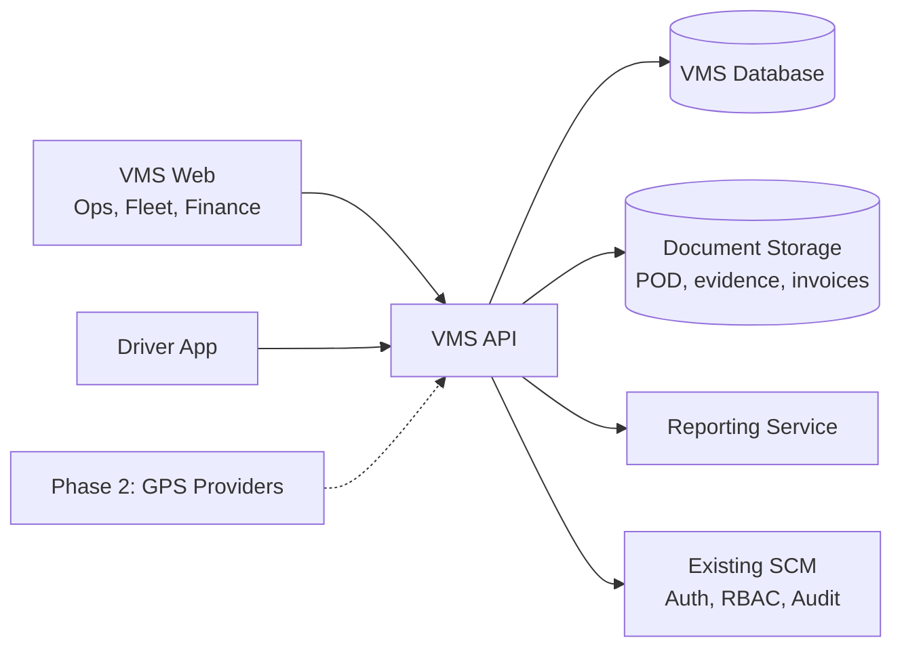

The web app serves back-office users; the driver app is a mobile-first client of the same API. GPS (dashed) is Phase 2 only.

**Reused existing VMS entities (Recommended Design: do not duplicate)**

| Entity | Used for |
| --- | --- |
| Vehicle | Trip vehicle, configuration vehicles, fuel card assignment |
| Driver (Business Partner with Driver role) | Trip driver, default driver |
| DriverVehicleAssignment | Default driver per vehicle |
| BusinessPartner | Fuel card company, expense vendor/workshop |
| VehicleTransaction | Optional roll-up of trip fuel/expense into vehicle financial history |

## 9. Actors and Roles

| Actor | Description | Main activities |
| --- | --- | --- |
| Admin | System administrator | All configuration, user and role management, overrides |
| Finance | Billing and collections staff | Customers, tax rules, templates, rates, invoices, payments, ledger, regeneration |
| Fleet Manager | Owns vehicles and drivers | Trip configurations, vehicle assignment, fuel cards, rates (if authorised), trip supervision |
| Operations | Dispatch and trip desk | Create fixed/open trips, assign drivers, log events, expenses, fuel |
| Driver | Vehicle driver using the app | Own trips only: status steps, fuel, expenses, POD, issues |
| Read Only | Management or auditors | View and report only |
| System | Background jobs | Ledger posting, evidence rendering, reminders, overlap checks |

The full permission matrix is in section 44.

## 10. Customer Management

**Business requirement.** Customers are billed for trips and must be a dedicated master, independent of Business Partner. A customer that is inactive cannot be used for new transactions but remains on all historical records.

**Functional behaviour**

- Create, view, edit, activate and deactivate customers. No physical delete once any child or transaction exists; a never-used Draft customer may be deleted by Admin only.
- Customer status: `Draft` → `Active` ↔ `Inactive`. A customer becomes Active only when the activation checklist passes (see workflow).
- Customer Code is unique across the tenant, case-insensitive, and immutable after the customer is referenced by a trip or invoice.
- Inactive customers are hidden from selection lists for trips, trip configurations, rates and invoice generation, but are visible in search with an `Inactive` badge and in all reports.
- Payment Terms drive the invoice Due Date (Invoice Date + terms days).

**User workflow**

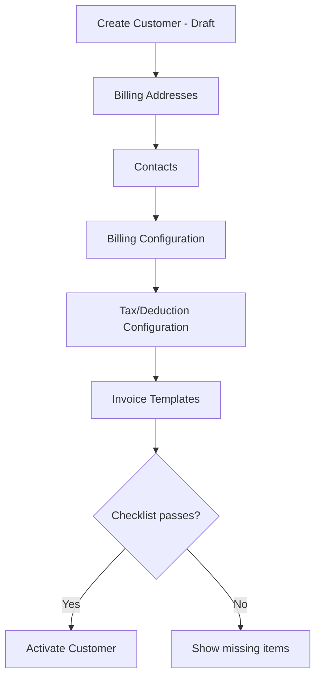

**Activation checklist (Recommended Design):** at least one active default billing address, at least one active contact, a billing configuration record, and at least one active invoice template. Tax rules are optional (a customer can have no deduction). Admin can activate with an override reason.

**Fields — Customer**

| Field | Type | Req | Validation / rule |
| --- | --- | --- | --- |
| CustomerId | bigint, PK | Sys | Identity |
| CustomerCode | varchar(20) | Y | Unique; A–Z, 0–9, hyphen; auto-suggest `CUS-00001`, editable before first use |
| CustomerName | nvarchar(200) | Y | Trimmed; duplicate name → warning only |
| ShortName | nvarchar(50) | N | Used on grids and evidence headers |
| AddressLine1 / AddressLine2 | nvarchar(200) | Y / N | Registered address |
| CountryId | int FK | Y | Default Pakistan |
| Province/State | nvarchar(100) | N |  |
| CityId | int FK City | N | Active city only for new records |
| PostalCode | varchar(20) | N |  |
| NTN | varchar(20) | N | National Tax Number; format validated if entered |
| STRN | varchar(30) | N | Sales Tax Registration No. |
| OtherRegistrationNo | nvarchar(50) | N |  |
| CurrencyCode | char(3) | Y | Default PKR |
| PaymentTermsDays | int | Y | 0–365; default 30 |
| CreditLimit | decimal(18,2) | N | Informational in Phase 1 (warning only) |
| Status | enum | Y | Draft / Active / Inactive |
| InactiveReason | nvarchar(500) | Cond | Required when set Inactive |
| Remarks | nvarchar(1000) | N |  |
| CreatedBy/On, ModifiedBy/On | audit | Sys | UTC |
| RowVersion | rowversion | Sys | Optimistic concurrency |

**Business rules**

- BR-C1: Customer is not a Business Partner and has no BusinessPartnerId.
- BR-C2: Deactivation is allowed with open trips or unpaid invoices, but the user sees a warning listing them. **Existing trips can still be completed and invoiced (Confirmed).**
- BR-C3: Customer default currency comes from the currency setup (section 13A); changing it is blocked once any invoice exists.

**Permissions:** View — all back-office roles; Create/Edit/Activate/Deactivate — Admin, Finance.

**Database/API impact:** `Customer` table; `/api/customers` endpoints (section 47).

**Audit:** create, every field change (old/new), status change with reason.

**Errors:** "Customer code already exists." · "Customer cannot be activated: add a default billing address." · "Currency cannot be changed after invoices exist."

**Edge cases:** inactive customer selected in a stale browser tab → server rejects with "Customer is inactive."; duplicate name different code → allowed with warning.

## 11. Customer Contacts

**Business requirement.** A customer has many contact persons; contacts are never stored as single fields on Customer.

**Functional behaviour:** Add, Edit, View, Deactivate from the Contacts tab of Customer Details. Deactivated contacts stay visible under a "Show inactive" toggle. One contact may be flagged `IsPrimary` and contacts can be tagged for purpose (Billing, Operations, POD) so invoices and statements know whom to address.

| Field | Type | Req | Validation |
| --- | --- | --- | --- |
| CustomerContactId | bigint PK | Sys |  |
| CustomerId | FK | Y |  |
| Name | nvarchar(150) | Y |  |
| Designation | nvarchar(100) | N |  |
| Mobile1 | varchar(20) | Y | Pakistan mobile pattern `03XXXXXXXXX` or E.164 `+92…` |
| Mobile2 | varchar(20) | N | Same pattern |
| Telephone | varchar(20) | N | Digits, +, -, spaces |
| Email | varchar(150) | N | RFC email format |
| AvailabilityTime | nvarchar(100) | N | Free text, e.g. "Mon–Sat 09:00–18:00" |
| Purpose | set: Billing/Operations/POD/Other | N | Multi-select |
| IsPrimary | bit | N | Max one active primary per customer |
| Status | Active/Inactive | Y |  |
| Audit fields |  | Sys |  |

**Rules:** at least one active contact for an Active customer (warning if the last one is deactivated). No physical delete.

**Permissions:** Admin, Finance edit; Fleet/Ops view.

**Acceptance:** Given a customer has 3 contacts, when one is deactivated, then it no longer appears in contact pickers and remains in the contact history.

## 12. Customer Billing Addresses

**Business requirement.** A customer can have multiple billing addresses. The address chosen for an invoice is snapshotted so later changes never alter old invoices.

| Field | Type | Req | Validation |
| --- | --- | --- | --- |
| CustomerBillingAddressId | bigint PK | Sys |  |
| CustomerId | FK | Y |  |
| AddressName | nvarchar(100) | Y | Unique per customer, e.g. "Head Office", "Plant 2" |
| AddressLine1 / Line2 | nvarchar(200) | Y / N |  |
| CityId, Province/State, CountryId, PostalCode |  | Y/N/Y/N |  |
| NTN / STRN | varchar | N | Overrides customer-level registration on invoice if present |
| IsDefault | bit | Y | Exactly one active default per customer |
| EffectiveFrom | date | Y |  |
| EffectiveTo | date | N | ≥ EffectiveFrom |
| Status | Active/Inactive | Y |  |
| Audit fields |  | Sys |  |

**Behaviour**

- Setting a new default automatically clears the previous default (same transaction, audited).
- At invoice generation the list shows addresses that are Active and effective on the Invoice Date. With one applicable address it is auto-selected; with several, the default is pre-selected and the user may change it.
- **Snapshot on invoice:** `BillToName, BillToLine1, BillToLine2, BillToCity, BillToProvince, BillToCountry, BillToPostalCode, BillToNTN, BillToSTRN, CustomerBillingAddressId`.
- Editing an address that has been used on an invoice is allowed (future invoices only); Recommended Design is to prompt "Create as new address version?" so the change is traceable.

**Errors:** "A valid billing address is required before generating the invoice." · "Only one default billing address is allowed."

**Edge cases:** no billing address → invoice generation blocked; address expired between search and create → server revalidates and rejects.

## 13. Customer Billing Configuration

**Business requirement.** Customer-specific billing behaviour must be configuration, not code. One configuration record per customer, effective-dated history kept.

| Setting | Type | Default | Effect |
| --- | --- | --- | --- |
| PaymentTermsDays | int | 30 | Due date on invoice |
| CurrencyCode | char(3) | Tenant base (PKR) | Default invoice currency; selectable only when tenant multi-currency is enabled (13A) |
| DefaultBillingAddressId | FK | — | Pre-selection |
| DefaultInvoiceTemplateId | FK | — | Pre-selection when several templates apply |
| InvoiceNumberPrefix | varchar(10) | INV | Optional customer-specific prefix (invoice number format still open, section 58) |
| PODRequired | bit | 0 | If 1, trips without an approved POD are not invoiceable (Confirmed) |
| EvidenceRequired | bit | 1 | Evidence generated on invoice generation |
| EvidencePageSize | int | 50 | Rows per evidence page (10–200) |
| DuplicateReferenceBehaviour | enum | Warn | Allow / Warn / Block for duplicate CustomerTripReference within customer |
| CustomerReferenceRequired | bit | 0 | If 1, trip cannot be completed without CustomerTripReference |
| StatementEmailContactId | FK | — | Contact for ledger statements |
| EffectiveFrom / EffectiveTo | date |  | History of configuration |

Invoice approval is **not required** (Confirmed): there is no approval setting and no Approved status. Overpayment is allowed for every customer with a confirmation (Confirmed), so there is no overpayment flag. Evidence uses one standard layout (section 41), so there is no evidence grouping or template setting.

**Rule:** the configuration values in force at invoice generation are snapshotted on the invoice where they affect the invoice (page size, grouping, POD rule applied).

**Permissions:** Admin, Finance.

## 13A. Currency Setup

**Business requirement (Confirmed).** A currency setup exists with **PKR as the default**. Multi-currency is a **tenant-level** setting. When it is enabled, users choose the currency when adding charges and when logging a trip amount. When it is disabled, everything is PKR and no currency field is shown.

**Currency master**

| Field | Type | Req | Rule |
| --- | --- | --- | --- |
| CurrencyCode | char(3) PK | Y | ISO 4217, e.g. PKR, USD, AED |
| CurrencyName | nvarchar(50) | Y |  |
| Symbol | nvarchar(5) | N | Rs, $ |
| DecimalPlaces | tinyint | Y | 2 (Confirmed: amounts to two decimals) |
| IsBase | bit | Y | Exactly one base currency per tenant; PKR seeded as base |
| Status | Active / Inactive | Y |  |

**Tenant currency setting**

| Setting | Default | Effect |
| --- | --- | --- |
| BaseCurrencyCode | PKR | Reporting currency for P&L, balances and dashboards |
| MultiCurrencyEnabled | Off | Off: all amounts PKR, currency fields hidden. On: currency dropdown shown on the fields below |

**Exchange rates (Recommended Design; needed only when multi-currency is on).** `ExchangeRate` (FromCurrency, ToCurrency = base, RateDate, Rate). Each foreign-currency transaction stores `CurrencyCode`, `ExchangeRate` and `BaseAmount` at entry so reports can total in PKR without recalculating history.

**Where currency is selected when multi-currency is on**

| Record | Currency field | Default |
| --- | --- | --- |
| Trip rate (fixed trips) | TripRate.CurrencyCode | Customer currency |
| Open trip amount | Trip.CurrencyCode | Customer currency |
| Fixed trip amount | Trip.CurrencyCode | Copied from the resolved rate (not editable) |
| Trip expense (charges) | TripExpense.CurrencyCode | Base currency |
| Trip fuel | TripFuel.CurrencyCode | Base currency |
| Trip income | TripIncome.CurrencyCode | Trip currency |
| Invoice | Invoice.CurrencyCode | Customer currency |
| Payment receipt / advance | CustomerReceipt.CurrencyCode | Invoice / customer currency |

**Rules**

- An invoice has one currency. Only trips (and billable income) in the invoice currency are eligible; trips in another currency are shown as Blocked with reason "Currency differs from invoice currency" (Recommended Design).
- Payments, advances, write-offs and discounts are in the invoice currency. The Customer Ledger is kept per customer per currency.
- Trip P&L converts expenses and fuel to the trip currency (or base currency, selectable on the report) using the stored exchange rates.
- The base currency cannot be changed after transactions exist. Turning multi-currency off is blocked while any non-base-currency transaction is open.

**Permissions:** Admin only (tenant setting, currency master, exchange rates); Finance may maintain exchange rates if granted.

## 14. Customer Tax / Deduction Configuration

**Business requirement.** Customers may have one or more tax/deduction rules. They are **deductions from the invoice amount** (e.g. withholding income tax, sales tax withholding, service charges retained by customer). They apply to the **whole invoice**, not per trip line.

| Field | Type | Req | Validation |
| --- | --- | --- | --- |
| CustomerTaxRuleId | bigint PK | Sys |  |
| CustomerId | FK | Y |  |
| TaxName | nvarchar(100) | Y | e.g. "Income Tax WHT" |
| TaxCode | varchar(20) | Y | e.g. WHT-236 |
| TaxType | enum | Y | Percentage / Fixed |
| TaxPercentage | decimal(9,4) | Cond | Required if Percentage; 0 < x ≤ 100 |
| FixedAmount | decimal(18,2) | Cond | Required if Fixed; > 0 |
| Applicable | bit | Y | If 0 the rule is recorded but not applied (still snapshotted as not applicable) |
| CalculationBasis | enum | Y | GrossTripAmount / InvoiceSubtotal (extensible lookup) |
| Sequence | int | Y | Order of application when several rules exist |
| EffectiveFrom | date | Y |  |
| EffectiveTo | date | N | ≥ EffectiveFrom |
| Status | Active / Inactive (inactive rules keep their effective range for history) | Y |  |
| SupersedesRuleId | FK self | N | Link to the rule it replaced |
| Remarks | nvarchar(500) | N |  |
| CreatedBy/On, LastUpdatedBy/On | audit | Sys | CreatedOn never changes |

**Calculation basis definitions (Recommended Design)**

- `GrossTripAmount` = sum of invoice line amounts (trips only, before adjustments).
- `InvoiceSubtotal` = trip amount + net adjustments (the Gross Invoice Amount).

**Replacement behaviour (Confirmed).** When a user adds a new rule with the **same tax name** (same TaxName, matched case-insensitively, and TaxCode) for the same customer, the system automatically sets the existing rule `EffectiveTo = new.EffectiveFrom − 1 day` and `Status = Inactive`, and links the new rule through `SupersedesRuleId`. The user sees a confirmation: "WHT 2% (effective 01-Jan-2026) will be set Inactive from 31-Aug-2026. Continue?" The old rule's CreatedOn is unchanged; LastUpdatedBy/On are set. Nothing is physically deleted, so the full history can be tracked.

**Overlap validation.** Automatic inactivation handles a new rule that starts after the current one. A new rule whose EffectiveFrom is on or before the current rule's EffectiveFrom, or that falls inside a closed historical range, is rejected: "The selected effective date range overlaps an existing tax/deduction rule for this tax name."

**Rule resolution at invoice (Confirmed: a rule is applied if it is active).** A rule applies to an invoice when it was active on the Invoice Date, i.e. `EffectiveFrom ≤ InvoiceDate ≤ EffectiveTo (or open)` and `Applicable = 1`. A rule later set Inactive by replacement still applies to invoices dated inside its old range, which keeps regenerated invoices consistent.

**Snapshot on invoice (InvoiceTaxLine):** RuleId, TaxName, TaxCode, TaxType, Rate or FixedAmount, CalculationBasis, TaxableAmount, DeductionAmount, Applicable, EffectiveFrom/To, Sequence.

**Multiple rules (Confirmed).** A customer can have several deductions active at once (e.g. income tax WHT and sales tax WHT). Each rule is computed independently on its own basis and the results are summed (Recommended Design: no compounding; Sequence controls display order).

**Rounding.** Each deduction rounded half-up to 2 decimals (Recommended Design).

**Permissions:** Admin, Finance.

## 15. Customer Invoice Templates

**Business requirement.** A customer can have several invoice formats. The invoice records exactly which template and version produced it.

| Field | Type | Req | Validation |
| --- | --- | --- | --- |
| CustomerInvoiceTemplateId | bigint PK | Sys |  |
| CustomerId | FK | Y |  |
| TemplateName | nvarchar(100) | Y | e.g. "Customer Detailed Format" |
| Version | int | Sys | Starts at 1; new version on every file/layout change |
| TemplateType | enum | Y | SystemStandard / HTMLPDF / DocumentTemplate / ReportDefinition |
| TemplateReference | varchar(500) | Y | Storage key of template file or report id |
| EffectiveFrom / EffectiveTo | date | Y / N |  |
| IsDefault | bit | N | One default per customer |
| Status | Draft / Active / Inactive | Y |  |
| Audit fields |  | Sys |  |

**Selection behaviour**

- Applicable = Active and effective on the Invoice Date.
- Exactly one applicable → selected automatically, shown read-only.
- Several applicable → mandatory dropdown `Invoice Format *`, default pre-selected.
- None applicable → block: "No active invoice format is configured for this customer."
- Invoice stores `CustomerInvoiceTemplateId` and `TemplateVersion`. Re-printing an old invoice uses that version even if newer versions exist.

**Template mechanism.** The final rendering mechanism is **not fixed now**. Phase 1 ships a `SystemStandard` template (HTML → PDF) so invoicing works. When customer sample invoices/proformas and addenda are provided, the team will analyse them and choose per customer between report rendering, HTML/PDF template, document template or configurable report (**Client Confirmation Required**).

**Edge cases:** expired template → not applicable for new invoices, still used for reprint; template changed after invoice → old invoice unaffected.

## 16. City Management

**Business requirement.** A city master with unique abbreviations is used by routes, trip configurations, open trips and addresses. The UI always displays `CityName (ABBR)`, e.g. `Lahore (LHR)`.

| Field | Type | Req | Validation |
| --- | --- | --- | --- |
| CityId | int PK | Sys |  |
| CityName | nvarchar(100) | Y | Unique within Country + Province |
| Abbreviation | varchar(5) | Y | Unique (global), 2–5 upper-case letters |
| CountryId | FK | Y |  |
| Province/State | nvarchar(100) | N |  |
| Status | Active / Inactive | Y |  |
| Audit fields |  | Sys |  |

**Seed data:** Lahore LHR, Islamabad ISL, Faisalabad FSD, Sheikhupura SKP, Multan MUL, Karachi KHI, Dera Ghazi Khan DGK.

**Rules:** inactive cities cannot be used on new routes, configurations or open trips; existing records keep showing them. Abbreviation is immutable once used in a Route or TripCode (Recommended Design), since codes such as RT-LHR-FSD embed it.

**Permissions:** Admin, Fleet Manager edit; all view.

**Errors:** "City abbreviation already exists." · "Inactive city cannot be used for new routes."

## 17. Route Management

**Business requirement.** A route is a general, customer-independent corridor with ordered stops, e.g. `RT-LHR-FSD`: LHR → SKP → FSD.

**Route fields**

| Field | Type | Req | Validation |
| --- | --- | --- | --- |
| RouteId | int PK | Sys |  |
| RouteCode | varchar(30) | Y | Unique; suggested `RT-{OriginAbbr}-{DestAbbr}`, suffix `-2` if taken |
| RouteName | nvarchar(150) | Y | e.g. "Lahore – Faisalabad via Sheikhupura" |
| OriginCityId | FK | Y | = first stop |
| DestinationCityId | FK | Y | = last stop; ≠ origin unless IsRoundTrip |
| IsRoundTrip | bit | N |  |
| DistanceKm | decimal(9,2) | N | > 0 |
| StandardDurationMin | int | N | > 0 |
| Status | Active / Inactive | Y |  |
| Remarks, audit fields |  |  |  |

**RouteStop fields:** RouteStopId, RouteId, CityId, Sequence (1..n, unique per route, no gaps), StopType (Origin / Pickup / Via / Delivery / Destination), PlannedDurationMin, Remarks.

**Rules**

- At least 2 stops; Sequence 1 = Origin, last = Destination; origin/destination on the header are derived from stops.
- Stops can be reordered by drag-and-drop until the route is used by a trip configuration; afterwards changes create a new route (Recommended Design) so configurations are not silently altered.
- Inactive routes cannot be used in new trip configurations.

**Permissions:** Admin, Fleet Manager.

## 18. Trip Configuration (Customer-Specific)

**Business requirement.** Fixed trip configurations belong to one customer. There is no global fixed trip reused across customers; two customers on the same physical route have independent configurations, vehicles and rates.

```text
Customer ABC                    Customer XYZ
  ├─ ABC-LHR-FSD-01               ├─ XYZ-LHR-FSD-01
  ├─ ABC-LHR-FSD-RT               └─ XYZ-LHR-DGK-01
  └─ ABC-LHR-MUL-01
```

**TripConfiguration fields**

| Field | Type | Req | Validation |
| --- | --- | --- | --- |
| TripConfigurationId | bigint PK | Sys |  |
| CustomerId | FK Customer | Y | Active customer |
| TripCode | varchar(40) | Y | Unique per customer; suggested `{CustShort}-{Orig}-{Dest}-{nn}` |
| Name | nvarchar(150) | Y |  |
| RouteId | FK Route | Y | Active route |
| DirectionType | enum | Y | OneWay / Return / RoundTrip |
| Status | Draft / Active / Inactive | Y | Active needs ≥ 1 active vehicle and ≥ 1 rate (warning if no rate) |
| Remarks, audit fields, RowVersion |  |  |  |

**TripConfigurationStop:** TripConfigurationStopId, TripConfigurationId, CityId (or OtherLocation text), Sequence, StopType. On creation stops are copied from the Route and can then be adjusted for this customer (e.g. an extra customer site). Changes after trips exist affect only new trips; trips copy stops to `TripStop`.

**Behaviour**

- Configuration list is always filtered by Customer first. Selecting Customer A never shows Customer B's configurations.
- "Copy configuration" creates a new configuration for the same or another customer with stops and vehicles (rates are **not** copied unless the user ticks "Copy rates", Recommended Design).
- Deactivation blocks new trips; existing trips and invoices unaffected.

**Permissions:** Admin, Fleet Manager create/edit; Operations, Finance view.

**Errors:** "Trip code already exists for this customer." · "Customer is inactive."

**Acceptance:** Given Customer A and B both use RT-LHR-FSD, when the user selects Customer A on the trip screen, then only Customer A's configurations are listed.

## 19. Vehicle Assignment (Configuration Vehicles)

**Business requirement.** A trip configuration has many allowed vehicles. Vehicles are never stored as one VehicleId on the configuration.

| Field | Type | Req | Validation |
| --- | --- | --- | --- |
| TripConfigurationVehicleId | bigint PK | Sys |  |
| TripConfigurationId | FK | Y |  |
| VehicleId | FK Vehicle (existing) | Y | Vehicle must be operational (not sold/disposed/under-repair-blocked per vehicle lifecycle) |
| EffectiveFrom | date | Y |  |
| EffectiveTo | date | N | ≥ EffectiveFrom |
| Status | Active / Inactive | Y |  |
| Remarks, audit fields |  |  |  |

**Rules**

- Same vehicle cannot have overlapping effective ranges within one configuration.
- The same vehicle may be allowed on several configurations and several customers.
- On fixed trip entry the vehicle dropdown lists vehicles allowed on the selected configuration and effective on the Trip Date.
- Vehicle categories from the existing VMS (self-owned, shared, rented, customer arrangement, bank leased) are displayed as a badge; no category is excluded by default.

**Edge case:** vehicle removed from configuration after trips exist → existing trips unaffected; editing such a trip's vehicle requires choosing a currently allowed vehicle or an Admin override with reason.

## 20. Driver Assignment

**Business requirement.** A vehicle may have a default driver (from existing `DriverVehicleAssignment`). On fixed or open trip entry, selecting the vehicle auto-populates the driver. Authorised users may override.

**Behaviour**

1. User selects Vehicle.
2. System looks up the active default driver for the vehicle on the Trip Date and fills Driver.
3. If none exists, Driver is empty and required before the trip moves to `Assigned`.
4. If the user changes Driver, the system stores `DefaultDriverId` (what was proposed), `DriverId` (actual), `IsDriverOverridden = 1`, `DriverOverrideReason` (optional text, Recommended Design: required), and audits the change.

**Rules:** Driver must be an Active Business Partner with the Driver role. No availability/clash checking in Phase 1 (by requirement); a soft warning is shown if the same driver has another trip in `Started`/`In Transit` status (Recommended Design).

**Permissions:** override — Admin, Fleet Manager, Operations (with `Trip.OverrideDriver`).

**Acceptance:** Given ABC-123 has default driver Ali, when a trip is created with ABC-123, then Driver = Ali; when the user changes it to Bilal, then the trip stores Bilal, DefaultDriverId = Ali and IsDriverOverridden = true.

## 21. Fixed Trips

**Business requirement.** A fixed trip is created from a customer-specific trip configuration; its amount comes from the effective-dated rate for the trip date and is snapshotted.

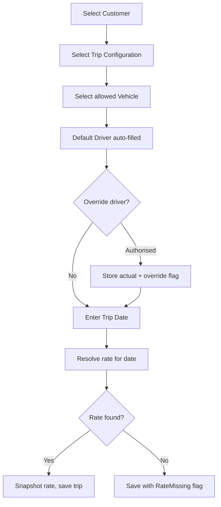

The entry order is Customer → Configuration → Vehicle → Driver → Date → Rate. When no rate exists, the trip can still be saved and executed, flagged `RateMissing`; it cannot be invoiced until a rate is configured and the trip rate is resolved (section 26).

**Fixed trip fields**

| Field | Type | Req | Rule |
| --- | --- | --- | --- |
| TripId | bigint PK | Sys |  |
| TripNumber | varchar(20) | Sys | `TRP-YYYY-NNNNNN`, unique, sequence per year |
| TripType | enum | Sys | Fixed |
| CustomerId | FK | Y | Active customer |
| CustomerTripReference | nvarchar(50) | Cond | Required if customer config `CustomerReferenceRequired`; duplicate behaviour per config |
| TripConfigurationId | FK | Y | Belongs to CustomerId, Active |
| RouteId | FK | Sys | Copied from configuration |
| VehicleId | FK | Y | Allowed on configuration on TripDate |
| DefaultDriverId / DriverId / IsDriverOverridden / DriverOverrideReason |  | Y (DriverId before Assigned) | Section 20 |
| TripDate | date | Y | Drives rate resolution and billing period |
| PlannedStart | datetime (UTC) | N |  |
| ActualStart / ActualEnd | datetime (UTC) | Cond | Set by Started / Completed events; End ≥ Start |
| StartOdometer / EndOdometer | decimal(10,1) | Cond | End ≥ Start; Start ≥ vehicle last known odometer (warning) |
| TripRateId / TripRateAmount / RateEffectiveFrom / RateEffectiveTo / RateSource |  | Sys | Rate snapshot; RateSource = Configured / Manual / Missing |
| TripAmount | decimal(18,2) | Sys | = TripRateAmount for fixed trips |
| RateMissing | bit | Sys | 1 when no rate resolved |
| Status | enum | Sys | Lifecycle (section 24) |
| IsActive | bit | Sys | Default 1; see section 24 |
| InvoiceId (current active) | FK | Sys | Set when invoiced; via InvoiceLine |
| Remarks, audit fields, RowVersion |  |  |  |

**Permissions:** create — Admin, Fleet, Operations; **Driver from the app (Confirmed)** for trips on their own assigned vehicle (section 43). Driver-created trips start as `Draft` with `Source = DriverApp` and are released to `Assigned` by Operations/Fleet review (Recommended Design). The rate still resolves automatically, but the driver never sees it.

## 22. Open Trips

**Business requirement.** Open trips have no configuration or rate master. From, To and Trip Amount are entered manually.

| Field | Type | Req | Rule |
| --- | --- | --- | --- |
| TripType | enum | Sys | Open |
| CustomerId | FK | Y | Active |
| CustomerTripReference | nvarchar(50) | Cond | As fixed |
| FromLocationType / FromCityId / FromOtherLocation |  | Y | City (preferred) or Other Location |
| ToLocationType / ToCityId / ToOtherLocation |  | Y | Same; From ≠ To unless round trip |
| Intermediate stops | TripStop rows | N | Ordered; City or Other |
| VehicleId | FK | Y | Any operational vehicle |
| DriverId | FK | Y | Default driver auto-filled |
| TripAmount | decimal(18,2) | Y | > 0; RateSource = Manual |
| TripDate, Start/End, Odometers, Remarks |  |  | As fixed |

**Other Location** captures a type (Warehouse, Factory, Customer Site, Depot, Terminal, Construction Site, Other), a name and an optional nearest City. Recommended Design: a reusable `Location` lookup per customer so repeated sites are not retyped.

**Rules:** RouteId is null; the route label on invoices is built from stops, e.g. `LHR → DGK`. Changing TripAmount after the trip is invoiced is blocked; before invoicing it is allowed with `Trip.EditAmount` permission and audited.

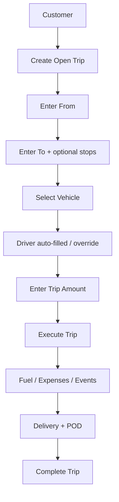

## 23. Trip Logging

**Customer Trip Reference.** Stored on Trip and copied to InvoiceLine. Duplicate check: same reference and same customer → behaviour from billing configuration (default **Warn**: "This customer reference is already used on TRP-2026-000123. Continue?"); same reference on a different customer → allowed. Comparison is case-insensitive and trimmed.

**Logging channels**

| Channel | Who | What |
| --- | --- | --- |
| Web – Trip Desk | Operations, Fleet | Create trips, assign, log events, fuel, expenses, documents |
| Driver App | Driver | Status steps, fuel, expenses, issues, POD, documents for own trips |
| Bulk import (Recommended Design) | Operations | Excel import of historical/backlog fixed trips with validation report |
| System | Jobs | Rate re-resolution, auto events |

**Trip documents:** POD, loading slip, gate pass, challan, photos. Each has DocumentType, file, uploaded by/on, source. PODs have `PODStatus` = Pending / Uploaded / Approved / Rejected (approval by Operations when the customer requires POD).

**Trip issues:** Breakdown, Accident, Delay, Customer Hold, Route Blocked, Other; with severity, description, photo, resolved flag. An issue can put the trip `On Hold`.

## 24. Trip Lifecycle

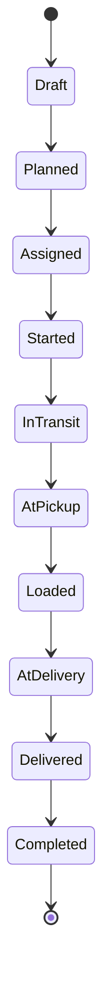

The main path is linear. On Hold and Cancelled are side states defined in the transition table.

| From | Allowed to | Who | Conditions |
| --- | --- | --- | --- |
| Draft | Planned, Cancelled | Ops, Fleet, Admin | Customer, date, vehicle set |
| Planned | Assigned, On Hold, Cancelled | Ops, Fleet, Admin | Driver set |
| Assigned | Started, On Hold, Cancelled | Driver (own), Ops, Fleet, Admin | Start odometer captured |
| Started | In Transit, At Pickup, On Hold | Driver, Ops, Fleet |  |
| In Transit | At Pickup, At Delivery, On Hold | Driver, Ops, Fleet | Multi-stop trips may cycle In Transit ↔ At Pickup/At Delivery |
| At Pickup | Loaded, On Hold | Driver, Ops |  |
| Loaded | In Transit, At Delivery, On Hold | Driver, Ops |  |
| At Delivery | Delivered, On Hold | Driver, Ops |  |
| Delivered | Completed, On Hold | Driver (if POD uploaded), Ops, Fleet | End odometer; POD if customer requires |
| On Hold | Status held before hold, Cancelled | Ops, Fleet, Admin | Hold reason required; resume returns to previous status |
| Completed | Delivered (reopen) | Admin, Fleet with `Trip.Reopen` | Only if not on an active invoice |
| Cancelled | — | — | Terminal. Reason required. Cancel after Started requires Fleet/Admin |

**Rules**

- Status changes are only through transition actions (never free edit of Status). Skipping steps (e.g. Assigned → Delivered) is allowed only for back-office users with `Trip.SkipStatus`, recorded as system events for skipped steps (Recommended Design: supports back-dated trip entry).
- Only **Completed**, **Active** trips are invoiceable. Cancelled trips are never invoiceable. On transition to Completed the system stores CompletionDate (the ActualEnd date in the tenant's business time zone), which decides the billing period (section 32.1).

**Trip Active / Inactive.** `IsActive` is independent of status. Inactivating needs a reason and `Trip.Inactivate`. Inactive trips are excluded from invoice search. If the trip is already on an invoice, inactivation is allowed but the invoice line is untouched (Recommended Design: warn "This trip is on active invoice INV-…. The invoice will not change. Regenerate the invoice to remove it."). Reactivation is allowed if the trip is not on another active invoice.

## 25. Trip Events

**Business requirement.** Every operational step is an event, forming the trip timeline, e.g. `08:00 Start LHR · 09:15 Pickup SKP · 09:45 Loading Complete · 10:00 In Transit · 14:20 Delivery FSD · 14:50 Delivered`.

| Field | Type | Req | Rule |
| --- | --- | --- | --- |
| TripEventId | bigint PK | Sys |  |
| TripId | FK | Y |  |
| EventType | enum | Y | Created, Planned, Assigned, Started, InTransit, ArrivedPickup, LoadingComplete, ArrivedDelivery, Delivered, PODUploaded, Completed, OnHold, Resumed, Cancelled, Fuel, Expense, Issue, Note, StatusSkipped |
| EventDateTime | datetime UTC | Y | ≤ now + 10 min; ≥ trip ActualStart for in-trip events |
| CityId / LocationText / Lat / Long |  | N | Lat/Long captured by app if permission granted (not GPS tracking) |
| Odometer | decimal | N | Non-decreasing along the trip (warning) |
| UserId | FK | Sys |  |
| Remarks | nvarchar(500) | N |  |
| AttachmentId | FK Document | N |  |
| Source | enum | Y | Manual / DriverApp / GPS / System |
| ClientEventId | uniqueidentifier | N | Idempotency for offline app sync |

**Rules:** status transitions create events automatically. Events are append-only; corrections are made by a new `Note`/correction event and an audited edit of time by Ops (original preserved in audit). GPS source is reserved for Phase 2.

## 26. Trip Rate Management

**Business requirement.** Rates are specific to Customer + Trip Configuration + effective date range, can last a single day, and must never overlap.

| Field | Type | Req | Rule |
| --- | --- | --- | --- |
| TripRateId | bigint PK | Sys |  |
| CustomerId | FK | Y | Must equal configuration's customer |
| TripConfigurationId | FK | Y |  |
| EffectiveFrom | date | Y |  |
| EffectiveTo | date | N | ≥ EffectiveFrom. **Blank = open-ended**: the rate runs until the day before the next rate's start date (Confirmed) |
| RateAmount | decimal(18,2) | Y | > 0; two decimals |
| CurrencyCode | char(3) | Y | Customer currency; selectable when multi-currency is on (13A) |
| Status | Active / Inactive | Y | Inactive rates are ignored and free their range |
| Remarks, audit fields, RowVersion |  |  |  |

**Example (one-day rate)**

| Customer | Configuration | From | To | Rate (PKR) |
| --- | --- | --- | --- | --- |
| ABC | ABC-LHR-FSD-01 | 01-Jul | 10-Jul | 25,000 |
| ABC | ABC-LHR-FSD-01 | 11-Jul | 11-Jul | 28,000 |
| ABC | ABC-LHR-FSD-01 | 12-Jul | 31-Jul | 25,000 |

**Open-ended rates (Confirmed).** A rate saved without EffectiveTo stays in force until a later rate starts. When a new rate is added with EffectiveFrom after the open-ended rate's start, the system automatically closes the open-ended rate at `new.EffectiveFrom − 1 day` (audited, shown in a confirmation). At most one open-ended Active rate may exist per customer + configuration.

**Overlap validation.** For the same CustomerId + TripConfigurationId among Active rates, treating a blank EffectiveTo as open: reject when `new.From ≤ existing.To AND new.To ≥ existing.From`, except for the automatic close of an open-ended rate described above. Message: "The selected effective date range overlaps an existing rate configuration." Enforced in the service layer and by a DB check inside a serializable transaction (SQL Server has no exclusion constraint).

**Example (open-ended then new rate).** 01-Jul → (open) 25,000. On 20-Jul the user adds 16-Aug → (open) 27,000. The first rate becomes 01-Jul → 15-Aug; trips on 16-Aug onwards resolve 27,000.

**Split helper (Recommended Design).** "Insert one-day rate" on the rate grid splits an existing range into three rows in one transaction (as in the example), each audited.

**Rate resolution for a fixed trip**

1. Take Customer, Trip Configuration and Trip Date.
2. Find the single Active rate (blank EffectiveTo treated as open) where `EffectiveFrom ≤ TripDate ≤ EffectiveTo`.
3. Found → snapshot TripRateId, RateAmount, EffectiveFrom, EffectiveTo, RateSource = Configured; TripAmount = RateAmount.
4. Not found → RateMissing = 1, TripAmount null, RateSource = Missing. **Never** fall back to previous, next, average or zero rate.

**Rate snapshot.** The trip keeps its snapshot even if the rate row is edited later. Example: trip on 20-Jul resolved 27,000; the rate is later changed to 30,000; the trip stays 27,000.

**When is a trip rate re-resolved?** Only by explicit action:

- Automatically when a trip's TripDate, configuration or customer is changed **before** invoicing.
- "Resolve missing rates" action (Finance/Fleet) re-resolves trips with RateMissing = 1.
- "Re-price trips" action (Finance, `Rate.Reprice` permission) re-resolves selected uninvoiced trips after a rate correction, with a preview of old vs new amount and a reason. Trips on an active invoice are excluded; they change only through invoice regeneration (section 38).

**Rate editing rules:** a rate row used by any trip snapshot may have Remarks edited freely; amount/date edits are allowed but show the count of trips that hold the old snapshot and state they will not change (Recommended Design: prefer inactivate + new row).

**Permissions:** Admin, Finance; Fleet Manager only with `Rate.Configure` granted.

## 27. Fuel Management

**Business requirement.** Fuel fills are recorded against a trip (and always the vehicle), paid by cash, fuel card or other.

| Field | Type | Req | Rule |
| --- | --- | --- | --- |
| TripFuelId | bigint PK | Sys |  |
| TripId | FK | Y\* | \*Required in trip context; Recommended Design allows vehicle-only fuel (TripId null) for depot fills |
| VehicleId | FK | Y | Defaults to trip vehicle; must match trip vehicle when TripId set |
| FuelDateTime | datetime UTC | Y | Within trip window ± 24 h (warning outside) |
| FuelType | enum | Y | Diesel / Petrol / CNG / Other |
| Quantity (litres) | decimal(10,3) | Y | > 0 |
| Rate (per litre) | decimal(10,2) | Y | > 0 |
| Amount | decimal(18,2) | Y | Default Quantity × Rate; editable; if differs by > 1 PKR from Qty × Rate show warning |
| Odometer | decimal(10,1) | N | ≥ previous fuel odometer for vehicle (warning) |
| StationName / CityId |  | N |  |
| PaymentMethod | enum | Y | Cash / FuelCard / Other |
| FuelCardId | FK | Cond | **Mandatory when PaymentMethod = FuelCard**; card must be Active, not expired, assigned to the vehicle (or driver) on that date |
| OtherPaymentText | nvarchar(100) | Cond | Required when Other |
| Receipt attachment | FK Document | N | Recommended mandatory from the Driver App |
| Remarks, CreatedBy/On, Source (Web/DriverApp) |  |  |  |

**Rules:** fuel entries after the trip is invoiced are allowed (cost side does not change the invoice). Fuel efficiency (km/litre) is derived per trip where odometers exist. Optionally mirrored to `VehicleTransaction` for vehicle-level financial history (Recommended Design).

**Errors:** "Fuel card is required when payment method is Fuel Card." · "Selected fuel card is expired or inactive."

## 28. Fuel Card Management

| Field | Type | Req | Rule |
| --- | --- | --- | --- |
| FuelCardId | int PK | Sys |  |
| CardNumber | varchar(30) | Y | Unique; displayed masked except last 4 digits |
| FuelCardCompanyId | FK BusinessPartner (Fuel Card Company role) | Y |  |
| VehicleId | FK | N | Current assignment (derived from FuelCardAssignment) |
| DriverId | FK | N | If card is driver-held |
| CardHolderName | nvarchar(100) | N |  |
| ExpiryDate | date | Y |  |
| MonthlyLimit | decimal(18,2) | N | Informational |
| Status | Active / Inactive / Expired / Blocked | Y | Expired set by nightly job when ExpiryDate < today |
| Remarks, audit fields |  |  |  |

**FuelCardAssignment:** FuelCardAssignmentId, FuelCardId, VehicleId, DriverId, AssignedFrom, AssignedTo, Reason. Supports assignment, reassignment (closes the current row, opens a new one), inactivation and expiry. No overlapping assignments per card.

**Reminders:** card expiring in 30 days uses the existing configurable reminder engine.

**Permissions:** Admin, Fleet Manager, Finance.

## 29. Trip Expense Management

**Business requirement.** A trip can have many expenses of configurable types.

**Initial expense types (lookup, extensible):** Fuel (use Fuel screen; shown here read-only), Toll Tax, Traffic Challan, Vehicle Service, Tyre Air Check, Parking, Loading/Unloading, Driver Expense, Repair, Other.

| Field | Type | Req | Rule |
| --- | --- | --- | --- |
| TripExpenseId | bigint PK | Sys |  |
| TripId | FK | Y |  |
| ExpenseDate | datetime UTC | Y |  |
| ExpenseTypeId | FK lookup | Y |  |
| OtherExpenseType | nvarchar(100) | Cond | **Required when type = Other** |
| Description | nvarchar(300) | N |  |
| Quantity / Rate | decimal | N | If both given, Amount defaults to Qty × Rate |
| Amount | decimal(18,2) | Y | > 0 |
| Reference | nvarchar(50) | N | Challan no., toll receipt no. |
| BusinessPartnerId | FK | N | Workshop/vendor where applicable |
| PaymentMethod | enum | Y | Cash / Card / Bank / Paid by Driver / Other |
| Attachment | FK Document | N |  |
| ApprovalStatus | Pending / Approved / Rejected | Sys | Driver-app expenses start Pending (Recommended Design); approved by Ops/Fleet |
| Source, CreatedBy/On, RowVersion |  |  |  |

**Rules:** rejected expenses stay visible but excluded from P&L. Expenses are never physically deleted; mistaken entries are Voided with reason.

**Errors:** "Please specify the other expense type."

## 30. Trip Income

The primary revenue of a trip is its **TripAmount**. Trip Income records **additional** operational revenue attached to a trip, e.g. detention charges, extra drop, loading charge recovered.

| Field | Type | Req | Rule |
| --- | --- | --- | --- |
| TripIncomeId | bigint PK | Sys |  |
| TripId | FK | Y |  |
| CustomerId | FK | Y | Defaults to trip customer |
| IncomeType | lookup | Y | Detention / Extra Drop / Loading Recovery / Other |
| Amount | decimal(18,2) | Y | > 0 |
| CurrencyCode | char(3) | Y | Trip currency; selectable when multi-currency is on (13A) |
| IncomeDate | date | Y |  |
| IsBillable | bit | Y | If 1, included on the trip's invoice as an extra line with `LineType = Income` (Confirmed) |
| InvoiceLineId | FK | Sys | Set when billed; a billed income row cannot be edited |
| Reference, Remarks, audit fields |  |  |  |

## 31. Trip Operational P&L

**Formula**

```latex
\text{Trip P\&L} = (\text{TripAmount} + \text{Approved Trip Income}) - (\text{Fuel} + \text{Approved Trip Expenses})
```

**Example**

| Line | PKR |
| --- | --- |
| Revenue (TripAmount) | 80,000 |
| Fuel | −15,000 |
| Toll | −3,000 |
| Parking | −1,000 |
| Driver Expense | −2,000 |
| **Operational P&L** | **59,000** |

**Rules**

- This is **operational** P&L, not accounting profit. Depreciation, lease installments, driver salary, insurance and overheads are excluded unless a later phase introduces allocation.
- Revenue basis option on reports: *Trip amount* (default) or *Invoiced amount* (the invoice line amount, which equals the snapshot).
- Trips with RateMissing show revenue as "Not priced" and are excluded from totals with a count shown.
- Tax/deductions are invoice-level and are **not** allocated to trips in P&L (Recommended Design; allocation pro-rata is a future option).
- Aggregations: by trip, vehicle, driver, customer, route/configuration, month.

## 32. Invoice Generation

**Business requirement.** Finance generates one invoice per customer for any arbitrary billing period (not tied to calendar months), containing any mix of vehicles, routes, configurations and trips.

**Inputs**

| Field | Type | Req | Rule |
| --- | --- | --- | --- |
| CustomerId | FK | Y | Active customer. "Customer is required." |
| PeriodFrom / PeriodTo | date | Y | From ≤ To; max span 366 days (Recommended Design) |
| InvoiceDate | date | Y | Default today; ≥ PeriodFrom (warning if before PeriodTo) |
| CustomerInvoiceTemplateId | FK | Cond | Auto if one applicable, required if several (section 15) |
| CustomerBillingAddressId | FK | Y | Auto/default (section 12) |
| Adjustments | 0..n rows | N | Section 32.3 |
| Remarks | nvarchar(1000) | N |  |

Period examples: 01-Aug → 31-Aug, 05-Aug → 25-Aug, 15-Aug → 14-Sep are all valid. An invoice must contain at least one trip; adjustment-only invoices are not allowed (Confirmed; an addendum on adjustments may follow).

### 32.1 Invoiceable trip search

A trip is **eligible** when all hold:

1. `Trip.CustomerId` = selected customer.
2. `PeriodFrom ≤ CompletionDate ≤ PeriodTo` — trips are billed by **completion date** (Confirmed). The rate is still resolved by Trip Date (section 26).
3. `Status = Completed` and `IsActive = 1`.
4. Not linked to any invoice that is active (`Invoice.IsActive = 1` and status not Cancelled/Inactive). Trips on an invoice being regenerated are treated as available **for that regeneration only**.
5. If customer `PODRequired = 1`: POD status Approved.
6. Has a valid amount: TripAmount not null and > 0 (fixed trips: RateMissing = 0).
7. Trip currency = invoice currency (only relevant when multi-currency is on).

Billable trip income (section 30) of an eligible trip is added automatically as extra lines under that trip.

The search returns every trip for the customer and period with a category, so the user sees why a trip is not available:

| Summary tile | Meaning |
| --- | --- |
| Completed Trips | Completed + active trips in period |
| Already Invoiced | Linked to an active invoice (number shown) |
| Blocked | Missing rate, missing POD, inactive, not completed (with reason column) |
| Available Trips | Eligible |
| Selected Trips | Currently ticked |
| Selected Amount | Sum of ticked TripAmount |

Grid columns: select, Trip No, Trip Date, Customer Ref, Type, Configuration, Route, Vehicle, Driver, Amount, POD, Status/Reason. Select all, Deselect all and individual selection are available; grouping by vehicle can be toggled.

### 32.2 Missing trip amount — hard stop

If any trip in the period that is otherwise eligible (completed, active, not invoiced) has no valid amount, **the invoice is not created** and an error is shown at invoice creation (Confirmed). The user cannot bypass this by deselecting the unpriced trip. Message:

> Invoice cannot be generated. Trip amount is not configured for the selected date range.

Followed by the affected list:

| Trip | Date | Route | Configuration | Error |
| --- | --- | --- | --- | --- |
| TRP-2026-000057 | 15-Jul | LHR-FSD | ABC-LHR-FSD-01 | Amount not configured |

A "Go to rates" link opens the rate screen filtered to that configuration; after fixing, the user runs "Resolve missing rates" and retries. No fallback to previous, next, average or zero rate.

### 32.3 Invoice adjustments (past closed months)

Adjustments carry exceptional corrections for closed periods without touching the old invoice.

| Field | Type | Req | Rule |
| --- | --- | --- | --- |
| InvoiceAdjustmentId | bigint PK | Sys |  |
| InvoiceId | FK | Sys |  |
| AdjustmentMonth | nvarchar(30) | Y | **Free text**, e.g. "August 2026" |
| AdjustmentAmount | decimal(18,2) | Y | Non-zero; positive or negative |
| AdjustmentNote | nvarchar(500) | Y | Reason |
| ReferenceInvoiceNo | varchar(30) | N | Optional link text to the original invoice |
| Sequence, audit fields |  |  |  |

Multiple adjustment rows are allowed (Recommended Design; the UI shows one row by default). Examples: `August 2026, +20,000, Rate difference for August trips`; `July 2026, −15,000, Previous overbilling adjustment`. Permission `Invoice.Adjust`.

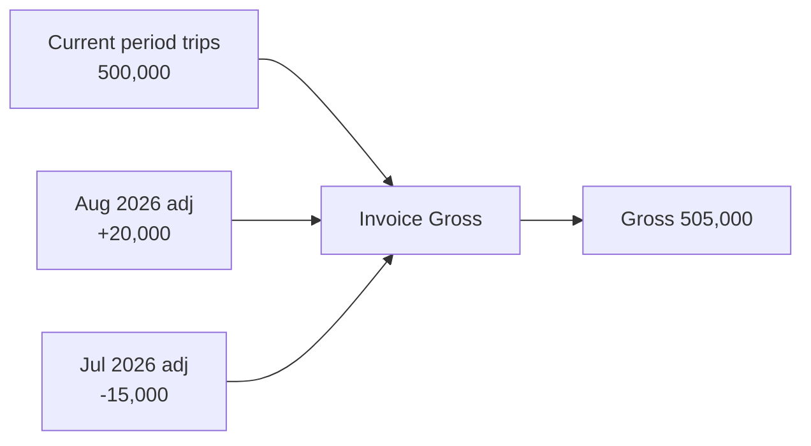

Positive and negative adjustments are summed with trip amounts into the gross; the closed-month invoices are not changed.

### 32.4 Generation workflow

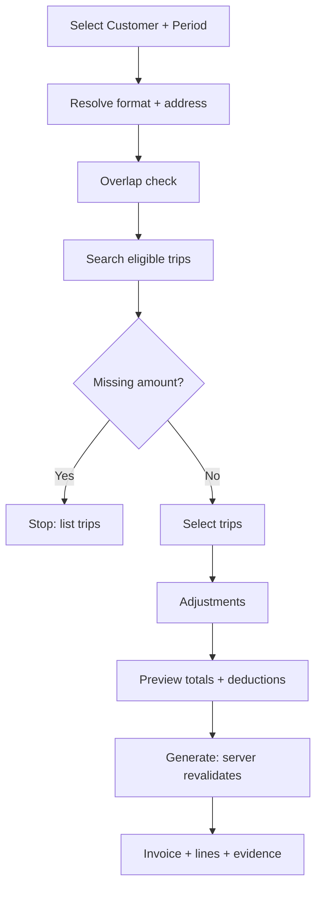

On **Generate** the server repeats every validation inside one transaction (section 52), creates the invoice in status `Generated` (or `Draft` if the user chose "Save as draft"), lines, adjustment rows, tax lines, links trips, and queues evidence rendering. Invoice numbering: `INV-YYYY-NNNNN` from a DB sequence, gap-free not guaranteed (**Client Confirmation Required**: numbering format, per-customer prefix, fiscal-year reset).

**Permissions:** Admin, Finance (`Invoice.Generate`).

## 33. Invoice Line Items

Each selected trip becomes one `InvoiceLine`, a full snapshot.

| Field | Type | Source (snapshot) |
| --- | --- | --- |
| InvoiceLineId | bigint PK |  |
| InvoiceId | FK |  |
| LineNo | int | Order: Vehicle, TripDate, TripNumber |
| TripId | FK | Link kept for traceability |
| TripNumber, TripDate, TripType |  | Trip |
| CustomerTripReference |  | Trip |
| RouteId, RouteCode, RouteLabel |  | Route / trip stops, e.g. "LHR → SKP → FSD" |
| TripConfigurationId, TripCode |  | Configuration |
| VehicleId, VehicleRegNo |  | Vehicle registration at invoice time |
| DriverId, DriverName |  | Driver |
| Description |  | Default "{TripCode} {RouteLabel}" or "Open trip {From}→{To}" |
| Quantity | decimal | 1 (per trip) |
| Rate | decimal(18,2) | TripRateAmount / manual amount |
| Amount | decimal(18,2) | Quantity × Rate |
| TripRateId, RateEffectiveFrom/To, RateSource |  | Trip rate snapshot |
| CustomerId, CustomerCode, CustomerName |  | Redundant snapshot for reporting |

**Integrity:** line is immutable after the invoice leaves Draft. Changes to customer, vehicle registration, driver, route, configuration or rate never update existing lines. A filtered unique index guarantees a trip sits on at most one active invoice (section 46).

Optional billable Trip Income lines (section 30) appear as `LineType = Income` lines when enabled.

## 34. Customer-specific Invoice Templates (rendering)

- The invoice PDF is rendered from the template/version stored on the invoice, using only invoice snapshot data (header, bill-to snapshot, lines, adjustments, tax lines, totals, payments summary optional).
- Rendered invoice PDFs are stored as `InvoiceDocument` (type InvoicePDF, version, hash). Re-print returns the stored file; "Re-render" is Admin-only and creates a new document version without altering data.
- Phase 1 standard layout: company header, invoice no./date/due date/period, bill-to, customer NTN/STRN, line table grouped by vehicle, subtotal, adjustments, gross, each deduction, net, amount in words (PKR), bank details, signature block.
- Final per-customer layouts follow the sample documents to be provided (**Client Confirmation Required**).

## 35. Tax / Deduction Calculation

Deductions apply to the whole invoice.

```latex
\begin{aligned}
\text{Gross} &= \sum \text{Line Amounts} + \sum \text{Adjustments} \\
\text{Deduction}_i &= \text{Basis}_i \times \text{Rate}_i \;\; (\text{or FixedAmount}_i) \\
\text{Net} &= \text{Gross} - \sum \text{Deduction}_i \\
\text{Balance} &= \text{Net} - \text{Payments applied} - \text{Payments transferred in}
\end{aligned}
```

**Worked example**

| Line | PKR |
| --- | --- |
| Trip amounts | 500,000 |
| Adjustments | +20,000 |
| **Gross invoice amount** | **520,000** |
| Tax/deduction (2% of InvoiceSubtotal) | −10,400 |
| **Net invoice amount** | **509,600** |

**Rules**

- Only rules with `Applicable = 1` are applied; non-applicable rules are still snapshotted with DeductionAmount 0 for traceability.
- Negative basis (large negative adjustment) → deduction computed as 0 and a warning shown (Recommended Design).
- Net may not be negative; if Gross − Deductions < 0 the invoice is blocked (Recommended Design; use a credit note in future).
- Balance sign: positive = outstanding; zero = fully paid; negative = customer credit (section 40).
- Stored on invoice: TotalTripAmount, TotalAdjustment, GrossAmount, TotalDeduction, NetAmount, PaidAmount, TransferredInAmount, BalanceAmount (maintained transactionally).

## 36. Invoice Status

Invoice status and payment status are separate fields.

**Invoice status**

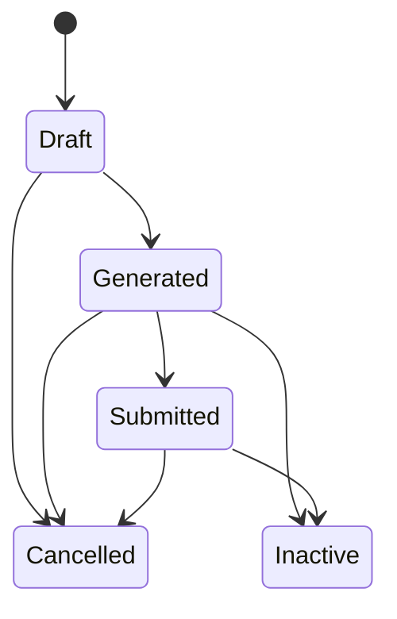

Invoice approval is **not required** (Confirmed), so there is no Approved status: a Generated invoice is submitted directly. `Inactive` is set only by regeneration/overlap replacement.

| Status | Meaning | Editable | Ledger effect |
| --- | --- | --- | --- |
| Draft | Saved selection; trips reserved | Lines, adjustments, address, template | None |
| Generated | Totals final; evidence produced | No (regenerate instead) | None |
| Submitted | Sent to customer; receivable | No | **Auto posting** on submission date: trip amount debit, one entry per adjustment, one per deduction (section 40A) |
| Inactive | Superseded by a regenerated invoice | No | Reversal of all its posted entries if it had been submitted |
| Cancelled | Voided; trips released | No | Reversal of all its posted entries if it had been submitted |

**Payment status** (derived, stored): `Unpaid` (paid + transferred-in = 0), `Partially Paid` (0 < paid < Net), `Paid` (paid ≥ Net). Overpaid invoices (negative balance) show `Paid` plus a **Credit** badge.

**Rules**

- Submit captures SubmittedOn (the ledger date), SubmittedBy, submission channel (Hand / Email / Portal) and optional acknowledgement document.
- Cancel requires reason and `Invoice.Cancel`; blocked if any non-reversed payment, write-off or discount exists ("Reverse or transfer payments before cancelling.").
- Invoice payments can be logged only on **Submitted** invoices. Money received before an invoice exists is recorded as an **advance** against an Open trip (section 37.4).

## 37. Invoice Payments (Payment Receipt Entry)

**Business requirement.** Finance must log money received from the customer against the invoice it settles. Each logged payment posts a **credit entry to the Customer Ledger against that invoice** (section 40A). Payment history is never deleted.

**Model (Recommended Design).** A **Payment Receipt** is the money received (one cheque, one bank transfer, one cash deposit). It is allocated to one or more invoices through **Invoice Payment** rows. The common case, one receipt for one invoice, is a single-screen entry from the invoice.

**CustomerReceipt (header)**

| Field | Type | Req | Rule |
| --- | --- | --- | --- |
| CustomerReceiptId | bigint PK | Sys |  |
| ReceiptNumber | varchar(20) | Sys | `RCPT-YYYY-NNNNN` |
| CustomerId | FK | Y |  |
| ReceiptType | enum | Sys | InvoicePayment / Advance |
| ReceiptDate | date | Y | ≤ today |
| ReceiptAmount | decimal(18,2) | Y | > 0; two decimals; equals sum of allocations |
| CurrencyCode | char(3) | Y | Invoice/customer currency (13A) |
| PaymentMethod | enum | Y | **Direct to Account** (transfer or deposit into company bank account) / **Bank Cheque** (Confirmed) |
| BankCashAccountId | FK | Y | Company bank account receiving the money |
| InstrumentNo | varchar(50) | Y | Cheque number (Cheque) or bank transaction / deposit reference (Direct to Account) |
| InstrumentDate | date | Cond | Cheque date; required for Bank Cheque |
| DrawnOnBank | nvarchar(100) | Cond | Customer's bank; required for Bank Cheque |
| PaymentReference | nvarchar(100) | N | Customer remittance reference |
| Attachment | FK Document | N | Cheque image / deposit slip / bank advice |
| Status | Posted / Reversed | Sys |  |
| Remarks, CreatedBy/On, RowVersion |  |  |  |

**InvoicePayment (allocation)**

| Field | Type | Req | Rule |
| --- | --- | --- | --- |
| InvoicePaymentId | bigint PK | Sys |  |
| CustomerReceiptId | FK | Y |  |
| InvoiceId | FK | Y | Same customer; Submitted; IsActive = 1 |
| PaymentDate | date | Sys | = ReceiptDate |
| Amount | decimal(18,2) | Y | > 0 |
| PaymentMethod, PaymentReference, BankCashAccountId |  | Sys | Copied from header for reporting |
| LedgerEntryId | FK | Sys | Credit entry posted |
| Status | Posted / Reversed / Transferred | Sys | Transferred = moved to a regenerated invoice; still counts historically |
| Remarks, CreatedBy/On |  |  |  |

**Entry workflow**

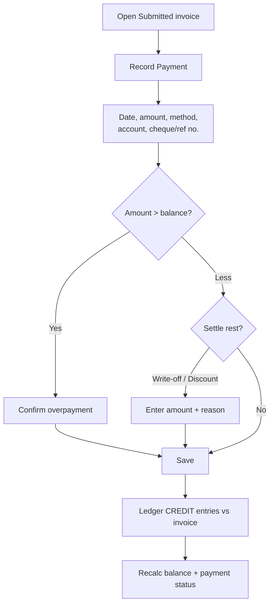

From the invoice, Record Payment opens with the invoice pre-selected and the amount defaulted to the balance. From **Receipts → New Receipt**, the user selects the customer, enters the receipt, and the grid lists the customer's open Submitted invoices (oldest first) with an **Auto-allocate (FIFO)** button and editable per-invoice amounts.

**Rules**

- BR-P1: Invoice payments are allowed only on Active, Submitted invoices of the same customer. Money received for an Open trip before invoicing is an **advance** (37.4).
- BR-P2: Overpayment (amount > invoice balance) is **allowed** (Confirmed) after confirmation: "Payment exceeds the outstanding balance by PKR X. The invoice will show a credit." The credit is then carried forward or refunded (section 40).
- BR-P3: Sum of allocations = ReceiptAmount.
- BR-P4: Duplicate guard: same customer + InstrumentNo + Amount + method → warning "A receipt with the same instrument number already exists (RCPT-…)."
- BR-P5: Payments are never edited or deleted. A wrong payment is **reversed** (Finance with `Payment.Reverse`, reason mandatory, e.g. cheque bounced). Reversal sets Status = Reversed, posts a ledger **debit** reversal against the same invoice, and recalculates the invoice. A corrected payment is then entered fresh.
- BR-P6: Invoice balance and payment status are recomputed in the same transaction as the payment (row-version check on the invoice).
- BR-P7: Payment on an Inactive invoice is rejected: "This invoice has been replaced by INV-…. Record the payment against the active invoice."
- BR-P8: Amounts are entered and stored to two decimal places.

**Balance formula**

```latex
\begin{aligned}
\text{Balance} = {} & \text{Net} - \text{Payments} - \text{Advances applied} - \text{Write-offs} - \text{Discounts} \\
& - \text{Transfers in} - \text{Carry-forward in} + \text{Transfers out} + \text{Carry-forward out} + \text{Refunds}
\end{aligned}
```

For an ordinary active invoice this is Net minus everything received or settled against it. Only posted (not reversed) rows count. Payment receipt printout (Recommended Design): a customer receipt voucher PDF from RCPT data.

**Permissions:** Record — Admin, Finance (`Payment.Create`); Reverse — Admin, Finance Lead (`Payment.Reverse`).

**Audit:** create, reverse (reason), attachment upload.

### 37.4 Advance payments on Open trips

**Business requirement (Confirmed).** For **Open** trips, the customer may pay in advance. The advance is later adjusted against that trip when the trip is invoiced.

**CustomerAdvance**

| Field | Type | Req | Rule |
| --- | --- | --- | --- |
| CustomerAdvanceId | bigint PK | Sys |  |
| AdvanceNumber | varchar(20) | Sys | `ADV-YYYY-NNNNN` |
| CustomerReceiptId | FK | Sys | Receipt with ReceiptType = Advance (same method/account fields as 37) |
| CustomerId | FK | Y |  |
| TripId | FK Trip | Y | Must be an **Open** trip of the same customer, not Cancelled, not yet on a Submitted invoice |
| Amount | decimal(18,2) | Y | > 0 |
| AppliedAmount / RefundedAmount | decimal(18,2) | Sys |  |
| Status | Open / Applied / Refunded / Reversed | Sys |  |
| LedgerEntryId | FK | Sys | `ADVANCE` credit |

**Flow**

1. Finance opens the Open trip (or Receipts → New Advance), enters date, amount, method, account, cheque/reference. Several advances per trip are allowed.
2. The system posts an `ADVANCE` **credit** to the customer ledger, linked to the customer and trip (no invoice yet). The customer balance shows the credit.
3. When the invoice containing that trip is **submitted**, the system automatically applies all Open advances of the trip to that invoice: `ADVANCE_APPLY_OUT` debit (trip advance) and `ADVANCE_APPLY_IN` credit (invoice), net zero for the customer. The invoice's AdvanceAppliedAmount increases and its balance falls.
4. The invoice PDF shows "Less: advance received (ADV-…)" under the totals.

**Rules**

- The full advance is applied, not capped; if it exceeds the trip's invoice balance, the invoice shows a credit (carry forward or refund).
- If the trip is cancelled or will not be invoiced, Finance can **move** the advance to another Open trip of the same customer (reason, audited) or **refund** it (`REFUND` debit).
- A bounced advance cheque is reversed (`ADVANCE_REVERSAL` debit) like a payment.
- When the invoice holding an applied advance is regenerated, the applied advance transfers to the new invoice with the payments (100%, section 40).
- Advances are for Open trips only; fixed trips are paid against invoices.

**Permissions:** `Payment.Advance` — Admin, Finance.

### 37.5 Write-off and discount

**Business requirement (Confirmed).** When recording against an invoice, Finance can settle part of the invoice amount as a **Write-off** or a **Discount**.

| Field | Type | Req | Rule |
| --- | --- | --- | --- |
| InvoiceSettlementId | bigint PK | Sys |  |
| InvoiceId | FK | Y | Active, Submitted |
| SettlementType | enum | Y | WriteOff / Discount |
| Amount | decimal(18,2) | Y | > 0 and ≤ invoice balance at that moment |
| SettlementDate | date | Y |  |
| Reason | nvarchar(500) | Y | e.g. "Short-payment accepted", "Volume discount August" |
| Status | Posted / Reversed | Sys |  |
| LedgerEntryId | FK | Sys | `WRITE_OFF` or `DISCOUNT` credit |
| CreatedBy/On |  | Sys |  |

**Behaviour**

- On Record Payment, when the amount is less than the balance, the section "Settle remaining balance" offers None / Write-off / Discount, pre-filled with the remaining amount (editable, reason required).
- The same action is available on Invoice Detail without a payment.
- Each settlement posts one ledger credit against the invoice; the invoice becomes Paid when the balance reaches zero and shows a "Settled with write-off" or "Discount given" badge.
- Settlements are reversible (reversal debit, reason), never edited or deleted.
- A fully settled invoice counts as fully paid (cannot be regenerated).

**Permissions:** `Payment.WriteOff`, `Payment.Discount` — Admin, Finance Lead (Recommended Design). Optional limit per user (e.g. discount up to PKR 10,000 without Admin) is **Recommended Design**.

## 38. Invoice Regeneration

**Business requirement.** An invoice that is not fully paid can be replaced by a new invoice with a new number. The old one becomes Inactive and remains visible forever, linked to its replacement.

| Payment status of old invoice | Regeneration |
| --- | --- |
| Paid (balance ≤ 0) | **Rejected**: "This invoice is fully paid and cannot be regenerated." |
| Partially Paid | Allowed (`Invoice.Regenerate`); 100% of payments transferred |
| Unpaid | Allowed (`Invoice.Regenerate`) |

Invoices in `Draft` are simply edited, not regenerated. Cancelled and Inactive invoices cannot be regenerated.

**Regeneration workflow**

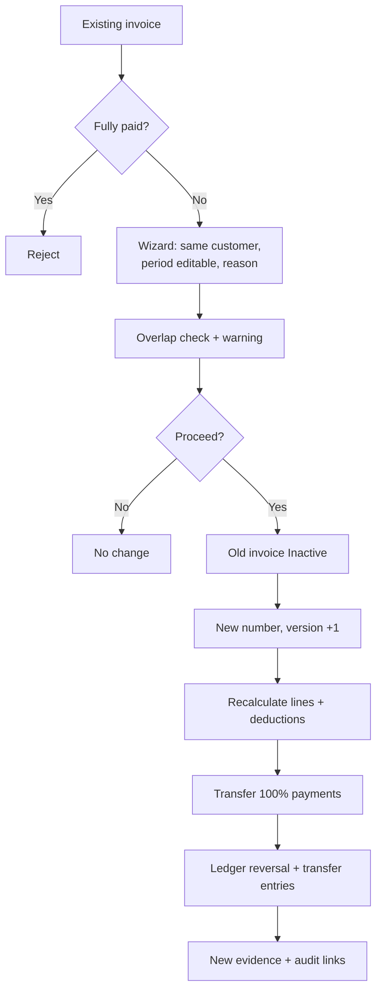

**Behaviour**

1. The wizard opens with the old invoice's customer, period, template, address and adjustments pre-filled; all remain editable. Reason is mandatory. No approval is needed (Confirmed); `Invoice.Regenerate` permission is enough.
2. Trip search treats the old invoice's trips as available. Previously selected trips are pre-ticked; newly eligible trips in the period are shown unticked with a "New" badge.
3. **Pricing:** lines are built from the trips' current snapshots. If rates were corrected, the user can tick **Re-price trips from rate master** (`Rate.Reprice`), which re-resolves rates for the selected trips and records the old/new snapshot in `TripRateHistory`. The old invoice lines are unchanged either way.
4. Tax/deduction rules and template are resolved again for the new Invoice Date (a new snapshot).
5. On confirm, in one transaction: old invoice `Status = Inactive`, `IsActive = 0`, `ReplacedByInvoiceId`; new invoice created with `PreviousInvoiceId`, `RootInvoiceId`, `Version = old + 1`, `RegenerationReason`, `RegeneratedBy/On`; old trip links deactivated, new links created; payment transfer (section 40); ledger reversals (section 40A); evidence queued for the new invoice; audit written.
6. The new invoice starts in `Generated` and must be Submitted to post its ledger entries. The wizard offers **Generate and Submit** for users with both permissions.

**Fully paid invoices (Confirmed).** If a fully paid invoice later needs correcting, it is not regenerated; the correction goes on a later invoice as an adjustment (section 32.3) referencing it.

**Versioning fields on Invoice:** InvoiceId, InvoiceNumber, Version, RootInvoiceId, PreviousInvoiceId, ReplacedByInvoiceId, IsActive, RegenerationReason, RegeneratedBy, RegeneratedOn. The **Version History** panel shows the chain INV-00125 v1 → INV-00188 v2 → … with status, net, paid and balance per version. Old invoices are never physically deleted.

**Historical integrity example.** July rate 25,000 invoiced on INV-00125. Rate later corrected to 30,000. INV-00125 and its evidence keep showing 25,000. A regenerated invoice with re-pricing shows 30,000.

## 39. Invoice Overlap Detection

**Rule.** Before generating (new or regenerated), the system checks for active invoices of the same customer whose period overlaps the requested period (`existing.From ≤ new.To AND existing.To ≥ new.From`), excluding the invoice being regenerated.

**Warning dialog**

> An active invoice already exists for part of the selected billing period.
>
> Existing Invoice: INV-2026-00125 · Existing Period: 01-Aug-2026 to 30-Aug-2026 · Payment Status: Unpaid
>
> If you proceed, the existing invoice will be set to Inactive and a new invoice will be generated for the selected period.
>
> &#91;Proceed\] \[Cancel\]

When several invoices overlap, all are listed. Additional lines appear when relevant:

- "12 trips on INV-2026-00125 fall outside the new period and will become uninvoiced." (old period extends beyond the new one)
- "Payments of PKR 200,000 will be transferred to the new invoice."

**Outcomes**

| Choice | Result |
| --- | --- |
| Cancel | No data change. |
| Proceed | Each overlapping invoice → Inactive; new invoice with new number becomes Active; old/new links recorded (a new invoice replacing several old ones stores each in `InvoiceReplacement`); evidence of old invoices kept; payments transferred; ledger entries posted; audit created. |

**Blocks:** if any overlapping invoice is **fully paid**, Proceed is disabled: "INV-… is fully paid and cannot be replaced. Choose a period that does not overlap it." Overlap replacement requires `Invoice.Regenerate`.

## 40. Payment Transfer

**Business requirement.** On regeneration, **100%** of the historical payments on the old invoice move to the new invoice. The transfer is **not capped** at the new invoice amount; a negative balance stays visible. Original payments are never deleted.

| Field | Type | Rule |
| --- | --- | --- |
| InvoicePaymentTransferId | bigint PK |  |
| OldInvoiceId | FK | Inactive invoice |
| NewInvoiceId | FK | Replacement |
| SourceInvoicePaymentId | FK | Original payment row (or prior transfer when chained) |
| AmountTransferred | decimal(18,2) | = full amount of the source |
| TransferDate | datetime UTC |  |
| TransferredBy | FK User |  |
| Reason | nvarchar(500) | = regeneration reason |
| LedgerEntryOutId / LedgerEntryInId | FK | Ledger pair (section 40A) |
| Audit fields |  |  |

**Examples**

| Case | Old net | Paid on old | New net | Transferred | New balance |
| --- | --- | --- | --- | --- | --- |
| Partial payment, new higher | 500,000 | 200,000 | 550,000 | 200,000 | **350,000** outstanding |
| Payment exceeds new invoice | 500,000 | 450,000 | 400,000 | 450,000 | **−50,000** credit |

**Chained regeneration.** If v2 is regenerated to v3, the transfer carries everything v2 holds (its own payments plus transfers in), each as a transfer row pointing to the source.

**Negative balance display**

- Invoice grid and detail: balance shown as `(50,000) CR` in the credit colour with a **Credit** badge; payment status `Paid`.
- Invoice detail banner: "Customer has a credit of PKR 50,000 on this invoice."
- Customer Ledger: the customer's running balance reflects the credit (section 40A).
- Reports: Outstanding Invoices excludes it; **Customer Credit Balances** report lists it.

**How Finance resolves a negative balance (Confirmed: Carry Forward or Refund)**

| Option | Action | Ledger effect |
| --- | --- | --- |
| **Carry Forward** | "Carry Forward" moves the credit (full or part) from the credit invoice to another open Submitted invoice of the same customer, normally the next one (`InvoiceCreditCarryForward`). Until then the credit stays visible on the Customer Credit Balances report | `CARRY_FORWARD_OUT` debit on the credit invoice + `CARRY_FORWARD_IN` credit on the target invoice (net zero for customer) |
| **Refund** | "Record Refund" with date, method (Direct to Account / Bank Cheque), account, reference | `REFUND` debit against the credit invoice |

Both need `Payment.CarryForward` or `Payment.Refund` permission and a reason, and are audited. Carry forward to a future invoice happens when that invoice is submitted; the invoice detail shows a prompt "Customer has PKR X credit from INV-…. Carry forward now?"

## 40A. Customer Ledger (Accounts Receivable Sub-ledger)

**Business requirement (Confirmed).** Every customer has a ledger. Submitting an invoice automatically posts an entry against that invoice. Logging a payment received against an invoice posts a second entry against the same invoice. The ledger shows what each customer owes at any date, invoice by invoice.

**Design summary**

- The ledger is **append-only**. Entries are never edited or deleted; every correction is a new reversing entry.
- Convention: **Debit increases** what the customer owes; **Credit reduces** it. Balance = Σ Debit − Σ Credit. Positive = receivable (Dr); negative = customer credit (Cr).
- Every entry references a **CustomerId** and an **InvoiceId**, so a customer statement and an invoice-wise ledger come from the same rows.
- Posting happens **inside the same database transaction** as the action that causes it (submit, payment, reversal, regeneration). If posting fails, the action fails and nothing is saved.

### 40A.1 Posting rules

| # | Trigger | Entry type | Dr / Cr | Amount | Linked to | Posted by |
| --- | --- | --- | --- | --- | --- | --- |
| L1 | Invoice status → **Submitted** | `INVOICE` | **Debit** | Total trip amount (incl. billable income lines) | That invoice | System (auto) |
| L2 | Same submission, per adjustment row | `ADJUSTMENT` | Debit if positive, Credit if negative | Adjustment amount | Same invoice (Confirmed) | System (auto) |
| L3 | Same submission, per applied deduction | `DEDUCTION` | Credit | Deduction amount | Same invoice | System (auto) |
| L4 | Payment logged against invoice | `PAYMENT` | **Credit** | Allocation amount | The invoice paid | System, on user's save |
| L5 | Payment reversed (bounced cheque, error) | `PAYMENT_REVERSAL` | Debit | Reversed amount | Same invoice | System |
| L6 | Write-off / discount recorded | `WRITE_OFF` / `DISCOUNT` | Credit | Settlement amount | That invoice | System (Confirmed) |
| L7 | Write-off / discount reversed | `SETTLEMENT_REVERSAL` | Debit | Same amount | Same invoice | System |
| L8 | Advance received for an Open trip | `ADVANCE` | Credit | Advance amount | Customer + trip (no invoice yet) | System (Confirmed) |
| L9 | Trip's invoice submitted: advance applied | `ADVANCE_APPLY_OUT` / `ADVANCE_APPLY_IN` | Debit (trip advance) / Credit (invoice) | Advance amount | Trip / invoice | System (auto) |
| L10 | Advance reversed (bounced cheque) | `ADVANCE_REVERSAL` | Debit | Advance amount | Customer + trip | System |
| L11 | Submitted invoice **Cancelled** | `INVOICE_CANCEL` | Mirror of each L1–L3 entry | Same amounts | That invoice | System |
| L12 | Submitted invoice **superseded** by regeneration / overlap | `INVOICE_SUPERSEDED` | Mirror of each L1–L3 entry | Same amounts | Old invoice | System |
| L13 | Payment transfer on regeneration | `TRANSFER_OUT` / `TRANSFER_IN` | Debit old / Credit new | Amount transferred | Old / new invoice | System |
| L14 | Carry forward of a credit | `CARRY_FORWARD_OUT` / `CARRY_FORWARD_IN` | Debit source / Credit target | Amount carried | Source / target invoice | System, on Finance action (Confirmed) |
| L15 | Refund of customer credit or advance | `REFUND` | Debit | Refund amount | Credit invoice or advance | System, on Finance action (Confirmed) |
| L16 | Opening balance at go-live | `OPENING_BALANCE` | **Debit or Credit** (Confirmed) | Migrated balance | Pseudo-invoice `OB-{CustomerCode}` | Admin |

Posting deductions as their own credit entries (L3) is Recommended Design, so the entries of an invoice always add up to its Net amount.

Draft and Generated invoices have **no** ledger entries; they are not yet a claim on the customer. Pairs (L9, L13, L14) net to zero for the customer and only move the balance between a trip advance and an invoice, or between invoices.

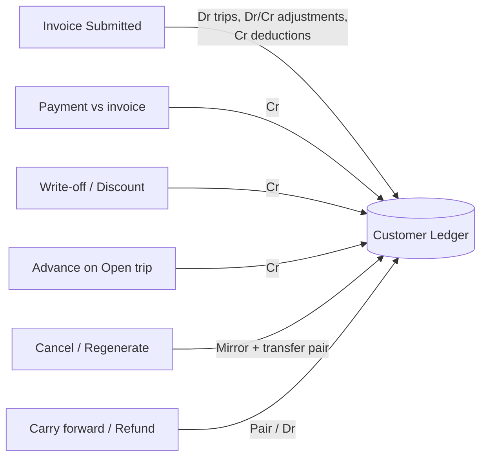

The confirmed entries are the invoice debit on submission (L1), a separate entry per adjustment against the same invoice (L2), payment credits against the invoice (L4), write-off/discount (L6), advances (L8), carry forward and refund (L14, L15) and opening balances (L16). The rest keep the ledger correct under the confirmed cancel, reversal and regeneration rules.

### 40A.2 CustomerLedgerEntry fields

| Field | Type | Rule |
| --- | --- | --- |
| CustomerLedgerEntryId | bigint PK |  |
| EntryNumber | varchar(20) | `LED-YYYY-NNNNNN`, unique |
| CustomerId | FK Customer | Required |
| InvoiceId | FK Invoice | Required except advance entries (L8, L9-out, L10, advance refunds) |
| TripId | FK Trip | Required for advance entries |
| EntryType | enum | L1–L16 types |
| EntryDate | date | **Submission date** for L1–L3 (Confirmed); receipt/settlement date for L4–L8; action date for the rest |
| PostedOn | datetime UTC | Server time of posting |
| DebitAmount | decimal(18,2) | ≥ 0 |
| CreditAmount | decimal(18,2) | ≥ 0; exactly one of Debit/Credit > 0 (check constraint) |
| CurrencyCode | char(3) | Invoice/receipt currency; ledger kept per customer per currency |
| SourceType | enum | Invoice / InvoiceAdjustment / InvoiceTaxLine / InvoicePayment / InvoiceSettlement / CustomerAdvance / PaymentTransfer / CarryForward / Refund / OpeningBalance |
| SourceId | bigint | Id of the source row |
| ReversesEntryId | FK self | Set on reversal and mirror entries |
| DocumentNo | varchar(30) | Invoice, receipt or advance number shown on statement |
| Narration | nvarchar(300) | Auto text. Invoice entries include the **Invoice Date** (Confirmed), e.g. "Invoice INV-2026-00125 dated 31-Aug-2026, period 01-Aug-2026 to 30-Aug-2026"; "Adjustment July 2026 — Previous overbilling adjustment (INV-2026-00125)"; "Payment RCPT-2026-00031 cheque 004512 against INV-2026-00125" |
| CustomerSeq | bigint | Monotonic sequence per customer, for stable running balance order |
| IsSystemGenerated | bit | 1 for all Phase 1 entries |
| CreatedBy | FK User | User whose action caused the posting |

**Constraints**

- Unique (`SourceType`, `SourceId`, `EntryType`) → the same event can never post twice (idempotent re-submit, double-click safe).
- No UPDATE/DELETE grants on the table for the application role; enforced by DB permissions and a trigger that rejects updates.
- `CustomerBalance` table (CustomerId, BalanceAmount, LastEntryId, RowVersion) updated in the same transaction for fast lookups; the ledger rows remain the source of truth.

### 40A.3 Worked example (partial payment, then regeneration)

INV-2026-00125: trips 500,000, adjustment "July 2026 +20,000", deduction 2% = 10,400, Net 509,600, dated 31-Aug, submitted 05-Sep. Regenerated on 20-Sep as INV-2026-00188: trips 540,000, same adjustment, deduction 11,200, Net 548,800, submitted 21-Sep. Amounts in PKR.

| Entry date | Doc | Entry | Invoice | Debit | Credit | Customer balance |
| --- | --- | --- | --- | --- | --- | --- |
| 05-Sep | INV-00125 | INVOICE | INV-00125 | 500,000.00 |  | 500,000.00 Dr |
| 05-Sep | INV-00125 | ADJUSTMENT (July 2026) | INV-00125 | 20,000.00 |  | 520,000.00 Dr |
| 05-Sep | INV-00125 | DEDUCTION (WHT 2%) | INV-00125 |  | 10,400.00 | 509,600.00 Dr |
| 12-Sep | RCPT-00031 | PAYMENT | INV-00125 |  | 200,000.00 | 309,600.00 Dr |
| 20-Sep | INV-00125 | INVOICE\_SUPERSEDED (trips) | INV-00125 |  | 500,000.00 | 190,400.00 Cr |
| 20-Sep | INV-00125 | INVOICE\_SUPERSEDED (adjustment) | INV-00125 |  | 20,000.00 | 210,400.00 Cr |
| 20-Sep | INV-00125 | INVOICE\_SUPERSEDED (deduction) | INV-00125 | 10,400.00 |  | 200,000.00 Cr |
| 20-Sep | TRF-00007 | TRANSFER\_OUT | INV-00125 | 200,000.00 |  | 0.00 |
| 20-Sep | TRF-00007 | TRANSFER\_IN | INV-00188 |  | 200,000.00 | 200,000.00 Cr |
| 21-Sep | INV-00188 | INVOICE | INV-00188 | 540,000.00 |  | 340,000.00 Dr |
| 21-Sep | INV-00188 | ADJUSTMENT (July 2026) | INV-00188 | 20,000.00 |  | 360,000.00 Dr |
| 21-Sep | INV-00188 | DEDUCTION (WHT 2%) | INV-00188 |  | 11,200.00 | 348,800.00 Dr |

Invoice-wise: INV-00125 nets to 0 (superseded, fully offset). INV-00188 = 548,800 − 200,000 = 348,800 outstanding, matching its invoice balance. Between regeneration and submission of the new invoice the customer shows a 200,000 credit, which is correct: money was received and no active invoice is yet claimed. **Generate and Submit** removes this gap.

**Advance example (Open trip).** 02-Sep ADV-00004 for TRP-2026-009120 (Open, 80,000): `ADVANCE` Cr 30,000 → customer 30,000 Cr. 10-Sep the trip's invoice INV-00190 (Net 80,000) is submitted: `INVOICE` Dr 80,000, then `ADVANCE_APPLY_OUT` Dr 30,000 (trip) and `ADVANCE_APPLY_IN` Cr 30,000 (INV-00190). Customer balance 50,000 Dr; INV-00190 balance 50,000.

**Write-off example.** INV-00190 balance 50,000; customer pays 49,500 and Finance writes off 500: `PAYMENT` Cr 49,500 and `WRITE_OFF` Cr 500; INV-00190 is Paid.

**Overpayment example:** after a regeneration where 450,000 is transferred to a 400,000 invoice, the new invoice's ledger nets to 50,000 Cr and the customer statement shows a credit balance.

### 40A.4 Ledger screens

**Customer Ledger (statement)** — Finance → Customer Ledger.

- Filters: Customer (required), From/To date, Invoice (optional), Entry type, Include reversed pairs (default on).
- Header: customer name/code, currency, **Opening balance** (sum of entries before From), period Debits, period Credits, **Closing balance**, overdue amount.
- Grid: Entry Date, Entry No, Doc No, Entry Type, Invoice No (link), Narration, Debit, Credit, Running Balance (Dr/Cr). Sorted by EntryDate, CustomerSeq.
- Actions: Export PDF (customer statement format with company header), Export Excel, Print. Email statement to the billing contact is Phase 1 optional (**Client Confirmation Required**).
- Row click opens the source (invoice, receipt, transfer).

**Invoice Ledger tab** — on Invoice Detail: every entry for that invoice, invoice-level running balance, and a reconciliation line "Ledger balance = Invoice balance ✓".

**Customer Balances** — all customers with Balance, Overdue, Credit, Last payment date, Last invoice date; drill-down to statement.

### 40A.5 Rules

| # | Rule |
| --- | --- |
| LR-1 | On Submit the system posts the invoice debit, one entry per adjustment and one per deduction, all dated on the submission date. Users cannot post invoice entries manually. |
| LR-2 | Each payment allocation posts exactly one credit against its invoice. A receipt split over 3 invoices posts 3 credits. |
| LR-3 | Ledger entries are immutable; corrections only by reversal/mirror entries. |
| LR-4 | For every Submitted, active invoice: Σ ledger (Dr − Cr) for the invoice = Invoice.BalanceAmount. A nightly reconciliation job reports any mismatch to Finance and Admin. |
| LR-5 | Customer balance = Σ (Dr − Cr) over all the customer's entries, including unapplied advances. |
| LR-6 | EntryDate may be back-dated to the business date; PostedOn is always server time. Statements filter on EntryDate. |
| LR-7 | Period lock (Recommended Design): Finance may close a month; entries with EntryDate in a closed month are rejected unless posted by Admin with reason. |
| LR-8 | Write-off and discount are the only discretionary credits (Confirmed); free-form manual journals are not available. |
| LR-9 | Ledger per customer per currency; statements are per currency when multi-currency is on. |
| LR-10 | Advances stay on the customer ledger linked to their Open trip until applied at invoice submission, moved to another Open trip, or refunded. |
| LR-11 | Opening balance may be debit or credit, posted once per customer and currency at go-live. |

**Permissions:** View ledger/statement — Admin, Finance, Read Only; Fleet/Operations no access (Recommended Design). Opening balance — Admin with Finance approval. Period lock — Finance Lead, Admin.

**Audit:** each entry is itself an audit record; plus audit events for statement export, period lock/unlock, opening balance import.

**Errors:** "Ledger posting failed; the invoice was not submitted. Please retry." · "Entry date falls in a closed period (Aug 2026)." · "This payment has already been posted."

**Acceptance criteria**

```text
Given invoice INV-1 is Generated with trips 500,000, adjustment +20,000 and deduction 10,400
When Finance submits INV-1 on 05-Sep
Then three entries are posted against INV-1 dated 05-Sep:
  INVOICE Dr 500,000, ADJUSTMENT Dr 20,000, DEDUCTION Cr 10,400
And the INVOICE narration shows the invoice date
And the customer balance increases by 509,600.

Given INV-1 is Submitted with balance 509,600
When Finance records a payment of 300,000 against INV-1
Then one PAYMENT credit of 300,000 is posted against INV-1
And INV-1 balance is 209,600 and payment status is Partially Paid.

Given INV-1 balance is 209,600
When Finance records 209,000 with a 600 write-off
Then PAYMENT Cr 209,000 and WRITE_OFF Cr 600 are posted and INV-1 is Paid.

Given a payment of 300,000 on INV-1 is reversed
When the reversal is saved
Then a PAYMENT_REVERSAL debit of 300,000 is posted against INV-1
And the original PAYMENT credit remains visible.

Given an advance of 30,000 on Open trip TRP-9
When the invoice containing TRP-9 is submitted
Then the advance is applied to that invoice and its balance falls by 30,000.

Given INV-1 is submitted twice due to a double click
When both requests reach the server
Then only one set of submission entries exists for INV-1.
```

## 41. Invoice Evidence

**Business requirement.** Every generated invoice has stored evidence listing the trips behind it. Evidence is built only from the invoice's own snapshots, is versioned, and is never overwritten, even when a new invoice is later generated for the same period.

**InvoiceEvidence fields**

| Field | Type | Rule |
| --- | --- | --- |
| InvoiceEvidenceId | bigint PK |  |
| InvoiceId | FK |  |
| EvidenceVersion | int | 1 on generation; +1 only if Admin re-renders the same invoice (e.g. template fix). Data never changes |
| GeneratedOn / GeneratedBy |  |  |
| FileReference | varchar(500) | Blob storage key (PDF); Excel copy optional |
| FileHash | char(64) | SHA-256 of the file for tamper evidence |
| PageSize | int | Snapshot of customer config (default 50) |
| GroupBy | enum | Vehicle |
| PageCount, LineCount | int |  |
| Status | Queued / Generated / Failed / Superseded | Superseded when invoice becomes Inactive (file kept) |
| ErrorMessage | nvarchar(1000) | On failure |

**Generation.** Queued in the invoice-creation transaction and rendered by a background job (Recommended Design: keeps generation fast for large invoices). The invoice shows "Evidence: Generating…" until done; failure shows "Retry" (Finance). Submitting an invoice requires evidence status Generated when the customer's `EvidenceRequired = 1`.

**Content — columns (initial, Confirmed)**

| # | Column | Source |
| --- | --- | --- |
| 1 | Trip Date | InvoiceLine.TripDate |
| 2 | Trip Route | InvoiceLine.RouteLabel |
| 3 | Company Provided Reference Number | InvoiceLine.CustomerTripReference |
| 4 | Bill Amount | InvoiceLine.Amount |

**No template (Confirmed).** Evidence sheets do not use customer templates. Every customer gets the same standard system layout with the columns above plus Sr. No.; the layout is changed only by a system release, never per customer.

**Header (repeated on every page):** company name/logo, "Invoice Evidence", Customer name and code, Invoice No. and version, Invoice Date, Billing Period, Vehicle registration (current group), route(s) in the group, Evidence version.

**Footer:** page X of Y (overall), "Vehicle page n of m", group subtotal on the last page of each vehicle, generated on/by, file hash short code.

**Pagination rules**

1. Lines are grouped by Vehicle (ordered by vehicle registration), then by Trip Date, then Trip Number.
2. Each vehicle starts on a new page.
3. A page holds at most `PageSize` lines (default 50).
4. If a vehicle has more lines than the page size, it continues on the next page **under the same vehicle header**; lines never move to another vehicle because the page is full.
5. Vehicle subtotal after its last line; grand total (trip amount), adjustments, gross, deductions and net on the final page.

```text
ABC-123  Page 1  rows 1–50
ABC-123  Page 2  rows 51–100   (same vehicle continues)
ABC-456  Page 3  rows 1–37     (new vehicle, new page)
```

**Integrity**

- Evidence uses InvoiceLine snapshots; current rates, vehicles or routes are never read.
- When an invoice is regenerated, the old invoice's evidence is kept unchanged (Status Superseded) and the new invoice gets its own evidence version 1.
- Evidence files are stored write-once (immutable blob policy recommended) and retained indefinitely (Confirmed: no retention limit).

**Permissions:** view/download — Admin, Finance, Read Only; re-render — Admin.

**Edge cases:** evidence already generated and invoice regenerated → both files exist; missing evidence at submit → "Invoice evidence is not ready. Please wait or retry evidence generation."

## 42. Reports

Phase 1 delivers 80 reports in seven groups, plus three dashboards. Every report supports filtering, sorting, server-side pagination, column show/hide, totals, and export to Excel, CSV and PDF. Each report is gated by its own `Report.{Code}.View` permission. Dates are filtered in the viewer's time zone and amounts are in the customer currency (PKR by default). All financial reports read snapshot data (invoice lines, ledger entries), never current master rates.

**Common filters** (where applicable): date range, customer, vehicle, driver, route, trip configuration, trip type (Fixed/Open), trip status, invoice status, payment status, active flag.

### 42.1 Customer reports

| Code | Report | Purpose | Key filters | Main columns | Roles |
| --- | --- | --- | --- | --- | --- |
| CUS-01 | Customer List | Master listing | Status, city | Code, name, NTN/STRN, currency, terms, status, created | All back-office |
| CUS-02 | Customer Contacts | Contact directory | Customer, purpose, status | Customer, name, designation, mobiles, email, availability | All back-office |
| CUS-03 | Customer Billing Addresses | Address list with defaults | Customer, status | Customer, address name, full address, NTN, default, effective range | Finance, Admin, RO |
| CUS-04 | Customer Tax/Deduction Rules | Current and historical rules | Customer, tax code, as-of date | Tax name/code, type, rate/fixed, basis, applicable, effective range, status | Finance, Admin, RO |
| CUS-05 | Customer Trip Configurations | Configurations, vehicles, current rate | Customer, status | Trip code, route, stops, allowed vehicles, current rate, next rate change | Finance, Fleet, Ops, RO |
| CUS-06 | Customer Trip Summary | Volume per customer | Period | Customer, trips (fixed/open), completed, cancelled, trip amount | All back-office |
| CUS-07 | Customer Invoice Summary | Billing per customer | Period, invoice status | Customer, invoices, gross, deductions, net, paid, balance | Finance, Admin, RO |
| CUS-08 | Customer Payment History | All receipts by customer | Period, method | Receipt no., date, method, instrument, amount, invoices allocated, status | Finance, Admin, RO |
| CUS-09 | Customer Outstanding | What each customer owes | As-of date | Customer, invoices open, balance, overdue, credit | Finance, Admin, RO |
| CUS-10 | Customer Revenue Trend | Monthly billed revenue | 12-month window | Customer × month net invoiced (chart + table) | Finance, Admin, RO |

### 42.2 Customer Ledger & receivables reports

| Code | Report | Purpose | Key filters | Main columns | Roles |
| --- | --- | --- | --- | --- | --- |
| LED-01 | Customer Ledger Statement | Statement of account | Customer, date range | Opening bal., entry date, entry no., doc no., type, invoice, narration, debit, credit, running balance, closing bal. | Finance, Admin, RO |
| LED-02 | Invoice-wise Ledger | Entries per invoice | Customer, invoice, period | Invoice, entry type, debit, credit, invoice balance, reconciled flag | Finance, Admin, RO |
| LED-03 | Customer Balances Summary | Balance of all customers | As-of date, balance sign | Customer, total debits, total credits, balance Dr/Cr, overdue, last payment | Finance, Admin, RO |
| LED-04 | Receivables Aging | Overdue buckets | As-of date, customer | Customer, current, 1–30, 31–60, 61–90, 91–180, 180+ days past due, total | Finance, Admin, RO |
| LED-05 | Aging Detail by Invoice | Invoice-level aging | As-of date | Invoice, date, due date, days overdue, net, paid, balance, bucket | Finance, Admin |
| LED-06 | Receipts Register | All payment receipts | Period, method, account | Receipt no., date, customer, method, instrument, bank account, amount, status | Finance, Admin |
| LED-07 | Payment Allocation Detail | Receipt → invoice split | Period, customer | Receipt, invoice, allocated amount, ledger entry | Finance, Admin |
| LED-08 | Payment Reversals | Bounced / reversed payments | Period | Receipt, invoice, amount, reversal date, reason, by | Finance, Admin |
| LED-09 | Customer Credit Balances | Negative-balance invoices and customers | As-of date | Customer, invoice, credit amount, origin (overpayment / transfer), age | Finance, Admin |
| LED-10 | Collections Report | Cash collected in a period | Period, customer, account | Date, customer, receipt, amount; totals by method and bank account | Finance, Admin |
| LED-11 | Days Sales Outstanding (DSO) | Collection speed | Period | Customer, avg. days invoice → full payment, DSO | Finance, Admin |
| LED-12 | Ledger Reconciliation Exceptions | Ledger vs invoice mismatches | Run date | Invoice, invoice balance, ledger balance, difference | Finance, Admin |
| LED-13 | Carry Forward & Refunds | Use of customer credits | Period | Date, customer, source invoice, target invoice / refund, amount, reason | Finance, Admin |
| LED-14 | Advance Payments (Open trips) | Advances received, applied, moved, refunded | Period, customer, status | Advance no., date, customer, trip, amount, applied, refunded, unapplied, invoice applied to | Finance, Admin |
| LED-15 | Write-offs & Discounts | Amounts settled without payment | Period, customer, type | Date, customer, invoice, type, amount, reason, by, reversed | Finance, Admin |

### 42.3 Trip reports

| Code | Report | Purpose | Key filters | Main columns | Roles |
| --- | --- | --- | --- | --- | --- |
| TRP-01 | Trip Register | Master list of trips | All common filters | Trip no., date, type, customer, ref., configuration/route, vehicle, driver, status, active, amount, invoice no. | All back-office |
| TRP-02 | Trips by Customer | Grouped by customer | Period | Customer → trips, amount subtotal | All back-office |
| TRP-03 | Trips by Vehicle | Vehicle workload | Period, vehicle | Vehicle → trips, km, amount | Fleet, Ops, Finance, RO |
| TRP-04 | Trips by Driver | Driver workload | Period, driver | Driver → trips, km, overrides count | Fleet, Ops, RO |
| TRP-05 | Trips by Route / Configuration | Corridor volume | Period | Route/config → trips, amount, avg. duration | All back-office |
| TRP-06 | Fixed Trips | Fixed only, with rate snapshot | Period, customer | Trip, configuration, rate id, rate, rate effective range, amount | Finance, Fleet, RO |
| TRP-07 | Open Trips | Open only | Period | Trip, from, to, stops, manual amount, entered by | Finance, Ops, RO |
| TRP-08 | Trip Status / Lifecycle | Trips by current status | Status, age | Trip, status, since, next expected step, hold reason | Ops, Fleet |
| TRP-09 | Trip Event Timeline | Event log per trip | Trip, period, source | Event, time, location, odometer, user, source | Ops, Fleet |
| TRP-10 | On Hold & Cancelled Trips | Exceptions | Period | Trip, status, reason, by, date | Ops, Fleet, Finance |
| TRP-11 | Inactive Trips | Inactivated trips | Period | Trip, reason, by, on invoice? | Ops, Finance |
| TRP-12 | POD Status | Missing / pending PODs | Period, customer, POD status | Trip, delivered on, POD status, days pending | Ops, Finance |
| TRP-13 | Rate Missing Trips | Trips blocking invoicing | Customer, period | Trip, date, configuration, error | Finance, Fleet |
| TRP-14 | Duplicate Customer References | Reference clashes | Customer, period | Reference, trips, dates | Finance, Ops |
| TRP-15 | Driver Override Report | Default driver overrides | Period | Trip, vehicle, default driver, actual driver, reason, by | Fleet |
| TRP-16 | Trip Issues | Breakdowns, delays | Period, issue type | Trip, issue, severity, reported by, resolved | Ops, Fleet |

### 42.4 Trip cost, income & P&L reports

| Code | Report | Purpose | Key filters | Main columns | Roles |
| --- | --- | --- | --- | --- | --- |
| PNL-01 | Trip Expenses | Expense detail | Period, type, approval | Trip, date, type, other type, amount, method, vendor, approval | Fleet, Finance, Ops |
| PNL-02 | Expense Summary by Type | Where money goes | Period, vehicle | Type × month totals | Fleet, Finance |
| PNL-03 | Trip Fuel | Fuel detail | Period, vehicle, method | Trip, date, vehicle, type, litres, rate, amount, method, card | Fleet, Finance |
| PNL-04 | Fuel Efficiency | km per litre | Period, vehicle | Vehicle, km, litres, km/l, cost/km | Fleet |
| PNL-05 | Fuel Card Usage | Card spend and assignment | Period, card, company | Card (masked), vehicle, driver, fills, litres, amount, expiry | Fleet, Finance |
| PNL-06 | Fuel Card Expiry | Cards expiring | Days ahead | Card, vehicle, expiry, status | Fleet |
| PNL-07 | Trip Income | Additional income | Period, type | Trip, customer, type, amount, billable | Finance |
| PNL-08 | Trip P&L | Per-trip operational P&L | Period, customer, vehicle | Trip, revenue, income, fuel, expenses, P&L, margin % | Finance, Fleet, Admin |
| PNL-09 | Vehicle P&L (Operational) | Per-vehicle margin | Period | Vehicle, trips, revenue, fuel, expenses, P&L, P&L/trip | Finance, Fleet |
| PNL-10 | Customer Profitability | Per-customer margin | Period | Customer, trips, revenue, costs, P&L | Finance, Admin |
| PNL-11 | Route / Configuration Profitability | Per-corridor margin | Period | Route/config, trips, avg. revenue, avg. cost, P&L | Finance, Fleet |
| PNL-12 | Driver Cost Report | Driver-recorded expenses | Period, driver | Driver, trips, driver expenses, fuel, P&L of trips | Fleet |
| PNL-13 | Monthly Operational P&L | Company-level trend | 12 months | Month, revenue, fuel, expenses, P&L (chart + table) | Finance, Admin |

### 42.5 Invoice reports

| Code | Report | Purpose | Key filters | Main columns | Roles |
| --- | --- | --- | --- | --- | --- |
| INV-01 | Invoice Register | All invoices | Period, customer, status, payment status, active | Invoice no., version, date, period, customer, gross, deductions, net, paid, balance, status | Finance, Admin, RO |
| INV-02 | Invoice Detail | One invoice fully | Invoice | Header, bill-to snapshot, lines, adjustments, tax lines, totals, payments, ledger | Finance, Admin, RO |
| INV-03 | Invoice Lines | Line-level extract | Period, customer, vehicle | Invoice, line, trip, date, ref., route, vehicle, driver, rate, amount | Finance, Admin |
| INV-04 | Invoiceable Trips | Ready to bill | Customer, period | Trip, date, amount, POD | Finance |
| INV-05 | Invoiced Trips | Trips billed | Period | Trip, invoice, line amount, invoice status | Finance, RO |
| INV-06 | Uninvoiced Trips | Completed, not billed (with reason) | Period, customer | Trip, date, amount, blocking reason, age | Finance, Ops |
| INV-07 | Paid Invoices | Fully paid | Period | Invoice, net, paid, paid date | Finance |
| INV-08 | Partially Paid Invoices | Part paid | Period | Invoice, net, paid, balance | Finance |
| INV-09 | Unpaid Invoices | Nothing paid | Period | Invoice, net, due date, days overdue | Finance |
| INV-10 | Outstanding Invoices | Balance > 0 | As-of date | Invoice, due date, balance, days overdue | Finance, Admin, RO |
| INV-11 | Invoice Adjustments Register | Past-month adjustments | Period, sign | Invoice, adjustment month, amount, note, by | Finance, Admin |
| INV-12 | Tax/Deduction Report | Deductions by code | Period, tax code | Invoice, customer, tax code, basis, rate, taxable, deduction | Finance |
| INV-13 | Regeneration History | Version chains | Period, customer | Root invoice, versions, old/new no., reason, by, on, net change | Finance, Admin |
| INV-14 | Payment History | Payments per invoice | Period | Invoice, receipt, date, amount, method, status | Finance |
| INV-15 | Payment Transfer History | Transfers on regeneration | Period | Old invoice, new invoice, source payment, amount, by, reason | Finance, Admin |
| INV-16 | Invoice Evidence Register | Evidence files | Period, status | Invoice, evidence version, generated on/by, pages, lines, status, download | Finance, Admin, RO |
| INV-17 | Cancelled & Inactive Invoices | Voided / superseded | Period | Invoice, status, reason, replaced by | Finance, Admin |
| INV-18 | Billing Coverage Gaps | Periods with trips but no active invoice | Customer, year | Customer, date range, uninvoiced trips, amount | Finance |

### 42.6 Master data & configuration reports

| Code | Report | Purpose | Main columns | Roles |
| --- | --- | --- | --- | --- |
| MST-01 | Rate Master History | All rate rows per customer/configuration | Customer, configuration, from, to, rate, status, changed by/on | Finance, Fleet, Admin |
| MST-02 | Rate Coverage Gaps | Dates with no rate for active configurations | Configuration, missing date range | Finance, Fleet |
| MST-03 | City & Route List | Geography masters | City/abbr., route, stops, distance | All back-office |
| MST-04 | Configuration Vehicle Assignments | Who may run what | Configuration, vehicle, effective range | Fleet, Ops |
| MST-05 | Invoice Template Register | Templates and versions | Customer, template, version, type, effective, default | Finance, Admin |

### 42.7 Audit reports

| Code | Report | Purpose | Main columns | Roles |
| --- | --- | --- | --- | --- |
| AUD-01 | Audit Log | Any entity change | Date/time, user, entity, record, action, field, old, new, reason | Admin |
| AUD-02 | Financial Audit Trail | Rates, invoices, payments, ledger actions only | As AUD-01, filtered | Admin, Finance Lead |
| AUD-03 | User Activity | Actions per user | User, action counts, last login | Admin |

### 42.8 Dashboards (Recommended Design)

| Dashboard | Tiles and charts | Roles |
| --- | --- | --- |
| Operations | Trips today by status, on hold, POD pending, rate missing | Ops, Fleet |
| Finance | Uninvoiced amount, outstanding, overdue, collected this month, aging chart, top 10 debtors | Finance, Admin |
| Fleet | Trips per vehicle, fuel cost/km, expense trend, fuel cards expiring | Fleet |

### 42.9 Report rules

- Large exports (> 50,000 rows) run as background jobs and notify the user when the file is ready.
- Reports respect data access: drivers never access reports; Read Only sees no personal driver phone numbers (Recommended Design).
- Every report shows its run time, filters used and the user who ran it in the export header.
- Customer-facing exports (LED-01 statement, INV-02 invoice, evidence) use company branding.

## 43. Driver App

**Business requirement.** A simple, mobile-first app for drivers to progress their own trips and record fuel, expenses, issues and POD. It must not look like an ERP.

**Main flow**


Each step is one large button showing only the next valid action; multi-stop trips repeat pickup/delivery steps per stop.

**Screens**

| Screen | Content | Actions |
| --- | --- | --- |
| Login | Mobile number + OTP or PIN (**Client Confirmation Required**) | Sign in |
| My Trips | Cards: Today, Upcoming, Recent (7 days). Each card: trip no., customer short name, route label, vehicle, planned time, status chip | Open trip |
| Trip | Route stops with tick marks, customer reference, big next-step button | Next step, Add Fuel, Add Expense, Report Issue, Upload Document, View Vehicle |
| Start Trip | Odometer (numeric keypad), optional photo of odometer | Confirm |
| Add Fuel | Litres, amount, payment method (Cash / Fuel Card — card preselected if vehicle has one), receipt photo, odometer | Save |
| Add Expense | Type chips (Toll, Parking, Challan, Loading, Driver, Repair, Other), amount, photo, note | Save |
| Report Issue | Type chips, note, photo; "Put trip on hold?" toggle | Send |
| Upload POD | Camera (multi-page), gallery | Upload |
| Complete | End odometer; summary | Complete |
| View Vehicle | Registration, make/model, documents expiry (read-only) | — |

**Create Trip in the app (Confirmed).** Drivers can create trips from My Trips → **New Trip**:

| Step | Fixed trip | Open trip |
| --- | --- | --- |
| 1 | Choose customer (only customers with configurations that allow the driver's vehicle) | Choose customer |
| 2 | Choose trip configuration (filtered to the driver's vehicle) | From / To (city list or Other Location), optional stops |
| 3 | Vehicle pre-filled with the driver's assigned vehicle | Vehicle pre-filled |
| 4 | Trip date (default today), customer reference, optional photo of loading slip | Trip date, customer reference, optional photo |
| 5 | Submit → trip created as Draft, `Source = DriverApp`, rate resolved in the background (hidden from driver) | Submit → Draft without amount; Operations enters the trip amount when reviewing (Recommended Design, keeps amounts hidden from drivers) |

Operations/Fleet see driver-created trips in a **Pending review** queue on the Trip Desk and release them to Assigned (or reject with reason). The driver can start a released trip immediately. Whether drivers may start a trip before review is still open until the driver app walkthrough (section 58 item 17).

**Data visibility.** Drivers see only trips where they are the assigned driver, only from Assigned status onwards; never rates, trip amounts, invoices, customer ledger or other drivers' data.

**Offline.** Actions queue locally when offline with device timestamp and `ClientEventId`; sync on reconnect; server dedupes by ClientEventId. Conflicts (trip cancelled meanwhile) show "This trip was changed by the office."

**Validation.** End odometer ≥ start; Fuel Card requires a card; Complete requires POD if the customer requires it (else optional).

**Location.** The app may attach device location to events if permitted; this is not tracking and not required (GPS is Phase 2).

**Technology.** Responsive PWA or native (Android first) (**Client Confirmation Required**). Urdu/English language toggle (Recommended Design).

## 44. Role-Based Access Control

Permissions are defined per feature action and grouped into default roles. Admin can create custom roles.

| Feature / action | Admin | Finance | Fleet Mgr | Operations | Driver | Read Only |
| --- | --- | --- | --- | --- | --- | --- |
| Customer view | ✓ | ✓ | ✓ | ✓ | Own-trip customer name only | ✓ |
| Customer create/edit/activate | ✓ | ✓ | – | – | – | – |
| Contacts, billing addresses edit | ✓ | ✓ | – | – | – | – |
| Billing configuration, tax rules, templates | ✓ | ✓ | – | – | – | – |
| Currency setup, multi-currency switch | ✓ | Exchange rates if granted | – | – | – | – |
| City, route edit | ✓ | – | ✓ | – | – | – |
| Trip configuration + vehicles edit | ✓ | – | ✓ | – | – | – |
| Rate configure | ✓ | ✓ | If granted | – | – | – |
| Rate re-price trips | ✓ | ✓ | – | – | – | – |
| Rate view | ✓ | ✓ | ✓ | View amount on trip only | – | ✓ |
| Trip create (fixed/open) | ✓ | – | ✓ | ✓ | Own vehicle, from app (Draft) | – |
| Review / release driver-created trips | ✓ | – | ✓ | ✓ | – | – |
| Open trip amount edit (pre-invoice) | ✓ | ✓ | ✓ | ✓ (on review) | – | – |
| Driver override | ✓ | – | ✓ | ✓ | – | – |
| Trip status steps | ✓ | – | ✓ | ✓ | Own trips | – |
| Trip complete | ✓ | – | ✓ | ✓ | Own trips | – |
| Trip skip status / reopen | ✓ | – | ✓ | – | – | – |
| Trip cancel / inactivate | ✓ | – | ✓ | Cancel before start | – | – |
| Fuel / expense entry | ✓ | ✓ | ✓ | ✓ | Own trips | – |
| Expense approve | ✓ | – | ✓ | ✓ | – | – |
| Fuel card manage | ✓ | ✓ | ✓ | – | – | – |
| POD upload / approve | ✓ / ✓ | – / – | ✓ / ✓ | ✓ / ✓ | Upload own | – |
| Invoice generate | ✓ | ✓ | – | – | – | – |
| Invoice submit (no approval step) | ✓ | ✓ | – | – | – | – |
| Invoice adjust (adjustment rows) | ✓ | ✓ | – | – | – | – |
| Invoice regenerate / overlap replace | ✓ | ✓ | – | – | – | – |
| Invoice cancel | ✓ | Finance Lead | – | – | – | – |
| Payment entry | ✓ | ✓ | – | – | – | – |
| Advance entry (Open trips) / move advance | ✓ | ✓ | – | – | – | – |
| Write-off / discount | ✓ | Finance Lead | – | – | – | – |
| Payment, advance or settlement reverse | ✓ | Finance Lead | – | – | – | – |
| Payment transfer / carry forward / refund | ✓ | ✓ | – | – | – | – |
| Customer ledger view / statement | ✓ | ✓ | – | – | – | ✓ |
| Opening balance, period lock | ✓ | Finance Lead | – | – | – | – |
| Evidence view / re-render | ✓ / ✓ | ✓ / – | – | – | – | ✓ / – |
| Reports | All | Customer, ledger, invoice, P&L, master | Trip, P&L, fuel, master | Trip, POD, uninvoiced | – | All except audit |
| Audit log | ✓ | Financial audit | – | – | – | – |

**Rules**

- "Finance Lead" is a Finance sub-role holding approval, cancel, reverse and period-lock permissions (Recommended Design).
- Every API enforces permissions server-side; the UI only hides controls.
- Driver tokens are scoped to the driver's BusinessPartnerId; any request for another driver's trip returns 404.

## 45. Audit Trail

**Audited entities:** Customer, CustomerContact, CustomerBillingAddress, CustomerBillingConfiguration, CustomerTaxRule, CustomerInvoiceTemplate, City, Route, RouteStop, TripConfiguration (+ stops, vehicles), TripRate, Trip, TripStop, TripEvent edits, TripExpense, TripFuel, TripIncome, TripPOD, FuelCard, FuelCardAssignment, Invoice, InvoiceLine, InvoiceAdjustment, InvoiceTaxLine, CustomerReceipt, InvoicePayment, InvoicePaymentTransfer, InvoiceCreditApplication, Refund, CustomerLedgerEntry (creation), InvoiceEvidence, InvoiceDocument, period lock.

**Audited actions:** create, update (per field), status change, activate/deactivate, override driver, rate re-resolve/re-price, invoice generate/submit/cancel/regenerate/overlap replace, payment create/reverse/transfer, advance create/move/refund/reverse, write-off/discount create/reverse, carry forward, refund, currency and exchange-rate changes, driver trip release/reject, evidence generate/re-render/download, export of customer statements, login and permission changes.

**AuditLog fields**

| Field | Rule |
| --- | --- |
| AuditLogId | bigint |
| EntityName / EntityId | e.g. Invoice / 1250 |
| Action | Create, Update, StatusChange, Reverse, Regenerate, … |
| FieldName / OldValue / NewValue | One row per changed field (or JSON diff) |
| Reason | Required for financial and status actions |
| ReferenceType / ReferenceId | Related record, e.g. new invoice id |
| AttachmentId | Where applicable |
| UserId, UserName, Role |  |
| ActionOn | UTC |
| ClientIp, Channel (Web / DriverApp / API / System) |  |
| CorrelationId | Groups all rows of one transaction |

**Rules:** audit rows are insert-only; audit viewing is Admin (all) and Finance Lead (financial). No physical deletion of financial history: use Inactive, Cancelled, Reversed, Superseded. Every master screen and transaction screen has a **History** button showing its audit rows.

## 46. Database Design

**Recommended Design:** SQL Server / Azure SQL (consistent with the Azure-hosted SCM application), normalised to 3NF for masters, with deliberate snapshot columns on transactions. All tables carry `CreatedBy, CreatedOn, ModifiedBy, ModifiedOn` (UTC) and, where concurrently edited, `RowVersion rowversion`. Soft state (`Status`, `IsActive`) replaces deletes.

### 46.1 Master data vs transaction data

| Master / configuration (changes affect future only) | Transaction (historical, snapshotted) |
| --- | --- |
| Currency, ExchangeRate, TenantSetting (BaseCurrency, MultiCurrencyEnabled), Customer, CustomerContact, CustomerBillingAddress, CustomerBillingConfiguration, CustomerTaxRule, CustomerInvoiceTemplate, CustomerDocument, City, Location, Route, RouteStop, TripConfiguration, TripConfigurationStop, TripConfigurationVehicle, TripRate, FuelCard, FuelCardAssignment, ExpenseType, BankCashAccount | Trip, TripStop, TripEvent, TripExpense, TripFuel, TripIncome, TripDocument, TripPOD, TripIssue, TripRateHistory, Invoice, InvoiceLine, InvoiceTripLink, InvoiceAdjustment, InvoiceTaxLine, InvoiceDocument, InvoiceEvidence, InvoiceHistory, InvoiceReplacement, CustomerReceipt, InvoicePayment, CustomerAdvance, InvoiceSettlement, InvoicePaymentTransfer, InvoiceCreditCarryForward, CustomerRefund, CustomerLedgerEntry, CustomerBalance, LedgerPeriod, AuditLog |

**Principle:** configuration changes affect future transactions, not historical ones. Master changes never cascade into transaction tables.

### 46.2 Entity catalogue

| Entity | Purpose | Key relationships |
| --- | --- | --- |
| Customer | Billed party (not a Business Partner) | 1–n contacts, addresses, tax rules, templates, configurations, trips, invoices, ledger |
| CustomerContact | Contact persons | n–1 Customer |
| CustomerBillingAddress | Bill-to addresses, effective-dated | n–1 Customer; referenced by Invoice (+ snapshot) |
| CustomerBillingConfiguration | Billing behaviour settings, effective-dated | n–1 Customer |
| CustomerTaxRule | Deduction rules, effective-dated, superseding chain | n–1 Customer; self FK SupersedesRuleId |
| CustomerInvoiceTemplate | Invoice formats + versions | n–1 Customer; referenced by Invoice |
| CustomerDocument | Contracts, rate agreements, NTN certificates | n–1 Customer |
| City | City master with abbreviation | Referenced by RouteStop, stops, addresses |
| Location | Named non-city sites (Recommended Design) | Optional n–1 Customer, n–1 City |
| Route / RouteStop | Generic corridor and ordered stops | Route 1–n RouteStop |
| TripConfiguration | Customer-specific predefined trip | n–1 Customer, n–1 Route; 1–n stops, vehicles, rates |
| TripConfigurationStop | Customer-adjusted stops | n–1 TripConfiguration |
| TripConfigurationVehicle | Allowed vehicles, effective-dated | n–1 TripConfiguration, n–1 Vehicle |
| TripRate | Effective-dated rate per customer + configuration | n–1 Customer, n–1 TripConfiguration |
| Trip | Executed trip with rate snapshot | n–1 Customer, TripConfiguration (null for open), Route, Vehicle, Driver (BusinessPartner), TripRate |
| TripStop | Stops actually planned for this trip | n–1 Trip |
| TripEvent | Timeline events | n–1 Trip |
| TripExpense / TripFuel / TripIncome | Costs and extra income | n–1 Trip; TripFuel n–1 FuelCard |
| TripDocument / TripPOD / TripIssue | Attachments, POD with status, issues | n–1 Trip |
| TripRateHistory | Old/new snapshot when a trip is re-priced | n–1 Trip |
| FuelCard / FuelCardAssignment | Cards and assignment history | FuelCard n–1 BusinessPartner (fuel card company) |
| Invoice | Invoice header, totals, snapshots, versioning | n–1 Customer, template, address; self FKs Previous/ReplacedBy/Root |
| InvoiceLine | Immutable trip snapshot line | n–1 Invoice, n–1 Trip |
| InvoiceTripLink | Active billing lock of a trip | n–1 Invoice, n–1 Trip, 1–1 InvoiceLine |
| InvoiceAdjustment | Past-month adjustments | n–1 Invoice |
| InvoiceTaxLine | Deduction snapshot | n–1 Invoice, n–1 CustomerTaxRule |
| InvoiceDocument | Rendered invoice PDFs | n–1 Invoice |
| InvoiceEvidence | Evidence files and versions | n–1 Invoice |
| InvoiceHistory | Status transitions with reason | n–1 Invoice |
| InvoiceReplacement | Many-old-to-one-new replacement map (overlap) | n–1 Invoice (old), n–1 Invoice (new) |
| CustomerReceipt | Money received | n–1 Customer, n–1 BankCashAccount |
| InvoicePayment | Allocation of a receipt to an invoice | n–1 CustomerReceipt, n–1 Invoice, 1–1 CustomerLedgerEntry |
| InvoicePaymentTransfer | Payments moved on regeneration | n–1 Invoice old/new, n–1 InvoicePayment |
| CustomerAdvance / InvoiceSettlement / InvoiceCreditCarryForward / CustomerRefund / Currency / ExchangeRate | Open-trip advances (37.4), write-off/discount (37.5), carry forward and refund of credits (40), currency setup (13A) | n–1 Invoice |
| CustomerLedgerEntry | Append-only receivable ledger | n–1 Customer, n–1 Invoice; self FK ReversesEntryId |
| CustomerBalance | Cached balance per customer | 1–1 Customer |
| LedgerPeriod | Month open/closed | — |
| AuditLog | Change history | Polymorphic EntityName/EntityId |
| *Reused:* Vehicle, BusinessPartner (Driver, Fuel card company, Vendor), DriverVehicleAssignment, VehicleTransaction | Existing VMS | Not duplicated |

### 46.3 Core relationships

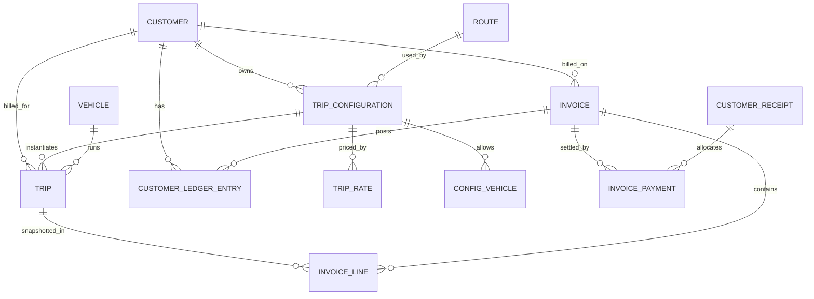

The diagram shows the trip-to-cash spine; supporting tables (stops, events, costs, tax lines, evidence, transfers) hang off Trip and Invoice as listed in 46.2.

### 46.4 Key table definitions

**Trip**

| Column | Type | Null | Notes |
| --- | --- | --- | --- |
| TripId | bigint identity | N | PK |
| TripNumber | varchar(20) | N | UQ |
| TripType | tinyint | N | 1 Fixed, 2 Open |
| CustomerId | bigint | N | FK Customer |
| CustomerTripReference | nvarchar(50) | Y | IX (CustomerId, CustomerTripReference) |
| TripConfigurationId | bigint | Y | FK; required when Fixed (CHECK) |
| RouteId | int | Y | FK |
| VehicleId | bigint | N | FK Vehicle |
| DriverId, DefaultDriverId | bigint | Y | FK BusinessPartner |
| IsDriverOverridden | bit | N |  |
| TripDate | date | N | Drives rate resolution |
| CompletionDate | date | Y | Set on Completed; billing period basis. IX (CustomerId, CompletionDate, Status, IsActive) |
| CurrencyCode, ExchangeRate, BaseAmount | char(3), decimal(18,6), decimal(18,2) | N / Y / Y | Trip amount currency (13A); same three columns on TripExpense, TripFuel, TripIncome, CustomerReceipt |
| Source, ReviewStatus | tinyint | N / Y | Web / DriverApp / Import; driver-created trips: Pending / Released / Rejected |
| PlannedStart, ActualStart, ActualEnd | datetime2 | Y | UTC |
| StartOdometer, EndOdometer | decimal(10,1) | Y | CHECK End ≥ Start |
| TripRateId | bigint | Y | FK TripRate |
| TripRateAmount | decimal(18,2) | Y | Snapshot |
| RateEffectiveFrom, RateEffectiveTo | date | Y | Snapshot |
| RateSource | tinyint | N | Configured / Manual / Missing |
| TripAmount | decimal(18,2) | Y | CHECK > 0 when not null |
| RateMissing | bit | N |  |
| Status | tinyint | N | Lifecycle |
| StatusBeforeHold | tinyint | Y |  |
| IsActive | bit | N | Default 1 |
| CurrentInvoiceId | bigint | Y | Denormalised from active InvoiceTripLink |
| RowVersion | rowversion | N |  |

**Invoice**

| Column | Type | Notes |
| --- | --- | --- |
| InvoiceId | bigint PK |  |
| InvoiceNumber | varchar(30) | UQ |
| Version | int | 1.. |
| RootInvoiceId, PreviousInvoiceId, ReplacedByInvoiceId | bigint FK self | Version chain |
| CustomerId | bigint FK | IX (CustomerId, IsActive, PeriodFrom, PeriodTo) for overlap check |
| PeriodFrom, PeriodTo, InvoiceDate, DueDate | date | CHECK PeriodFrom ≤ PeriodTo |
| CustomerInvoiceTemplateId, TemplateVersion | FK, int | Snapshot of format |
| CustomerBillingAddressId + BillTo\* columns |  | Address snapshot |
| CustomerCode, CustomerName, NTN, STRN, CurrencyCode, PaymentTermsDays |  | Customer snapshot |
| TotalTripAmount, TotalAdjustment, GrossAmount, TotalDeduction, NetAmount | decimal(18,2) |  |
| PaidAmount, AdvanceAppliedAmount, WriteOffAmount, DiscountAmount, TransferredInAmount, TransferredOutAmount, CarryForwardInAmount, CarryForwardOutAmount, RefundedAmount, BalanceAmount | decimal(18,2) | Maintained in the same transaction as the source row |
| Status | tinyint | Draft/Generated/Submitted/Inactive/Cancelled (no Approved status) |
| PaymentStatus | tinyint | Unpaid/PartiallyPaid/Paid |
| IsActive | bit |  |
| GeneratedBy/On, SubmittedBy/On (ledger date), SubmissionChannel, CancelledBy/On, CancelReason |  |  |
| RegenerationReason, RegeneratedBy, RegeneratedOn |  |  |
| PODRuleApplied, EvidencePageSize |  | Config snapshot |
| Remarks, RowVersion |  |  |

**InvoiceTripLink** — InvoiceTripLinkId PK, InvoiceId FK, TripId FK, InvoiceLineId FK, IsActive bit, LinkedOn, UnlinkedOn, UnlinkReason. **Filtered unique index `UX_InvoiceTripLink_ActiveTrip ON (TripId) WHERE IsActive = 1`** — the database-level guarantee that a trip is billed on at most one active invoice.

**CustomerLedgerEntry** — as section 40A.2, with CHECK `(DebitAmount > 0 AND CreditAmount = 0) OR (CreditAmount > 0 AND DebitAmount = 0)`, UQ (SourceType, SourceId, EntryType), IX (CustomerId, EntryDate, CustomerSeq), IX (InvoiceId).

### 46.5 Constraints and indexes summary

| Rule | Implementation |
| --- | --- |
| Customer code unique | UQ Customer(CustomerCode) |
| City abbreviation unique | UQ City(Abbreviation) |
| Trip code unique per customer | UQ TripConfiguration(CustomerId, TripCode) |
| One default billing address / template per customer | Filtered UQ (CustomerId) WHERE IsDefault = 1 AND Status = Active |
| No overlapping rates | Service check under SERIALIZABLE + trigger `TR_TripRate_NoOverlap` |
| No overlapping tax rules per code | Same pattern on CustomerTaxRule |
| No overlapping configuration vehicle ranges | Same pattern on TripConfigurationVehicle |
| Trip billed once | Filtered UQ InvoiceTripLink(TripId) WHERE IsActive = 1 |
| Ledger idempotency | UQ CustomerLedgerEntry(SourceType, SourceId, EntryType) |
| Receipt allocation total | Service check: Σ InvoicePayment.Amount = CustomerReceipt.ReceiptAmount |
| Effective ranges | CHECK EffectiveTo IS NULL OR EffectiveTo ≥ EffectiveFrom |
| Invoice search | IX Trip(CustomerId, CompletionDate) INCLUDE (Status, IsActive, TripAmount, RateMissing, CurrentInvoiceId) |
| Report performance | IX InvoiceLine(InvoiceId), IX InvoicePayment(InvoiceId), IX TripExpense(TripId), IX TripFuel(TripId, VehicleId) |
| Optimistic concurrency | RowVersion on Customer, TripConfiguration, TripRate, Trip, Invoice, CustomerReceipt, CustomerBalance |
| Immutability | DENY UPDATE, DELETE on CustomerLedgerEntry, InvoiceLine, AuditLog to the app role |

### 46.6 Number sequences

| Document | Format | Source |
| --- | --- | --- |
| Trip | TRP-YYYY-NNNNNN | SQL SEQUENCE per year |
| Invoice | INV-YYYY-NNNNN (optionally customer prefix) | SQL SEQUENCE (**Client Confirmation Required**) |
| Receipt | RCPT-YYYY-NNNNN | SQL SEQUENCE |
| Ledger entry | LED-YYYY-NNNNNN | SQL SEQUENCE |
| Payment transfer | TRF-YYYY-NNNNN | SQL SEQUENCE |
| Advance | ADV-YYYY-NNNNN | SQL SEQUENCE |
| Write-off / discount | STL-YYYY-NNNNN | SQL SEQUENCE |

## 47. API Specification

### 47.1 Conventions (all endpoints)

| Aspect | Rule |
| --- | --- |
| Style | REST, JSON, `/api/...`, camelCase fields |
| Authentication | Bearer JWT from the existing SCM identity provider; driver app uses the same issuer with a driver scope |
| Authorisation | Permission claims checked per endpoint (section 44); row-level filters (driver = own trips) |
| Concurrency | `If-Match: "<rowVersion>"` required on PUT/POST actions against existing records; mismatch → 409 `CONCURRENCY_CONFLICT` |
| Idempotency | `Idempotency-Key` header required on POST that creates money or ledger records (invoices, payments, submit, regenerate, reverse); a replay returns the first response |
| Dates | `date` = `YYYY-MM-DD` (business dates); `datetime` = ISO-8601 UTC |
| Paging | `?page=1&pageSize=50&sort=tripDate:desc`; response `{ items, page, pageSize, totalCount }` |
| Errors | `{ "code": "RATE_MISSING", "message": "…", "details": [ { "field": "…", "entityId": 57, "reason": "…" } ], "correlationId": "…" }` |
| Status codes | 200 OK, 201 Created, 204 No Content, 400 validation, 401, 403, 404 (also for rows outside the caller's scope), 409 conflict/duplicate/state, 422 business rule violation, 500 |
| Audit | Every mutating call writes AuditLog with CorrelationId |

### 47.2 Endpoint catalogue

| Area | Method + path | Purpose | Permission |
| --- | --- | --- | --- |
| Customer | GET /api/customers | Search (code, name, status) | Customer.View |
|  | POST /api/customers | Create (Draft) | Customer.Edit |
|  | GET /api/customers/{id} | Details incl. summary counts | Customer.View |
|  | PUT /api/customers/{id} | Update | Customer.Edit |
|  | POST /api/customers/{id}/activate · /deactivate | Status change (reason) | Customer.Edit |
| Contacts | GET, POST /api/customers/{id}/contacts · PUT /api/customer-contacts/{id} · POST /api/customer-contacts/{id}/deactivate | Contacts | Customer.Edit |
| Addresses | GET, POST /api/customers/{id}/billing-addresses · PUT /api/customer-billing-addresses/{id} · POST …/{id}/set-default | Addresses | Customer.Edit |
| Billing config | GET, PUT /api/customers/{id}/billing-configuration | Settings | Customer.Edit |
| Tax rules | GET, POST /api/customers/{id}/tax-rules · PUT /api/customer-tax-rules/{id} · POST /api/customer-tax-rules/{id}/replace | Deduction rules | TaxRule.Edit |
| Templates | GET, POST /api/customers/{id}/invoice-templates · POST /api/customer-invoice-templates/{id}/activate · /new-version | Formats | Template.Edit |
| Cities | GET, POST /api/cities · PUT /api/cities/{id} | City master | City.Edit |
| Routes | GET, POST /api/routes · GET, PUT /api/routes/{id} · PUT /api/routes/{id}/stops | Routes and stops | Route.Edit |
| Trip configs | GET /api/customers/{id}/trip-configurations · POST /api/trip-configurations · GET, PUT /api/trip-configurations/{id} · POST …/{id}/copy | Customer configurations | TripConfig.Edit |
|  | PUT /api/trip-configurations/{id}/stops | Stops | TripConfig.Edit |
|  | GET, POST /api/trip-configurations/{id}/vehicles · PUT /api/trip-configuration-vehicles/{id} | Allowed vehicles | TripConfig.Edit |
| Rates | GET, POST /api/trip-configurations/{id}/rates · PUT /api/trip-rates/{id} · POST /api/trip-rates/{id}/inactivate · POST /api/trip-configurations/{id}/rates/split | Effective-dated rates | Rate.Configure |
|  | GET /api/trip-rates/resolve?customerId&tripConfigurationId&date | Rate lookup preview | Trip.Create |
|  | POST /api/trips/resolve-missing-rates · POST /api/trips/reprice (preview + commit) | Re-resolution | Rate.Configure / Rate.Reprice |
| Trips | GET /api/trips · POST /api/trips · GET, PUT /api/trips/{id} | Trips (fixed/open) | Trip.View / Trip.Create / Trip.Edit |
|  | POST /api/trips/{id}/transition `{ "toStatus": "Started", … }` | Lifecycle (and aliases /start, /complete, /hold, /resume, /cancel) | Trip.Status |
|  | POST /api/trips/{id}/inactive · /reactivate | Active flag (reason) | Trip.Inactivate |
|  | GET, POST /api/trips/{id}/events | Events | Trip.Status |
|  | GET, POST /api/trips/{id}/expenses · POST /api/trip-expenses/{id}/approve · /void | Expenses | Expense.Edit / Expense.Approve |
|  | GET, POST /api/trips/{id}/fuel · POST /api/trip-fuel/{id}/void | Fuel | Fuel.Edit |
|  | GET, POST /api/trips/{id}/income | Income | Income.Edit |
|  | POST /api/trips/{id}/documents · POST /api/trips/{id}/pod · POST /api/trip-pods/{id}/approve | Documents, POD | Trip.Documents / POD.Approve |
|  | POST /api/trips/{id}/issues | Issues | Trip.Status |
|  | GET /api/trips/{id}/pnl | Operational P&L | PnL.View |
| Fuel cards | GET, POST /api/fuel-cards · PUT /api/fuel-cards/{id} · POST /api/fuel-cards/{id}/assign | Cards | FuelCard.Edit |
| Invoices | POST /api/invoices/search-eligible-trips | Eligibility search | Invoice.Generate |
|  | POST /api/invoices/overlap-check | Overlap preview | Invoice.Generate |
|  | POST /api/invoices | Create (Draft or Generated) | Invoice.Generate |
|  | GET /api/invoices · GET /api/invoices/{id} · GET /api/invoices/{id}/lines | Read | Invoice.View |
|  | PUT /api/invoices/{id} | Edit Draft only | Invoice.Generate |
|  | POST /api/invoices/{id}/submit · /cancel | Status actions | Invoice.Submit / Invoice.Cancel |
|  | POST /api/invoices/{id}/regenerate | Regeneration | Invoice.Regenerate |
|  | GET /api/invoices/{id}/versions | Version chain | Invoice.View |
|  | GET /api/invoices/{id}/evidence · POST /api/invoices/{id}/evidence/retry · /re-render | Evidence | Invoice.View / Admin |
|  | GET /api/invoices/{id}/document | Invoice PDF | Invoice.View |
| Payments | POST /api/invoices/{id}/payments | Quick payment for one invoice (creates receipt + allocation) | Payment.Create |
|  | POST /api/customer-receipts · GET /api/customer-receipts · GET /api/customer-receipts/{id} | Multi-invoice receipt | Payment.Create / View |
|  | POST /api/invoice-payments/{id}/reverse | Reverse (reason) | Payment.Reverse |
|  | GET /api/invoices/{id}/payments · /payment-transfers | History | Invoice.View |
|  | POST /api/invoices/{id}/carry-forward · /refund · /settlements (write-off / discount) · POST /api/invoice-settlements/{id}/reverse | Credit handling | Payment.CarryForward / Payment.Refund / Payment.WriteOff / Payment.Discount |
| Ledger | GET /api/customers/{id}/ledger?from&to&invoiceId | Statement with opening/closing balance | Ledger.View |
|  | GET /api/invoices/{id}/ledger | Invoice-wise entries | Ledger.View |
|  | GET /api/customers/{id}/balance · GET /api/customer-balances | Balances | Ledger.View |
|  | GET /api/customers/{id}/ledger/statement.pdf | Statement export | Ledger.View |
|  | POST /api/customers/{id}/opening-balance | Go-live opening balance | Ledger.OpeningBalance |
|  | POST /api/ledger-periods/{yyyymm}/close · /reopen | Period lock | Ledger.PeriodLock |
| Reports | GET /api/reports/{code}?filters · POST /api/reports/{code}/export | Any report in section 42 | Report.{Code}.View |
| Driver app | GET /api/driver/trips · GET /api/driver/trips/{id} · POST /api/driver/trips/{id}/steps · /fuel · /expenses · /issues · /pod · POST /api/driver/sync | Driver-scoped facade | Driver scope |

### 47.3 Key API details

**POST /api/trips** (fixed)

```json
{ "tripType": "Fixed", "customerId": 12, "tripConfigurationId": 88, "vehicleId": 301,
  "driverId": 45, "driverOverrideReason": null, "tripDate": "2026-07-20",
  "customerTripReference": "ABC-TRP-2026-00981", "plannedStart": "2026-07-20T03:00:00Z" }
```

Response 201: trip with `tripNumber`, `defaultDriverId`, `isDriverOverridden`, rate snapshot (`tripRateId`, `tripRateAmount`, `rateEffectiveFrom/To`, `rateSource`), `rateMissing`, `warnings[]` (e.g. `DUPLICATE_CUSTOMER_REFERENCE`). Validation: customer active; configuration belongs to customer and is active; vehicle allowed on date; driver active with Driver role. Errors: 422 `CUSTOMER_INACTIVE`, `CONFIG_CUSTOMER_MISMATCH`, `VEHICLE_NOT_ALLOWED`, 409 `DUPLICATE_CUSTOMER_REFERENCE` (when behaviour = Block).

**POST /api/invoices/search-eligible-trips**

```json
{ "customerId": 12, "periodFrom": "2026-08-01", "periodTo": "2026-08-31", "invoiceDate": "2026-09-02",
  "regeneratingInvoiceId": null }
```

Response 200:

```json
{ "summary": { "completedTrips": 142, "alreadyInvoiced": 10, "blocked": 2, "available": 130, "availableAmount": 3250000 },
  "trips": [ { "tripId": 9001, "tripNumber": "TRP-2026-009001", "tripDate": "2026-08-03", "category": "Available", "amount": 25000, "vehicle": "ABC-123", "route": "LHR → SKP → FSD", "customerTripReference": "PO-2026-4587", "rowVersion": "AAAAAAAB9xk=" } ],
  "blockingErrors": [ { "code": "RATE_MISSING", "tripId": 9057, "tripDate": "2026-08-15", "configuration": "ABC-LHR-FSD-01" } ],
  "overlaps": [ { "invoiceId": 125, "invoiceNumber": "INV-2026-00125", "periodFrom": "2026-08-01", "periodTo": "2026-08-30", "paymentStatus": "Unpaid", "fullyPaid": false } ],
  "resolved": { "templateOptions": [ { "id": 4, "name": "Customer Detailed Format", "version": 2, "isDefault": true } ], "billingAddressOptions": [ { "id": 7, "name": "Head Office", "isDefault": true } ], "taxRulesPreview": [ { "taxCode": "WHT-236", "rate": 2.0, "basis": "InvoiceSubtotal" } ] } }
```

Read-only; validates customer, date range, excludes inactive/cancelled/invoiced trips, returns rate problems and totals.

**POST /api/invoices**

```json
{ "customerId": 12, "periodFrom": "2026-08-01", "periodTo": "2026-08-31", "invoiceDate": "2026-09-02",
  "customerInvoiceTemplateId": 4, "customerBillingAddressId": 7, "tripIds": [9001, 9002],
  "adjustments": [ { "adjustmentMonth": "July 2026", "amount": -15000, "note": "Previous overbilling adjustment" } ],
  "confirmOverlapReplacement": true, "replaceInvoiceIds": [125], "saveAsDraft": false, "remarks": null }
```

Server steps (single transaction, section 52): revalidate customer/template/address; re-run eligibility for each tripId; re-check rate completeness for the period; re-check overlaps (must match `replaceInvoiceIds` exactly, else 409 `OVERLAP_CHANGED`); insert invoice, lines, adjustments, tax lines, trip links (unique index); inactivate replaced invoices, transfer payments, post ledger entries; queue evidence. Response 201 with invoice header, totals and `evidenceStatus: "Queued"`. Errors: 422 `RATE_MISSING` (with trip list), `INACTIVE_TRIP`, `TEMPLATE_REQUIRED`, `BILLING_ADDRESS_REQUIRED`, `REPLACED_INVOICE_FULLY_PAID`; 409 `TRIP_ALREADY_INVOICED` ("One or more selected trips have already been invoiced.") with trip ids.

**POST /api/invoices/{id}/submit** — body `{ "submissionChannel": "Email", "submittedOn": "2026-09-03", "acknowledgementDocumentId": null }`, `If-Match` + `Idempotency-Key`. Checks status Generated (no approval step), evidence Generated if required, ledger period open. Sets Submitted and `posts the submission ledger entries (trip debit, one per adjustment, one per deduction, advance application) dated the submission date, in the same transaction`. Response 200 with `ledgerEntryId`. Errors: 422 `INVALID_STATUS`, `EVIDENCE_NOT_READY`, `PERIOD_CLOSED`.

**POST /api/invoices/{id}/payments**

```json
{ "receiptDate": "2026-09-12", "amount": 200000, "paymentMethod": "BankCheque", "bankCashAccountId": 3,
  "instrumentNo": "004512", "instrumentDate": "2026-09-10", "drawnOnBank": "HBL", "paymentReference": "Remit-7781",
  "attachmentId": 5521, "remarks": null, "confirmOverpayment": false }
```

Creates CustomerReceipt + InvoicePayment + ledger `PAYMENT` credit, recalculates invoice balance and payment status. Response 201 `{ receiptNumber, invoicePaymentId, ledgerEntryId, invoiceBalance, paymentStatus }`. Errors: 422 `INVOICE_NOT_SUBMITTED`, `INVOICE_INACTIVE` (with replacement number), `OVERPAYMENT_NOT_ALLOWED`, `OVERPAYMENT_CONFIRMATION_REQUIRED`; 409 `DUPLICATE_INSTRUMENT` (warning unless `confirmDuplicate`).

**POST /api/customer-receipts** — header fields + `allocations: [ { invoiceId, amount } ]`; rule Σ allocations = amount; one ledger credit per allocation.

**POST /api/invoice-payments/{id}/reverse** — `{ "reason": "Cheque bounced", "reversalDate": "2026-09-20" }`; posts `PAYMENT_REVERSAL` debit; invoice recalculated. Error 422 `PAYMENT_ALREADY_REVERSED`, `PAYMENT_TRANSFERRED` (reverse on the active invoice instead).

**POST /api/invoices/{id}/regenerate** — body as POST /api/invoices plus `regenerationReason` (required) and `repriceTrips` (bool). Rejects 422 `INVOICE_FULLY_PAID` ("This invoice is fully paid and cannot be regenerated."), `INVALID_STATUS` (Draft, Cancelled, Inactive). Response 201 with new invoice, `previousInvoiceId`, `transfers[]`, `ledgerEntries[]`.

**GET /api/customers/{id}/ledger?from=2026-09-01&to=2026-09-30**

```json
{ "customerId": 12, "currency": "PKR", "openingBalance": 120000, "totalDebit": 1050000, "totalCredit": 700000, "closingBalance": 470000,
  "entries": [ { "entryDate": "2026-09-05", "entryNumber": "LED-2026-000812", "entryType": "INVOICE", "documentNo": "INV-2026-00125", "invoiceId": 125, "narration": "Invoice INV-2026-00125 for 01-Aug-2026 to 30-Aug-2026", "debit": 500000, "credit": 0, "runningBalance": 620000 } ] }
```

**Driver API** returns only the caller's trips; responses omit amounts, rates and customer financial data.

**New endpoints (v1.1)**

| Method + path | Purpose | Permission |
| --- | --- | --- |
| GET, POST /api/currencies · PUT /api/currencies/{code} | Currency master | Admin |
| GET, PUT /api/tenant/currency-settings | Base currency, multi-currency switch | Admin |
| GET, POST /api/exchange-rates | Exchange rates | Admin / granted Finance |
| POST /api/trips/{id}/advances · GET /api/customer-advances · POST /api/customer-advances/{id}/move · /refund · /reverse | Open-trip advances (37.4) | Payment.Advance |
| POST /api/invoices/{id}/settlements `{ "type": "WriteOff", "amount": 600.00, "date": "2026-09-20", "reason": "Short payment accepted" }` | Write-off / discount (37.5) | Payment.WriteOff / Payment.Discount |
| GET /api/driver/trip-options (customers, configurations for own vehicle, cities) · POST /api/driver/trips | Driver trip creation (43) | Driver scope |
| GET /api/trips/pending-review · POST /api/trips/{id}/release · /reject | Review of driver-created trips | Trip.Review |

`POST /api/invoices/{id}/payments` accepts `"settleRemaining": { "type": "WriteOff" | "Discount", "amount": 600.00, "reason": "…" }` to post a payment and a settlement in one transaction. `paymentMethod` values are `DirectToAccount` and `BankCheque`.

## 48. UI Specification

### 48.1 Common patterns (apply to every screen)

| Pattern | Behaviour |
| --- | --- |
| List screens | Filter bar (collapsible), grid with server paging (25/50/100), sort by header, column chooser, Export (Excel/CSV/PDF), "Show inactive" toggle, row actions menu |
| Forms | Required fields marked `*`; inline validation on blur; server errors mapped to fields; Save / Save & New / Cancel; unsaved-changes prompt |
| Status | Coloured status chip; actions offered only for valid transitions and permitted users |
| Confirmation | Any status change, deactivation, cancel, reverse, regenerate asks for confirmation; financial ones require a reason (min 10 chars) |
| History | "History" button on every record opens audit rows (who, when, field, old → new, reason) |
| Empty state | Plain message + primary action, e.g. "No contacts yet. Add the first contact." |
| Concurrency | If the record changed since opened: "This record was updated by {user} at {time}. Reload to see the latest version." |
| Display | Cities as `Lahore (LHR)`; amounts with thousands separators and currency; negative balances as `(50,000) CR` |
| Time | Shown in the viewer's time zone; stored UTC |

### 48.2 Customer screens

| # | Screen | Purpose & layout | Filters / grid | Form fields & buttons | Validation, errors, empty state | Permission |
| --- | --- | --- | --- | --- | --- | --- |
| 1 | Customer List | Find and open customers | Filters: code, name, city, status. Grid: code, name, short name, city, currency, terms, balance, status | New Customer, Export | Empty: "No customers found." | Customer.View |
| 2 | Customer Details | Tabbed record: General, Contacts, Billing Addresses, Billing Configuration, Tax/Deductions, Invoice Templates, Trip Configurations, Documents, Ledger (Finance), History | Header: code, name, status chip, balance | Fields per section 10; Save, Activate, Deactivate (reason), History | Activation checklist panel lists missing items; "Customer code already exists." | Customer.Edit |
| 3 | Customer Contacts | Tab grid + side panel form | Grid: name, designation, mobiles, email, purpose, primary, status | Add, Edit, View, Deactivate | Confirm "Deactivate contact {name}?"; mobile format error | Customer.Edit |
| 4 | Billing Addresses | Tab grid + form | Grid: name, address, city, NTN, default, effective, status | Add, Edit, Set Default, Deactivate | "Only one default billing address is allowed." (auto-switch with confirm) | Customer.Edit |
| 5 | Billing Configuration | Single form with groups: Terms & currency, Defaults, POD & evidence, References, Payments | — | Save (creates new effective version), View history | Page size 10–200 | Customer.Edit |
| 6 | Tax/Deduction Configuration | Grid of rules with effective timeline bar | Grid: name, code, type, rate/fixed, basis, applicable, from, to, status | Add, Edit, Add Rule (a rule with the same tax name auto-inactivates the current one after confirmation), Inactivate | Overlap message; "Percentage must be between 0 and 100." | TaxRule.Edit |
| 7 | Invoice Templates | Grid + upload form | Grid: name, version, type, effective, default, status | Add, New Version, Activate, Set Default, Preview | "No active invoice format is configured for this customer." | Template.Edit |

### 48.3 Setup screens

| # | Screen | Purpose & layout | Filters / grid | Form fields & buttons | Validation, errors, empty state | Permission |
| --- | --- | --- | --- | --- | --- | --- |
| 8 | City | Master list + modal | Name, abbreviation, province, status | Add, Edit, Deactivate | "City abbreviation already exists." | City.Edit |
| 9 | Route | List + editor with drag-and-drop stops and preview string `LHR → SKP → FSD` | Code, name, origin, destination, distance, status | Add, Edit, Add Stop, Reorder, Deactivate | "A route needs at least two stops."; inactive city blocked | Route.Edit |
| 10 | Trip Configuration | Customer-first list; editor tabs: General, Stops, Vehicles, Rates | Filter: customer (required), route, status. Grid: trip code, name, route, vehicles count, current rate, status | Add, Copy, Edit, Deactivate; Vehicles tab: Add vehicle with effective dates | "Trip code already exists for this customer."; vehicle overlap message; empty: "This customer has no trip configurations yet." | TripConfig.Edit |
| 11 | Trip Rates | Grid per configuration with calendar strip showing covered/uncovered days | Grid: from, to, rate, status, created by, trips using | Add Rate, Insert One-Day Rate (split), Inactivate, Resolve Missing Rates, Re-price Trips (preview grid old/new) | "The selected effective date range overlaps an existing rate configuration."; gap warning "No rate for 12-Jul to 14-Jul." | Rate.Configure |
| 17 | Fuel Card | List + form + assignment history | Card (masked), company, vehicle, driver, expiry, status | Add, Assign/Reassign, Inactivate, Block | "Card number already exists."; expired chip | FuelCard.Edit |

### 48.4 Trip screens

| # | Screen | Purpose & layout | Filters / grid | Form fields & buttons | Validation, errors, empty state | Permission |
| --- | --- | --- | --- | --- | --- | --- |
| 12 | Fixed Trip (create/edit) | Stepper form: Customer → Configuration → Vehicle → Driver → Date → Rate panel | — | Rate panel shows resolved rate and range or red "Rate not configured for this date" with link to rates. Save Draft, Save & Plan, Save & Assign | Duplicate reference warning dialog; vehicle not allowed; driver override reason | Trip.Create |
| 13 | Open Trip (create/edit) | Form: Customer, reference, From/To (City or Other Location), stops, vehicle, driver, amount, date | — | Add Stop, Save Draft, Save & Plan | "Trip amount must be greater than zero."; From = To error | Trip.Create |
| 14 | Trip Details | Header (trip no., type, status chip, customer, route string, vehicle, driver, amount, invoice link) + tabs: Timeline, Stops, Fuel, Expenses, Income, Documents/POD, Issues, P&L, History | — | Next-status buttons, Hold/Resume, Cancel, Inactivate/Reactivate, Reopen | Invoiced trip shows lock banner "On INV-…; amount locked" | Trip.View + action perms |
| 15 | Trip Events | Timeline tab; vertical list with source icons | Filter by event type/source | Add Event (type, time, location, odometer, remarks, attachment) | Time in future > 10 min rejected; odometer decrease warning | Trip.Status |
| 16 | Fuel | Tab grid + form | Date, type, litres, rate, amount, method, card, odometer | Add, Void (reason) | "Fuel card is required when payment method is Fuel Card." | Fuel.Edit |
| 18 | Expenses | Tab grid + form | Date, type, amount, method, vendor, approval | Add, Approve, Reject, Void | "Please specify the other expense type." | Expense.Edit / Approve |
| — | Trip List (desk) | Operational board | Filters: date, customer, vehicle, driver, status, type, active, invoiced. Grid: trip no., date, customer, ref., route, vehicle, driver, status, amount, rate flag, POD, invoice | New Fixed Trip, New Open Trip, bulk status (Admin), Export | Empty: "No trips for the selected filters." | Trip.View |

### 48.5 Billing, payment and ledger screens

| # | Screen | Purpose & layout | Filters / grid | Form fields & buttons | Validation, errors, empty state | Permission |
| --- | --- | --- | --- | --- | --- | --- |
| 19 | Invoice Generation | Wizard: 1 Parameters → 2 Trips → 3 Adjustments → 4 Review & Generate | Step 2 tiles: Completed, Already Invoiced, Blocked, Available, Selected, Selected Amount; grid with select-all, group-by-vehicle, blocked reasons | Step 1: customer, from, to, invoice date, `Invoice Format *` (only if several), billing address. Step 3: adjustment rows. Buttons: Search, Select All, Deselect All, Save as Draft, Generate | Overlap dialog (section 39); missing-rate stop panel; "Customer is required."; "Please select an invoice format."; "A valid billing address is required before generating the invoice." | Invoice.Generate |
| 20 | Invoice Review | Step 4 preview: bill-to snapshot, lines grouped by vehicle, adjustments, gross, each deduction, net | — | Back, Generate, Generate & Submit | Final server errors shown inline (e.g. trips invoiced meanwhile, with "Refresh selection") | Invoice.Generate |
| 21 | Invoice Detail | Header card (no., version, status, payment status, period, dates, customer, template, net, paid, balance) + tabs: Lines, Adjustments, Deductions, Payments, Transfers, Ledger, Evidence, Documents, Versions, History | — | Submit, Record Payment, Write-off/Discount, Carry Forward, Refund, Regenerate, Cancel, Download PDF, Download Evidence | Inactive invoice banner "Replaced by INV-…"; credit banner for negative balance | Invoice.View + action perms |
| 22 | Invoice Payment (Record Payment) | Modal from invoice, or Receipts → New Receipt full page | Receipt page grid: open invoices of customer (no., date, due, net, balance, allocate) | Receipt date, amount, currency (if multi-currency), method (Direct to Account / Bank Cheque), bank account, cheque no. or transfer reference, cheque date, drawn-on bank, "Settle remaining" (None / Write-off / Discount + reason), reference, attachment, remarks; Auto-allocate FIFO; Save | Overpayment confirm; duplicate instrument warning; "Total allocated must equal receipt amount."; empty: "This customer has no open submitted invoices." | Payment.Create |
| — | Receipts List | All receipts | Filters: date, customer, method, account, status. Grid: receipt no., date, customer, method, instrument, amount, invoices, status | View, Reverse (per allocation, reason), Print Receipt | Reverse confirm: "Reverse PKR X on INV-…? A ledger debit will be posted." | Payment.View / Reverse |
| 23 | Invoice Regeneration | Wizard like 19, pre-filled; top banner with old invoice summary (net, paid, balance) and mandatory reason; option Re-price trips | As 19 | Regenerate, Regenerate & Submit | "This invoice is fully paid and cannot be regenerated." (button disabled with tooltip); transfer preview "PKR 200,000 will be transferred." | Invoice.Regenerate |
| 24 | Invoice Evidence | Evidence tab: versions list + PDF viewer | Version, generated on/by, pages, lines, status, hash | Download, Retry (failed), Re-render (Admin) | "Invoice evidence is not ready." | Invoice.View |
| — | Customer Ledger | Statement view (section 40A.4) | Customer\*, from, to, invoice, entry type. Header: opening, debits, credits, closing, overdue. Grid with running balance | Export PDF statement, Excel, Print; row → source | Empty: "No ledger entries in this period. Opening balance: PKR X." | Ledger.View |
| — | Customer Balances | All customers' balances + aging buckets | Filters: balance sign, overdue only | Open statement | — | Ledger.View |
| 25 | Reports | Catalogue page grouped as section 42, search box, favourites | Each report: filter panel, run, grid, chart where defined | Run, Export, Save filter preset | "No data for the selected filters." | Report.{Code}.View |
| 26 | Driver App | See section 43 | — | — | — | Driver scope |

### 48.6 Invoice Generation wireframe (step 2)

```text
+-----------------------------------------------------------------------------------+
| Generate Invoice  ·  ABC Traders (CUS-00012)  ·  01-Aug-2026 → 31-Aug-2026         |
| Format: Customer Detailed Format v2   Bill to: Head Office                          |
+-----------------------------------------------------------------------------------+
| Completed 142 | Already invoiced 10 | Blocked 2 | Available 130 | Selected 128 | PKR 3,200,000 |
+-----------------------------------------------------------------------------------+
| [x] Select all  [ ] Group by vehicle            ! 2 trips blocked (view reasons)    |
| [x] TRP-2026-009001  03-Aug  PO-2026-4587  ABC-LHR-FSD-01  LHR>SKP>FSD  ABC-123  25,000 |
| [ ] TRP-2026-009057  15-Aug  —             ABC-LHR-FSD-01  LHR>SKP>FSD  ABC-456  Rate missing |
+-----------------------------------------------------------------------------------+
|                                             [Back] [Save as Draft] [Next: Adjustments] |
+-----------------------------------------------------------------------------------+
```

### 48.7 Record Payment modal

```text
+-----------------------------------------------+
| Record Payment · INV-2026-00125               |
| Net 509,600 · Paid 0 · Balance 509,600        |
| Receipt date*    [12-Sep-2026]                |
| Amount*          [200,000.00]                 |
| Method*          [Bank Cheque v]                   |
| Received in*     [HBL Current A/c v]          |
| Cheque no.*      [004512]  Cheque date [10-Sep]|
| Drawn on bank    [HBL]                        |
| Reference        [Remit-7781]                 |
| Attachment       [Upload deposit slip]        |
| Remarks          [                    ]       |
| After save: Balance 309,600 · Partially Paid  |
| A ledger credit will be posted against this   |
| invoice.                  [Cancel] [Save]     |
+-----------------------------------------------+
```

### 48.8 Screens added in v1.1

| Screen | Purpose & layout | Fields & buttons | Validation / messages | Permission |
| --- | --- | --- | --- | --- |
| Currency Setup | Admin → Settings: base currency, multi-currency switch, currency list, exchange rates grid | Add currency, Set base (only before transactions), Add rate (date, rate) | "Multi-currency cannot be turned off while foreign-currency transactions are open." | Admin |
| Record Advance | From an Open trip's Payments tab or Receipts → New Advance | Customer, Open trip, date, amount, method, account, cheque/ref, attachment; Save; Move to another trip; Refund; Reverse | "Advances can only be recorded against Open trips." | Payment.Advance |
| Write-off / Discount | Modal on Invoice Detail (also inside Record Payment) | Type, amount (default = balance), date, reason; Save | "Amount cannot exceed the invoice balance." | Payment.WriteOff / Discount |
| Carry Forward / Refund | Modal on a credit invoice | Carry Forward: target open invoice (list of the customer's submitted invoices), amount. Refund: date, method, account, reference, amount | "Amount cannot exceed the available credit." | Payment.CarryForward / Refund |
| Pending Review (Trip Desk) | Queue of driver-created trips | Grid: trip, driver, customer, type, route, date, photo; Release (enter amount for open trips), Reject (reason) | "Enter the trip amount before releasing an open trip." | Trip.Review |
| Driver App → New Trip | See section 43 | Customer, configuration or From/To, date, reference, photo; Submit | Simple inline messages | Driver |

## 49. Business Rules (Consolidated)

| # | Rule | Section |
| --- | --- | --- |
| 1 | Customer is independent from Business Partner; trips and invoices use CustomerId. | 10 |
| 2 | Fixed trip configurations are customer-specific. | 18 |
| 3 | Open trips have no predefined configuration. | 22 |
| 4 | Customer must be selected for every trip. | 21, 22 |
| 5 | Customer must be selected for every invoice. | 32 |
| 6 | A customer can have multiple trip configurations. | 18 |
| 7 | A configuration can have multiple vehicles. | 19 |
| 8 | A vehicle can have a default driver. | 20 |
| 9 | Driver can be overridden by an authorised user; override is recorded. | 20 |
| 10 | Rates are customer- and configuration-specific. | 26 |
| 11 | Rates are effective-dated. | 26 |
| 12 | One-day rates are supported. | 26 |
| 13 | Rate periods cannot overlap. | 26 |
| 14 | A trip snapshots its rate. | 26 |
| 15 | Missing rate prevents invoice generation; no fallback rate. | 32.2 |
| 16 | Trips can be inactive. | 24 |
| 17 | Inactive trips cannot be newly invoiced. | 32.1 |
| 18 | Historical invoice lines remain intact. | 33 |
| 19 | Invoice period can be any date range. | 32 |
| 20 | One invoice belongs to one customer. | 32 |
| 21 | One invoice can contain multiple vehicles. | 32 |
| 22 | One invoice can contain multiple routes. | 32 |
| 23 | One invoice can contain multiple trips. | 32 |
| 24 | A customer can have multiple billing addresses. | 12 |
| 25 | The invoice snapshots the billing address. | 12 |
| 26 | A customer can have multiple contacts. | 11 |
| 27 | A customer can have multiple tax/deduction configurations. | 14 |
| 28 | Tax/deduction applies at invoice level. | 35 |
| 29 | A customer can have multiple invoice formats. | 15 |
| 30 | One applicable format is auto-selected. | 15 |
| 31 | Multiple formats require user selection. | 15 |
| 32 | Invoice lines snapshot trip information. | 33 |
| 33 | Past-month adjustments are supported. | 32.3 |
| 34 | Adjustment amount can be positive. | 32.3 |
| 35 | Adjustment amount can be negative. | 32.3 |
| 36 | Adjustment month is stored as text. | 32.3 |
| 37 | Adjustment note is stored. | 32.3 |
| 38 | A fully paid invoice cannot be regenerated. | 38 |
| 39 | An unpaid invoice can be regenerated, subject to permission. | 38 |
| 40 | A partially paid invoice can be regenerated. | 38 |
| 41 | The old invoice becomes Inactive. | 38 |
| 42 | The new invoice gets a new invoice number. | 38 |
| 43 | The old/new relationship is preserved. | 38 |
| 44 | Historical payments are preserved. | 37, 40 |
| 45 | 100% of historical payment is transferred. | 40 |
| 46 | Transferred payment is not capped. | 40 |
| 47 | Negative balance is allowed and visible. | 40 |
| 48 | Evidence is stored against the invoice. | 41 |
| 49 | Historical evidence is not overwritten. | 41 |
| 50 | Evidence is built from invoice snapshots. | 41 |
| 51 | Evidence supports vehicle grouping. | 41 |
| 52 | 50-line pages continue across pages for the same vehicle. | 41 |
| 53 | Audit is mandatory. | 45 |
| 54 | Financial records cannot be physically deleted. | 45 |
| 55 | Invoice generation must be concurrency-safe. | 52 |
| 56 | GPS is not required for Phase 1. | 55 |
| 57 | The data model must be GPS-ready for Phase 2. | 56 |
| 58 | Submitting an invoice automatically posts a ledger debit against that invoice. | 40A |
| 59 | Logging a payment against an invoice posts a ledger credit against that invoice. | 37, 40A |
| 60 | Ledger entries are immutable; corrections are reversal entries. | 40A |
| 61 | Invoice payments are recorded only against Active, Submitted invoices; advances only against Open trips. | 37 |
| 62 | Payments are reversed, never edited or deleted. | 37 |
| 63 | Invoice balance and invoice ledger balance always agree. | 40A |
| 64 | Invoice status and payment status are separate. | 36 |
| 65 | Configuration changes affect future transactions, never historical ones. | 46.1 |

**Rules added from client answers (v1.1)**

| # | Rule | Section |
| --- | --- | --- |
| 66 | Invoice approval is not required; Generated invoices are submitted directly. | 36 |
| 67 | Adding a tax rule with the same name auto-inactivates the existing rule by date. | 14 |
| 68 | Multiple deductions can apply to one invoice. | 14, 35 |
| 69 | A rate without end date runs until the next rate's start date. | 26 |
| 70 | Trips are included in an invoice by completion date. | 32.1 |
| 71 | Invoices always contain trips; adjustment-only invoices are not allowed. | 32 |
| 72 | Ledger invoice entries are dated by submission date; the invoice date appears in the narration. | 40A |
| 73 | Each adjustment posts its own ledger entry against the same invoice. | 40A |
| 74 | Payment methods are Direct to Account and Bank Cheque. | 37 |
| 75 | Overpayment is allowed with confirmation. | 37 |
| 76 | Write-off and discount can settle part of an invoice, with reason. | 37.5 |
| 77 | Advances can be received for Open trips and are applied to the trip's invoice on submission. | 37.4 |
| 78 | A customer credit is either carried forward or refunded. | 40 |
| 79 | A fully paid invoice is corrected by an adjustment on a later invoice. | 38 |
| 80 | Opening balances may be debit or credit. | 40A |
| 81 | Currency defaults to PKR; multi-currency is a tenant setting. | 13A |
| 82 | Amounts are kept to two decimal places. | 13A |
| 83 | Drivers can create trips in the app; office review releases them. | 21, 43 |
| 84 | Billable trip income appears as invoice lines. | 30, 33 |
| 85 | Invoice evidence uses one standard layout, no template. | 41 |
| 86 | Records and documents have no retention limit. | 54 |

## 50. Validations

| Area | Field / condition | Rule | Message | Layer |
| --- | --- | --- | --- | --- |
| Customer | CustomerCode | Required, unique, pattern | "Customer code already exists." | UI + API + DB |
| Customer | Activate | Checklist | "Customer cannot be activated: {missing item}." | API |
| Contact | Mobile1 | Required, PK format | "Enter a valid mobile number (03XXXXXXXXX)." | UI + API |
| Contact | Email | Format | "Enter a valid email address." | UI + API |
| Address | Default | One active default | "Only one default billing address is allowed." | API + DB |
| Tax rule | Percentage | 0 < x ≤ 100 when Percentage | "Percentage must be between 0 and 100." | UI + API |
| Tax rule | Effective range | No overlap per tax code | "The selected effective date range overlaps an existing tax/deduction rule for this tax code." | API + DB |
| City | Abbreviation | Unique, 2–5 letters | "City abbreviation already exists." | UI + API + DB |
| Route | Stops | ≥ 2, sequence unique | "A route needs at least two stops." | API |
| Configuration | TripCode | Unique per customer | "Trip code already exists for this customer." | API + DB |
| Config vehicle | Effective range | No overlap per vehicle | "This vehicle is already assigned for part of this period." | API |
| Rate | Range | To ≥ From; no overlap | "The selected effective date range overlaps an existing rate configuration." | API + DB |
| Rate | Amount | > 0 | "Rate must be greater than zero." | UI + API |
| Trip | Customer | Required, active | "Customer is required." / "Customer is inactive." | UI + API |
| Trip | Vehicle (fixed) | Allowed on config on date | "This vehicle is not configured for the selected trip configuration on this date." | API |
| Trip | Driver | Active driver before Assigned | "Driver is required to assign the trip." | API |
| Trip | Odometer | End ≥ Start | "End odometer cannot be less than start odometer." | UI + API + DB |
| Trip | Open amount | > 0 | "Trip amount must be greater than zero." | UI + API |
| Trip | Status change | Valid transition + permission | "This status change is not allowed." | API |
| Trip | Customer reference | Duplicate per config | "This customer reference is already used on {trip}." | API |
| Fuel | Fuel card | Required if method = Fuel Card; active, unexpired | "Fuel card is required when payment method is Fuel Card." | UI + API |
| Expense | Other type | Required if type = Other | "Please specify the other expense type." | UI + API |
| Invoice | Period | From ≤ To | "From date must be on or before To date." | UI + API |
| Invoice | Format | Required if several | "Please select an invoice format." | UI + API |
| Invoice | Address | Required, active | "A valid billing address is required before generating the invoice." | UI + API |
| Invoice | Trips | ≥ 1 selected (or adjustments only — **Client Confirmation Required**) | "Select at least one trip." | UI + API |
| Invoice | Trip amounts | All priced | "Invoice cannot be generated. Trip amount is not configured for the selected date range." | API |
| Invoice | Trip state | Completed, active, not invoiced | "One or more selected trips have already been invoiced." / "Inactive trips cannot be selected for invoice generation." | API + DB |
| Invoice | Adjustment | Month text, non-zero amount, note | "Adjustment month, amount and note are required." | UI + API |
| Invoice | Net | ≥ 0 | "Invoice net amount cannot be negative." | API |
| Payment | Amount | > 0; ≤ balance unless overpay allowed | "Payment exceeds the outstanding balance." | UI + API |
| Payment | Invoice | Submitted, active | "Payments can only be recorded against submitted invoices." | API |
| Payment | Receipt | Σ allocations = amount | "Total allocated must equal receipt amount." | UI + API |
| Payment | Instrument | Required for cheque/transfer | "Instrument number is required for this payment method." | UI + API |
| Regeneration | Paid status | Not fully paid | "This invoice is fully paid and cannot be regenerated." | API |
| Regeneration | Reason | Required | "Please enter a regeneration reason." | UI + API |
| Ledger | Period | EntryDate month open | "Entry date falls in a closed period ({month})." | API |

**Validations added in v1.1**

| Area | Condition | Rule | Message |
| --- | --- | --- | --- |
| Tax rule | Same tax name exists | New EffectiveFrom must be after the current rule's EffectiveFrom | "The selected effective date range overlaps an existing tax/deduction rule for this tax name." |
| Rate | Open-ended rate exists | New rate must start after it; it is auto-closed | "An open-ended rate exists from {date}. It will end on {date − 1}. Continue?" |
| Payment | Method = Bank Cheque | Cheque no., cheque date, drawn-on bank required | "Cheque number, date and bank are required." |
| Payment | Method = Direct to Account | Account and transfer reference required | "Bank account and transfer reference are required." |
| Advance | Trip type | Open trip, same customer, not on a submitted invoice | "Advances can only be recorded against Open trips." |
| Settlement | Amount | > 0 and ≤ balance; reason required | "Amount cannot exceed the invoice balance." |
| Carry forward | Amount | ≤ available credit; target open, same customer and currency | "Amount cannot exceed the available credit." |
| Currency | Invoice | All selected trips share the invoice currency | "Currency differs from invoice currency." |
| Amounts | Any money field | Maximum two decimal places | "Enter an amount with up to two decimals." |
| Driver trip | Vehicle | Driver's own assigned vehicle | "You can only create trips for your assigned vehicle." |

## 51. Error Handling

**Principles**

- User messages are plain and actionable; technical details go to logs with the CorrelationId shown to the user as "Reference: {id}".
- Validation errors return all failing fields at once (not one at a time).
- Business-rule failures (422) list affected records (e.g. trips with missing rates) with links.
- Transactions roll back fully; no partial invoice, payment or ledger posting is ever left behind.
- Background jobs (evidence, exports) record failures with retry (3 automatic attempts, then manual Retry).

**Message catalogue (key)**

| Code | Message |
| --- | --- |
| RATE\_MISSING | Invoice cannot be generated. Trip amount is not configured for the selected date range. |
| INVOICE\_FULLY\_PAID | This invoice is fully paid and cannot be regenerated. |
| RATE\_OVERLAP | The selected effective date range overlaps an existing rate configuration. |
| TRIP\_ALREADY\_INVOICED | One or more selected trips have already been invoiced. |
| INACTIVE\_TRIP | Inactive trips cannot be selected for invoice generation. |
| CUSTOMER\_REQUIRED | Customer is required. |
| BILLING\_ADDRESS\_REQUIRED | A valid billing address is required before generating the invoice. |
| TEMPLATE\_REQUIRED | Please select an invoice format. |
| NO\_TEMPLATE | No active invoice format is configured for this customer. |
| OVERLAP\_WARNING | An active invoice already exists for part of the selected billing period. |
| OVERLAP\_CHANGED | Another user changed invoices for this period. Please review the overlap again. |
| REPLACED\_INVOICE\_FULLY\_PAID | {Invoice} is fully paid and cannot be replaced. Choose a period that does not overlap it. |
| INVOICE\_NOT\_SUBMITTED | Payments can only be recorded against submitted invoices. |
| INVOICE\_INACTIVE | This invoice has been replaced by {new}. Record the payment against the active invoice. |
| OVERPAYMENT\_NOT\_ALLOWED | Payment exceeds the outstanding balance. |
| DUPLICATE\_INSTRUMENT | A receipt with the same instrument number already exists ({receipt}). |
| EVIDENCE\_NOT\_READY | Invoice evidence is not ready. Please wait or retry evidence generation. |
| LEDGER\_POST\_FAILED | Ledger posting failed; the action was not saved. Please retry. |
| PERIOD\_CLOSED | Entry date falls in a closed period ({month}). |
| CONCURRENCY\_CONFLICT | This record was updated by another user. Reload to see the latest version. |
| FORBIDDEN | You do not have permission to perform this action. |

## 52. Concurrency

**Invoice generation (mandatory).** Scenario: Finance User A and User B both select TRP-001.

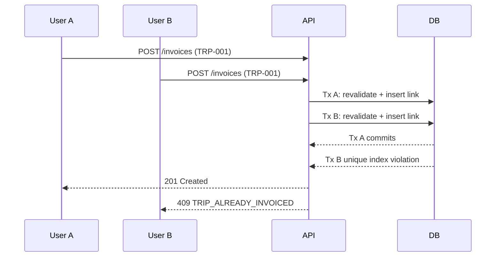

Only one transaction can hold an active link for TRP-001, so the second fails cleanly and nothing it wrote is kept.

**Steps inside POST /api/invoices**

1. Initial search (read-only) identifies eligible trips; user reviews.
2. On Generate, begin transaction (READ COMMITTED SNAPSHOT database default).
3. Take an application lock `sp_getapplock('INV-CUST-{CustomerId}', Exclusive)` to serialise invoice generation per customer (overlap and period checks become race-free).
4. Re-read selected trips `WITH (UPDLOCK, ROWLOCK)`; check Completed, IsActive, RateMissing = 0, RowVersion unchanged (else 409 with changed trips).
5. Check no active InvoiceTripLink exists.
6. Re-run overlap check; compare with user-confirmed list.
7. Insert Invoice, InvoiceLines, InvoiceTripLinks (filtered unique index is the final guard), adjustments, tax lines.
8. Update Trip.CurrentInvoiceId.
9. Inactivate replaced invoices, insert transfers, post ledger entries, update CustomerBalance (row version).
10. Queue evidence; commit. On any failure, full rollback.

**Other concurrency controls**

| Operation | Control |
| --- | --- |
| Edit of any master or trip | RowVersion (optimistic); 409 on mismatch |
| Rate / tax rule / config vehicle insert | Serializable check per (customer, configuration) + trigger |
| Invoice status actions (submit, cancel, regenerate) | RowVersion + Idempotency-Key; state re-checked in transaction |
| Payments on same invoice | UPDLOCK on Invoice row; balance recomputed in transaction |
| Ledger posting | Same transaction as source; unique (SourceType, SourceId, EntryType); CustomerBalance RowVersion; CustomerSeq from per-customer counter row under UPDLOCK |
| Number generation | SQL SEQUENCE (no table-based counters) |
| Driver app offline sync | ClientEventId dedupe; stale transitions rejected with current status |

## 53. Edge Cases

| # | Case | Handling |
| --- | --- | --- |
| 1 | Customer inactive | Not selectable for new trips/configs/invoices; historical records display it; API rejects stale selections. |
| 2 | No billing address | Invoice generation blocked with message; customer cannot be activated. |
| 3 | Multiple billing addresses | Default pre-selected; user may change; chosen one snapshotted. |
| 4 | Multiple contacts | All kept; primary and purpose tags drive defaults. |
| 5 | No invoice template | Generation blocked: "No active invoice format is configured for this customer." |
| 6 | Multiple invoice templates | Mandatory selection, default pre-selected. |
| 7 | Expired invoice template | Not offered for new invoices; old invoices still render with it. |
| 8 | Tax not applicable | Rule snapshotted with Applicable = 0 and deduction 0. |
| 9 | Multiple tax/deduction rules | Each computed on its basis in sequence and summed (pending confirmation of compounding). |
| 10 | Tax configuration changed | New rule via Replace; existing invoices keep their tax lines. |
| 11 | Tax effective date overlap | Rejected by validation. |
| 12 | No trip rate | Trip saved with RateMissing; invoice blocked until resolved. |
| 13 | Rate missing for one day | Only trips on that day flagged; rate calendar shows the gap; invoice blocked. |
| 14 | Rate changed after trip creation | Trip keeps snapshot; re-price only by explicit action before invoicing or during regeneration. |
| 15 | Manual/open trip | Amount entered; RateSource = Manual; no rate lookup. |
| 16 | Trip already invoiced | Shown as "Already invoiced" with invoice number; cannot be selected. |
| 17 | Trip inactive | Excluded from search; if already invoiced, invoice unchanged with warning. |
| 18 | Trip cancelled | Never invoiceable; cannot be cancelled if on an active invoice. |
| 19 | Invoice overlap | Warning dialog; Proceed inactivates old invoice(s). |
| 20 | Invoice regeneration | Old Inactive, new number and version, links preserved. |
| 21 | Fully paid invoice regeneration | Rejected. |
| 22 | Partially paid regeneration | Allowed; 100% transfer. |
| 23 | Payment transfer exceeds new invoice amount | Transferred in full; negative balance. |
| 24 | Negative invoice balance | Displayed as CR; listed on credit report; apply credit / refund / leave. |
| 25 | Duplicate customer reference | Per configuration: allow, warn (default) or block; other customers unaffected. |
| 26 | Multiple routes | One invoice; route label per line. |
| 27 | Multiple vehicles | One invoice; evidence grouped by vehicle. |
| 28 | Missing POD | If POD required: trip blocked with reason "POD missing"; else allowed. |
| 29 | Missing evidence | Submit blocked when evidence required; retry available. |
| 30 | Concurrent invoice generation | Second request fails with 409; no duplicates (section 52). |
| 31 | Vehicle without default driver | Driver blank, required before Assigned. |
| 32 | Driver changed from default | Stored with override flag, default id and reason. |
| 33 | Customer changed after trip | Allowed only before invoicing (re-resolves rate, audited); invoiced trips locked. |
| 34 | Invoice template changed | New version for future invoices; old invoices keep version. |
| 35 | Tax configuration changed (after invoice) | Existing invoice keeps snapshot. |
| 36 | Historical rate changed | Existing trips/invoices unchanged; count of affected snapshots shown to user. |
| 37 | Invoice evidence already generated | Never overwritten; re-render creates a new version file (Admin). |
| 38 | New invoice for same period | Via overlap flow only; old evidence kept. |
| 39 | Past-month adjustment | Adjustment rows on current invoice; old invoice untouched. |
| 40 | Positive adjustment | Increases gross. |
| 41 | Negative adjustment | Decreases gross; net may not go below zero. |
| 42 | Payment on an unsubmitted invoice | Rejected; submit first. For Open trips, record an advance instead (37.4). |
| 43 | Payment on an inactive (replaced) invoice | Rejected with pointer to the active invoice. |
| 44 | Cheque bounced after regeneration transferred it | Reverse on the active invoice holding the transfer; ledger debit posted there (Recommended Design). |
| 45 | Invoice submitted twice (double click / retry) | Idempotency key and ledger unique index: one debit only. |
| 46 | Submitted invoice cancelled | Allowed only with no active payments; ledger reversal credit posted. |
| 47 | Receipt covering several invoices | One receipt, several allocations, one ledger credit per invoice. |
| 48 | Old invoice period wider than new | Trips outside the new period become uninvoiced; warned before Proceed. |
| 49 | Ledger / invoice mismatch | Nightly reconciliation flags on LED-12; investigation by Finance. |
| 50 | Back-dated payment into closed month | Rejected unless Admin with reason. |

**Edge cases added in v1.1**

| # | Case | Handling |
| --- | --- | --- |
| 51 | Advance larger than the trip's invoice balance | Applied in full; invoice shows credit; carry forward or refund. |
| 52 | Open trip with advance is cancelled | Advance moved to another Open trip of the customer or refunded; never deleted. |
| 53 | Invoice holding an applied advance is regenerated | Applied advance transfers to the new invoice with the payments. |
| 54 | Write-off then customer pays the written-off amount | Reverse the write-off (debit), then record the payment. |
| 55 | Trip date in one month, completion in the next | Billed in the period containing the completion date; rate from trip date. |
| 56 | New tax rule with same name starting before current rule | Rejected as overlap. |
| 57 | Open-ended rate followed by a one-day rate | Open rate auto-closed before the one-day rate; user adds a new open rate from the following day. |
| 58 | Multi-currency enabled mid-year | Existing PKR records unchanged; new records may choose currency. |
| 59 | Driver creates a duplicate trip | Duplicate customer reference warning; review queue shows possible duplicates (same vehicle, date, configuration). |
| 60 | Customer overpays on normal entry | Allowed with confirmation; credit carried forward or refunded. |

## 54. Non-Functional Requirements

| Area | Requirement |
| --- | --- |
| Authentication | Existing SCM identity (JWT/OIDC); session timeout 30 min idle for web; driver app refresh tokens with device binding; MFA for Admin and Finance (Recommended Design) |
| Authorisation | Permission checks on every API; row-level scope for drivers; UI hides but never relies on hiding |
| API security | HTTPS only (TLS 1.2+); rate limiting on driver and auth endpoints; input validation and output encoding; no secrets in client apps |
| Data access control | Financial fields (rates, amounts, ledger) excluded from driver and Operations payloads where not permitted; masked fuel card numbers |
| Financial permissions | Rate, invoice, payment, regeneration, reversal, ledger and period-lock actions each behind distinct permissions; reasons mandatory |
| Auditability | Every financial and lifecycle change traceable to user, time, old/new value and reason; audit retained indefinitely |
| Performance | Eligible-trip search ≤ 3 s for 10,000 trips in period; invoice generation ≤ 10 s for 2,000 lines (evidence async); trip list ≤ 2 s at 1M trips; ledger statement ≤ 3 s for 5 years of entries; report export > 50k rows as background job |
| Scalability | Designed for 1,000 vehicles, 5,000 trips/day, 10 years online history; partition-ready indexes on TripDate and EntryDate |
| Concurrency | No duplicate billing (section 52); optimistic concurrency on all editable aggregates |
| Transaction integrity | Invoice creation, regeneration, payment, reversal and ledger posting are atomic |
| Availability | 99.5% business hours; driver app works offline and syncs |
| Backup & recovery | Point-in-time restore 7–35 days (Azure SQL); RPO ≤ 15 min, RTO ≤ 4 h |
| Document storage | Azure Blob Storage (Recommended Design, consistent with the SCM application): containers `pod`, `trip-docs`, `invoice-pdf`, `invoice-evidence`, `customer-docs`, `receipts`; private access via short-lived SAS; SHA-256 hash stored; immutable (WORM) policy on invoice PDFs and evidence; max file 20 MB; allowed types PDF, JPG, PNG, HEIC (converted), XLSX for templates; virus scan on upload |
| Retention | No retention limit (Confirmed): invoices, evidence, POD, attachments, ledger and audit are kept indefinitely; archiving to cool/archive blob tiers after 2 years keeps cost down without deletion (Recommended Design) |
| Reporting | Filter, sort, export, pagination; read-replica or reporting views for heavy reports |
| Driver usability | Mobile-first, large buttons (≥ 48 px), one primary action per screen, minimal typing (numeric keypads, chips), camera-first uploads, Urdu/English, works on low-end Android over 3G |
| Localisation | PKR formatting `1,234,567.00`; amount in words on invoices; dates `DD-MMM-YYYY` |
| Observability | Structured logs with CorrelationId; alerts on ledger reconciliation mismatch, evidence failures, posting failures |

## 55. Phase 1 Scope

Phase 1 runs entirely without GPS and includes: Customer (with contacts, addresses, billing configuration, tax/deductions, templates), Cities, Routes, customer Trip Configurations, Rates, Vehicles and Drivers (reused), Fixed and Open Trips, Trip Events, Driver App, Fuel and Fuel Cards, Expenses, Income, Operational P&L, Invoices, Tax/Deductions, Adjustments, Payment Receipts, Regeneration and Payment Transfer, Evidence, **Customer Ledger**, Audit and Reports.

**Suggested delivery increments (Recommended Design)**

| Increment | Content | Depends on |
| --- | --- | --- |
| 1 | Customer master and sub-entities, City, Route | Existing VMS |
| 2 | Trip configurations, vehicles, rates | 1 |
| 3 | Fixed and open trips, lifecycle, events, documents, POD | 2 |
| 4 | Fuel, fuel cards, expenses, income, P&L | 3 |
| 5 | Invoice generation, lines, adjustments, deductions, templates, evidence | 3 |
| 6 | Payments, Customer Ledger, regeneration, overlap, transfers | 5 |
| 7 | Driver app | 3, 4 |
| 8 | Reports and dashboards, hardening | All |

## 56. Phase 2 GPS Preparation

Phase 1 must not depend on GPS, but the model is ready for it.

| Prepared in Phase 1 | Purpose in Phase 2 |
| --- | --- |
| `TripEvent.Source` includes `GPS` | Automatic events from geofence entry/exit |
| TripEvent Lat/Long columns | Store GPS-derived positions on events |
| Route distance and standard duration | Baseline for ETA and deviation |
| City master (can hold centre coordinates, Recommended add-on) | Geofence seeds |
| Tracker Company as a Business Partner role (existing) | Provider master |

**Planned Phase 2 entities:** VehicleTracker (device), VehicleTrackerAssignment (device ↔ vehicle, effective-dated), GPSPosition (high-volume time series; separate store), TripGPSData (per-trip summary: distance, max speed, idle time), Geofence (polygon/radius for cities, customer sites, depots), RouteTracking (planned vs actual path, deviation events).

**Planned capabilities:** live location, route replay, distance and speed, ETA, geofence alerts, route deviation, automatic trip events, stop detection. Provider and API integration (**Client Confirmation Required**).

## 57. Future Enhancements

- General ledger integration (post invoices, receipts and deductions to the finance system's chart of accounts).
- Advances for fixed trips and unallocated on-account receipts (Phase 1 covers advances on Open trips only).
- Credit notes and debit notes as separate documents.
- Approval limits per user for write-offs and discounts.
- Customer portal: invoices, evidence, statement download, POD view.
- Email/WhatsApp delivery of invoices and statements.
- Pro-rata allocation of invoice deductions to trips for net P&L.
- Full vehicle cost allocation (lease installments, depreciation, salaries) for true profitability.
- Driver availability and scheduling.
- Multi-currency invoicing and FX.
- E-invoicing integration with tax authority, if mandated (FBR/PRA).

## 58. Open Questions / Client Confirmation Required

Client answers received 25-Sep-2026. 25 items are resolved and built into this FSD (sections noted); 5 remain open.

| # | Topic | Client answer | Status | Built into |
| --- | --- | --- | --- | --- |
| 1 | Tax formula | Tax/deduction is calculated (rate × basis or fixed amount) | Resolved | 14, 35 |
| 2 | Multiple deductions | Yes, multiple deductions per invoice. Each is computed independently on its basis (Recommended Design; no compounding) | Resolved | 14, 35 |
| 3 | Tax rule applicability | A rule is applied if Active for the invoice. Adding a new rule with the same tax name auto-sets the existing rule Inactive by date (EffectiveTo = new start − 1 day) for tracking | Resolved | 14 |
| 4 | Negative balance | Two options: **Carry Forward** or **Refund** | Resolved | 40, 40A |
| 5 | Invoice layout | Multiple invoice layouts per customer | Resolved | 15 |
| 6 | Evidence layout | Evidence sheets have **no template**; one standard system layout for all customers | Resolved | 41 |
| 7 | POD rules | Yes, POD mandatory/optional configurable per customer | Resolved | 13, 32.1 |
| 8 | Approval workflow | Invoice approval **not required**; Approved status removed | Resolved | 36 |
| 9 | Numbering | "Two decimal digits" — applied as amounts stored and shown to 2 decimal places. Invoice number format still to be confirmed | Partly open | 35, 46.6 |
| 10 | Payment methods | **Direct payment into account** (bank transfer/deposit) and **Bank Cheque** | Resolved | 37 |
| 11 | Currency | Currency setup, default PKR. Multi-currency is a tenant setting; when enabled, currency is selectable when charges are added and when trip amount is logged | Resolved | 13A |
| 12 | Adjustments in ledger | Each adjustment is posted as its own ledger entry against the same invoice | Resolved | 40A |
| 13 | Regeneration approval | No approval; permission + reason only | Resolved | 38 |
| 14 | Fully paid invoice correction | Corrected through an adjustment on a later invoice | Resolved | 32.3, 38 |
| 15 | Retention | No retention limit; records and documents kept indefinitely | Resolved | 41, 54 |
| 16 | GPS provider | To be discussed later | Open | 56 |
| 17 | Driver app technology | Client will explain later | Open | 43 |
| 18 | Customer samples | To be provided later | Open | 15 |
| 19 | Ledger entry date | Ledger dated by **Submission Date**; Invoice Date shown in the narration | Resolved | 40A |
| 20 | Advance receipts | For **Open** trips, advance payment can be received and later adjusted against the trip | Resolved | 37.4, 40A |
| 21 | Opening balances | Opening balance may be debit or credit | Resolved | 40A |
| 22 | Write-offs | Yes: when recording against an invoice, option to **Write-off** or **Discount** | Resolved | 37.5, 40A |
| 23 | Overpayment | Allowed (with confirmation) | Resolved | 37 |
| 24 | Missing rate | Error at invoice creation; invoice not generated | Resolved | 32.2 |
| 25 | Billing date basis | Trips included by **completion date** | Resolved | 32.1 |
| 26 | Inactive customer | Completed trips of an inactive customer can still be invoiced | Resolved | 10 |
| 27 | Driver-created trips | Yes, drivers create trips in the app | Resolved | 21, 43 |
| 28 | Open-ended rates | A rate without end date runs until the next rate's start date | Resolved | 26 |
| 29 | Billable income | Yes, trip income can appear as invoice lines | Resolved | 30, 33 |
| 30 | Adjustment-only invoice | Not allowed; invoices always contain trips. Client may issue an addendum on adjustments | Resolved | 32 |

**Still open:** invoice number format (9), GPS provider (16), driver app technology and login (17), customer invoice samples and addenda (18), any adjustment addendum (30).

## 59. Acceptance Criteria

Acceptance criteria for the Customer Ledger are also in section 40A.5. Each criterion below is a QA test case ID.

### Customer and masters

```text
AC-01 Customer independence
Given a customer is created
Then it has no BusinessPartnerId
And trips and invoices reference it by CustomerId.

AC-02 Unique customer code
Given customer CUS-00012 exists
When another customer is saved with code cus-00012
Then the save is rejected with "Customer code already exists."

AC-03 Inactive customer
Given a customer is Inactive
When a user opens New Trip
Then the customer is not listed
And existing trips and invoices still show the customer.

AC-04 Billing address snapshot
Given INV-1 was generated with address "Head Office, Mall Road"
When the address is changed to "Gulberg III"
Then INV-1 still shows "Head Office, Mall Road".

AC-05 Tax rule replacement
Given WHT 2% is effective from 01-Jan
When Finance adds WHT 3% with the same tax name from 01-Sep
Then the 2% rule ends 31-Aug automatically with status Inactive and its CreatedOn unchanged
And invoices dated before 01-Sep keep 2%.

AC-06 Tax overlap
Given WHT-236 is effective from 01-Jan
When a new WHT-236 rule starting on or before 01-Jan is saved
Then it is rejected with the overlap message.

AC-07 Template auto-selection
Given a customer has one applicable template
When generating an invoice
Then the format is selected automatically and not required from the user.

AC-08 Template selection required
Given a customer has two applicable templates
When the user generates without choosing
Then "Please select an invoice format." is shown.

AC-09 City abbreviation
Given LHR exists
When another city is saved with LHR
Then it is rejected.
```

### Configuration and rates

```text
AC-10 Customer-specific configuration
Given Customer A and Customer B exist
And both use the same route
When the user selects Customer A
Then only Customer A's trip configurations are displayed.

AC-11 Configured vehicles only
Given ABC-LHR-FSD-01 allows ABC-123 and ABC-456
When a fixed trip is created for that configuration
Then the vehicle list shows only ABC-123 and ABC-456.

AC-12 Rate resolution
Given rate A applies from 01-Jul to 15-Jul
And rate B applies from 16-Jul to 25-Jul
When a trip is created for 20-Jul
Then rate B is selected.

AC-13 One-day rate
Given 25,000 for 01-10 Jul, 28,000 for 11 Jul, 25,000 for 12-31 Jul
When a trip is created for 11-Jul
Then the trip amount is 28,000.

AC-14 Rate overlap
Given a rate exists 01-Jul to 15-Jul
When a rate 10-Jul to 20-Jul is saved for the same customer and configuration
Then it is rejected with "The selected effective date range overlaps an existing rate configuration."

AC-15 Rate snapshot
Given a trip on 20-Jul resolved 27,000
When the rate is changed to 30,000
Then the trip amount remains 27,000.

AC-16 No fallback
Given no rate covers 15-Jul
When a trip is created for 15-Jul
Then RateMissing is true and no amount is applied.
```

### Trips

```text
AC-17 Default driver
Given ABC-123 has default driver Ali
When ABC-123 is selected on a trip
Then Driver is Ali.

AC-18 Driver override
Given Driver was auto-filled as Ali
When an authorised user selects Bilal with a reason
Then the trip stores Bilal, DefaultDriverId Ali and IsDriverOverridden true, and an audit row.

AC-19 Open trip
Given Customer ABC
When an open trip LHR to DGK with amount 80,000 is saved
Then TripType is Open, RateSource is Manual and TripAmount is 80,000.

AC-20 Duplicate reference warning
Given PO-2026-4587 exists on a trip for Customer ABC
When another ABC trip uses PO-2026-4587
Then a warning is shown
And the same reference on Customer XYZ is accepted without warning.

AC-21 Lifecycle
Given a trip is Assigned
When a driver tries to set it Completed directly
Then the change is rejected.

AC-22 Trip P&L
Given revenue 80,000 and fuel 15,000, toll 3,000, parking 1,000, driver expense 2,000
When the P&L is viewed
Then it shows 59,000.

AC-23 Fuel card required
Given payment method Fuel Card
When fuel is saved without a card
Then it is rejected.

AC-24 Other expense type
Given expense type Other
When saved without Other Expense Type
Then it is rejected.
```

### Invoicing

```text
AC-25 Arbitrary period
Given trips completed from 15-Aug to 14-Sep
When an invoice for 15-Aug to 14-Sep is generated
Then all eligible trips in that range are included.

AC-26 Inactive trip
Given a trip is inactive
When invoiceable trips are searched
Then the trip is not returned as invoiceable.

AC-27 Missing rate
Given an invoice contains a trip for a date without a configured amount
When the user generates the invoice
Then the invoice is not generated
And an appropriate error is displayed listing the trip.

AC-28 Multiple vehicles and routes
Given eligible trips on 3 vehicles and 3 routes
When the invoice is generated
Then one invoice with all trips is created.

AC-29 Line snapshot
Given INV-1 has a line for vehicle ABC-123 driven by Ali
When the trip's driver master name changes
Then the INV-1 line still shows Ali.

AC-30 Adjustments
Given trips 500,000 and adjustments "August 2026 +20,000" and "July 2026 -15,000"
When the invoice is generated
Then Gross is 505,000 and both adjustment rows are stored with month text and note.

AC-31 Invoice-level deduction
Given Gross 520,000 and a 2% rule on InvoiceSubtotal
When the invoice is generated
Then TotalDeduction is 10,400 and Net is 509,600
And the rule snapshot is stored on the invoice.

AC-32 Concurrency
Given User A and User B both select TRP-001
When both generate invoices
Then exactly one invoice contains TRP-001
And the other request receives "One or more selected trips have already been invoiced."

AC-33 Evidence pagination
Given vehicle ABC-123 has 100 lines and page size is 50
When evidence is generated
Then pages 1 and 2 both belong to ABC-123
And ABC-456 starts on page 3.

AC-34 Evidence integrity
Given INV-1 evidence shows 25,000 for a July trip
When the July rate changes to 30,000 and INV-1 is regenerated as INV-2 with re-pricing
Then INV-1 evidence still shows 25,000 and INV-2 evidence shows 30,000.

AC-35 Status separation
Given INV-1 is Submitted and half paid
Then status is Submitted and payment status is Partially Paid.
```

### Payments, regeneration and ledger

```text
AC-36 Payment entry
Given INV-1 is Submitted with Net 509,600
When a cheque payment of 200,000 is recorded
Then a receipt and allocation are created, balance is 309,600, payment status is Partially Paid
And a PAYMENT credit of 200,000 is posted against INV-1.

AC-37 Auto ledger debit
Given INV-1 is Generated
When it is Submitted
Then INVOICE, ADJUSTMENT and DEDUCTION entries totalling Net are posted against INV-1, dated the submission date.

AC-38 No ledger before submit
Given INV-1 is Generated
Then INV-1 has no ledger entries.

AC-39 Multi-invoice receipt
Given a receipt of 300,000 allocated 100,000 to INV-1 and 200,000 to INV-2
When saved
Then two PAYMENT credits are posted, one per invoice.

AC-40 Payment reversal
Given a posted payment of 200,000 on INV-1
When it is reversed as cheque bounced
Then a PAYMENT_REVERSAL debit of 200,000 is posted, INV-1 balance increases by 200,000
And the original payment remains with status Reversed.

AC-41 Fully paid invoice
Given an invoice is fully paid
When the user requests regeneration
Then regeneration is rejected.

AC-42 Partial payment transfer
Given an invoice has a historical payment
When the invoice is regenerated
Then 100% of the historical payment is transferred.

AC-43 Payment exceeds new invoice
Given transferred payment is greater than the new invoice amount
When regeneration completes
Then the invoice balance is negative and shown as a credit.

AC-44 Overlap warning
Given INV-00125 covers 01-Aug to 30-Aug and is Unpaid
When an invoice for 01-Aug to 15-Sep is requested
Then the overlap warning is shown
And Cancel changes nothing
And Proceed sets INV-00125 Inactive, creates a new number and links old and new.

AC-45 Regeneration ledger
Given INV-00125 Submitted 500,000 with 200,000 paid
When it is regenerated as INV-00188 (550,000) and INV-00188 is submitted
Then INV-00125 ledger nets to 0 and INV-00188 ledger balance is 350,000
And the customer balance is 350,000.

AC-46 Payment on replaced invoice
Given INV-00125 is Inactive
When a payment is recorded against it
Then it is rejected with a pointer to INV-00188.

AC-47 Ledger immutability
Given any ledger entry
When an update or delete is attempted by the application
Then the database rejects it.

AC-48 Ledger statement
Given entries before and during September
When the statement for 01-Sep to 30-Sep is run
Then the opening balance equals the sum before 01-Sep, the running balance is correct per row
And closing = opening + debits - credits.

AC-49 Reconciliation
Given every Submitted active invoice
Then its ledger balance equals its invoice balance.

AC-50 Audit
Given any rate, invoice, payment or regeneration action
Then an audit row exists with user, time, old and new values and reason.
```

### Reports and driver app

```text
AC-51 Aging
Given INV-1 due 01-Aug with balance 100,000
When aging is run as of 15-Sep
Then 100,000 appears in the 31-60 bucket.

AC-52 Report export
Given any report with results
When exported to Excel
Then the file contains the same rows, filters and run time.

AC-53 Driver scope
Given driver Ali is assigned TRP-1 and not TRP-2
When Ali opens the app
Then only TRP-1 is visible and no amounts or rates are shown.

AC-54 Offline sync
Given the driver taps Delivered while offline
When connectivity returns
Then the event syncs once with the device time and is not duplicated on retry.
```

### Added in v1.1 (client answers)

```text
AC-55 No approval step
Given an invoice is Generated
When Finance clicks Submit
Then it becomes Submitted without any approval.

AC-56 Open-ended rate
Given rate 25,000 from 01-Jul with no end date
When rate 27,000 from 16-Aug is added
Then the first rate ends 15-Aug
And a trip on 30-Sep resolves 27,000.

AC-57 Completion-date billing
Given a trip dated 31-Aug completed 01-Sep
When an invoice for 01-Sep to 30-Sep is generated
Then the trip is included, priced at the 31-Aug rate.

AC-58 Adjustment ledger entry
Given INV-1 has adjustment "July 2026 -15,000"
When INV-1 is submitted
Then a separate ADJUSTMENT credit of 15,000 is posted against INV-1.

AC-59 Advance on Open trip
Given Open trip TRP-9 (80,000) and an advance of 30,000 recorded against it
Then the customer ledger shows ADVANCE Cr 30,000 linked to TRP-9
When the invoice with TRP-9 is submitted
Then the advance is applied and the invoice balance is 50,000.

AC-60 Advance on fixed trip rejected
Given a Fixed trip
When an advance is recorded against it
Then it is rejected with "Advances can only be recorded against Open trips."

AC-61 Discount
Given INV-1 balance 100,000
When Finance records a discount of 5,000 with a reason
Then a DISCOUNT credit of 5,000 is posted and the balance is 95,000.

AC-62 Carry forward
Given INV-1 has a credit of 50,000 and INV-2 has balance 200,000
When Finance carries forward 50,000 to INV-2
Then INV-1 balance is 0, INV-2 balance is 150,000 and the customer balance is unchanged.

AC-63 Payment methods
Given the Record Payment screen
Then the method list shows only Direct to Account and Bank Cheque.

AC-64 Multi-currency off
Given the tenant has multi-currency disabled
Then no currency field is shown and all amounts are PKR.

AC-65 Multi-currency on
Given multi-currency is enabled
When an expense is added or an open trip amount is logged
Then the user can choose its currency, defaulting to PKR / customer currency.

AC-66 Driver creates trip
Given driver Ali is assigned ABC-123
When Ali creates a fixed trip in the app
Then the trip is Draft with Source DriverApp, appears in Pending review, and Ali sees no rate or amount.

AC-67 Evidence layout
Given two customers with different invoice templates
When evidence is generated for both
Then both use the same standard evidence layout.
```
